# Design Document — Operations Pipeline

## Overview

The Operations Pipeline completes the Track B hospitality dashboard by wiring stubbed operational flows to real REST mutations and introducing a folio-centric billing domain. It adds:

1. A new **reservation-linked stay-experience table** (`stay_experiences`) separate from the tenant-oriented `stay_registrations`.
2. **Stay Records views** that join stay-experience rows to reservations through a REST repository.
3. A **reservation-centric guest request lifecycle**, making `guest_id` and `room_id` nullable while anchoring on `reservation_id`.
4. **Check-in / check-out mutations** that drive folio creation/finalization and emit a room/housekeeping signal.
5. A **Dining & Events create flow** and a **Staff create flow**.
6. A **folio billing domain** (`folios`, `folio_line_items`, `folio_payments`) that becomes the single billing source of truth, including the tax-export pipeline.
7. **Operations documentation** under `docs/`.

All schema changes are additive. `reservations` remains the booking source of truth. The legacy `guests` table and the tenant-oriented `stay_registrations` table are left unchanged.

### Design Principles (from constraints)

- **Track B REST-only**: no Supabase runtime adapter; the frontend reaches data only through `createRestRepositories()`.
- **Backend owns Prisma**: all persistence is behind Express routes + services; the frontend owns repository interfaces and REST calls only.
- **Frontend layering**: data and business logic live in `frontend/src/hooks/*` and `frontend/src/lib/repositories/*`, never in presentation panels or `components/ui` primitives.
- **Additive migrations only**: never drop or alter `stay_registrations` / `guests`.
- **`@/*` imports** for internal frontend paths.
- **Visual system**: Harbor primary / Harbor Deep secondary / Brass accent; `Newsreader` headings, `Plus Jakarta Sans` body.

---

## Current State Audit

Classification of each in-scope feature against the controlling file, since the original ask was to validate the current implementation. Status legend: **WIRED** (create/mutation path exists end-to-end), **PARTIAL** (some methods wired, mutation gaps), **STUB** (UI present, no mutation), **READ-ONLY** (list/detail only).

| Feature | Status | Controlling file(s) | Finding |
|---|---|---|---|
| Stay Experience table | **STUB** (absent) | `backend/prisma/schema.prisma` | No reservation-linked stay-experience table exists. `stay_registrations` is tenant/lease oriented and out of scope for modification. New `stay_experiences` table required. |
| Stay Records view | **READ-ONLY** | `frontend/src/components/guests/stay-records-tab.tsx`, `stay-registration-tab.tsx` | Renders tenant/registration data. No reservation-joined stay-experience grouping or detail view. Needs new repo + hook + REST seam. |
| Guest Requests | **PARTIAL** | `backend/src/routes/guest-requests.ts`, `backend/src/services/guest-request-service.ts`, `frontend/src/components/guests/guest-requests-tab.tsx` | Full CRUD + `transitionStatus` route exists. `guest_requests.guest_id` and `room_id` are **NOT NULL** in schema; not reservation-first. Needs additive nullability + reservation-anchored validation. REST adapter `update()` uses `PUT` but route exposes `PATCH /api/guest-requests/:id` — contract mismatch to reconcile. |
| Check-in / Check-out | **STUB** | `frontend/src/components/check-in-out/check-in-out-page.tsx`, `backend/src/room-status.ts` | Only `PATCH /api/rooms/:id/status` exists, which flips room+reservation status heuristically. No check-in/out mutation endpoints, no folio lifecycle, no explicit housekeeping signal. Needs new endpoints + services + event emitter. |
| Dining & Events | **READ-ONLY** | `backend/src/index.ts` (`GET /api/dining-events`), `frontend/src/components/dining-events/dining-events-page.tsx`, repo `DiningEventRepository` | GET-only. No POST endpoint; `DiningEventRepository` has no `create`. Needs create flow. |
| Staff & Roles | **READ-ONLY** | `backend/src/index.ts` (`GET /api/staff`), `frontend/src/components/admin/staff-roles-page.tsx`, repo `StaffRepository` | GET-only. No POST endpoint; `StaffRepository` has no `create`. Needs create flow with role + `property_ids`. |
| Folio domain | **STUB** (absent) | `backend/prisma/schema.prisma` | No folio tables. Billing is implicit. Needs `folios`, `folio_line_items`, `folio_payments`. |
| Tax export | **WIRED (reservation-derived)** | `backend/src/tax-export/*`, `tax_export_items.reservation_id` | Functional, but derives items from reservations. Needs additive migration path to read from `folio_line_items` while keeping reservation-derived fallback. |
| Operations documentation | **STUB** (absent) | `docs/` | No consolidated operations-pipeline doc. Needs new file(s). |

---

## Architecture

The Operations Pipeline is a single additive layer over the existing Track B stack: a React 19 + Vite frontend that reaches data exclusively through `createRestRepositories()`, an Express + Prisma backend that owns all persistence, and Azure PostgreSQL as the store. No Supabase runtime path is introduced.

Architecturally the work splits into three planes:

- **Data plane (Prisma + PostgreSQL).** One new reservation-anchored domain (`stay_experiences`), one new billing domain (`folios`, `folio_line_items`, `folio_payments`), and two additive column changes (`guest_requests` nullability + `reservation_id` anchoring, `tax_export_items.folio_line_item_id`). `reservations` stays the booking source of truth; `guests` and `stay_registrations` are left untouched.
- **Service plane (Express routes + injectable services).** Each feature is a thin route registrar delegating to a service module that returns `{ status, body }` and takes Prisma by injection (matching `guest-request-service.ts` / `room-status.ts`). Cross-cutting operational side effects flow through an in-process `operationsEvents` emitter so that check-out can finalize a folio and signal housekeeping without routes importing each other.
- **Client plane (repositories + hooks + presentation).** New repository interfaces and REST adapters extend `RepositoryFactory`; TanStack Query hooks own data fetching, mutation, and cache invalidation; feature pages bind to hooks only — no fetch or endpoint construction in panels or `components/ui` primitives.

The two structural decisions that shape everything else:

1. **Reservation-centric, not guest-centric.** Stay experiences and guest requests anchor on `reservation_id`; legacy `guest_id`/`room_id` become optional compatibility links rather than required keys.
2. **Folio as billing source of truth.** Check-in opens a folio, check-out finalizes it, and the tax-export pipeline migrates to read `folio_line_items` (with a reservation-derived fallback) so billing has one authoritative ledger.

The sections below split into **High-Level Design** (system/ER/state/sequence diagrams + API surface) and **Low-Level Design** (Prisma model blocks, route/service signatures, repository/hook/DTO additions, component touchpoints, and the tax-export migration path).

> Validation note: the backend does **not** use Zod (no `zod` dependency exists). Validation follows the established pattern in `guest-request-service.ts` — routes pass a `bodyObject(req): Record<string, unknown>` into services, and each service performs explicit field checks, returning `{ status: 400, body: { error, errors: [{ field, message }] } }` on failure. New services keep this convention rather than introducing a schema library.

---

## High-Level Design

### System / Component Diagram

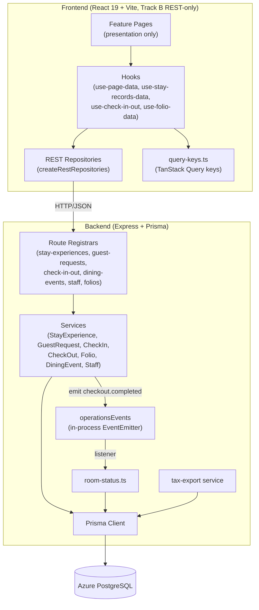

### Entity-Relationship Diagram (new + touched tables)

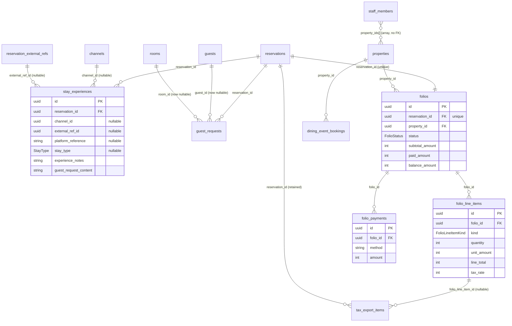

### API Surface Table

New and modified endpoints. All consumed via the Track B REST repositories.

| Method | Path | Status | Service | Purpose |
|---|---|---|---|---|
| POST | `/api/stay-experiences` | NEW | StayExperienceService | Create reservation-linked stay-experience record |
| GET | `/api/stay-experiences` | NEW | StayExperienceService | List (filters: `property_id`, `reservation_id`, `stay_type`) |
| GET | `/api/stay-experiences/:id` | NEW | StayExperienceService | Detail (joined reservation fields) |
| PATCH | `/api/stay-experiences/:id` | NEW | StayExperienceService | Partial update |
| DELETE | `/api/stay-experiences/:id` | NEW | StayExperienceService | Delete |
| POST | `/api/guest-requests` | MODIFIED | GuestRequestService | Reservation-anchored create; `guest_id`/`room_id` optional |
| PATCH | `/api/guest-requests/:id` | EXISTING | GuestRequestService | Partial update (reconcile FE adapter to `PATCH`) |
| PATCH | `/api/guest-requests/:id/status` | EXISTING | GuestRequestService | Status transition |
| DELETE | `/api/guest-requests/:id` | EXISTING | GuestRequestService | Delete |
| POST | `/api/reservations/:id/check-in` | NEW | CheckInService | Transition to checked-in + create/reuse folio |
| POST | `/api/reservations/:id/check-out` | NEW | CheckOutService | Finalize folio + transition + emit housekeeping signal |
| GET | `/api/folios` | NEW | FolioService | List folios (filter: `reservation_id`, `property_id`) |
| GET | `/api/folios/:id` | NEW | FolioService | Folio detail with line items + payments + balance |
| POST | `/api/folios/:id/line-items` | NEW | FolioService | Post a charge/credit; recompute balance |
| POST | `/api/folios/:id/payments` | NEW | FolioService | Record payment; recompute balance |
| POST | `/api/dining-events` | NEW | DiningEventService | Create dining/event booking |
| POST | `/api/staff` | NEW | StaffService | Create staff member with role + `property_ids` |

---

## Low-Level Design

This plane gives the concrete contracts: Prisma model blocks (under **Data Models**), Express route/service/validation signatures and the operations event emitter (under **Components and Interfaces**), the frontend repository/hook/DTO additions, the component touchpoints, and the tax-export migration path. State machines and sequence diagrams below tie the two planes together.

## Components and Interfaces

### Backend services

Each service is a pure-ish module returning `{ status, body }` results (matching the existing `guest-request-service.ts` and `room-status.ts` conventions), with Prisma injected so logic is unit-testable.

```typescript
// backend/src/services/stay-experience-service.ts
export type StayExperiencePrisma = {
  stay_experiences: { create; findMany; findUnique; update; delete };
  reservations: { findUnique(args): Promise<{ id: string } | null> };
};

export interface StayExperienceCreateBody {
  reservation_id: string;
  channel_id?: string | null;
  external_ref_id?: string | null;
  platform_reference?: string | null;
  stay_type?: "short_term" | "long_term" | null;
  experience_notes?: string;        // free-form, unconstrained string
  guest_request_content?: string;   // free-form guest-request content
}

export async function createStayExperience(
  prisma: StayExperiencePrisma,
  body: Record<string, unknown>
): Promise<{ status: 201 | 400 | 404; body: unknown }>;
// 404 when reservation_id does not resolve (Req 1.7)

export async function listStayExperiences(prisma, filters): Promise<{ status: 200; body: unknown[] }>;
export async function getStayExperienceById(prisma, id): Promise<{ status: 200 | 404; body: unknown }>;
export async function updateStayExperience(prisma, id, body): Promise<{ status: 200 | 400 | 404; body: unknown }>;
export async function deleteStayExperience(prisma, id): Promise<{ status: 204 | 404; body: unknown }>;
```

```typescript
// backend/src/services/check-in-service.ts
export type CheckInPrisma = {
  reservations: { findUnique; update };
  folios: { findUnique; create };
  $transaction<T>(fn): Promise<T>;
};

// Transitions reservation -> "checked_in"; creates folio if none exists, else reuses (Req 4.1–4.3).
export async function checkIn(
  prisma: CheckInPrisma,
  reservationId: string
): Promise<{ status: 200 | 404 | 409; body: { reservation; folio } | { error } }>;
```

```typescript
// backend/src/services/check-out-service.ts
import { operationsEvents } from "../events/operations-events.js";

export type CheckOutPrisma = {
  reservations: { findUnique; update };
  folios: { findUnique; update };
  folio_line_items: { findMany };
  folio_payments: { findMany };
  $transaction<T>(fn): Promise<T>;
};

// Requires reservation in "checked_in" (Req 4.7). Finalizes folio (totals + balance, Req 4.4),
// transitions reservation -> "checked_out" (Req 4.5), emits checkout.completed (Req 4.6).
export async function checkOut(
  prisma: CheckOutPrisma,
  reservationId: string
): Promise<{ status: 200 | 404 | 409; body: { reservation; folio } | { error } }>;
```

```typescript
// backend/src/events/operations-events.ts
import { EventEmitter } from "node:events";

export interface CheckoutCompletedPayload {
  reservationId: string;
  propertyId: string;
  roomIds: string[];         // primary_room_id + allocation room ids
  occurredAt: string;        // ISO timestamp
}

export interface OperationsEventMap {
  "checkout.completed": CheckoutCompletedPayload;
}

class OperationsEmitter extends EventEmitter {
  emitCheckoutCompleted(payload: CheckoutCompletedPayload): void {
    this.emit("checkout.completed", payload);
  }
  onCheckoutCompleted(listener: (p: CheckoutCompletedPayload) => void): void {
    this.on("checkout.completed", listener);
  }
}

export const operationsEvents = new OperationsEmitter();
```

The check-out route emits the event after the transaction commits. A listener registered once in `backend/src/index.ts` consumes `checkout.completed` and sets each associated room to a housekeeping state (`"Needs Attention"`/`"Checked Out"`) via the existing `room-status` logic. This keeps routes decoupled: the check-out route never imports room-status logic directly.

```typescript
// backend/src/services/folio-service.ts
export type FolioStatus = "open" | "finalized" | "settled";

export interface FolioLineItemInput {
  description: string;
  kind: "charge" | "credit";
  quantity: number;     // >= 1
  unit_amount: number;  // VND, integer
  tax_rate?: number;    // default from settings (8)
  source?: string;      // "manual" | "tax_export" | ...
}

export interface FolioPaymentInput {
  method: string;
  amount: number;       // VND, integer, > 0
  reference?: string | null;
}

// balance = sum(line_total of charges) - sum(line_total of credits) - sum(payments)  (Req 7.5)
export function computeBalance(lineItems, payments): { subtotal: number; paid: number; balance: number };

export async function postLineItem(prisma, folioId, input): Promise<{ status; body }>;
export async function recordPayment(prisma, folioId, input): Promise<{ status; body }>;
export async function getFolioById(prisma, id): Promise<{ status; body }>;
export async function listFolios(prisma, filters): Promise<{ status; body }>;
```

```typescript
// backend/src/services/dining-event-service.ts  — create + required-field validation (Req 5)
// backend/src/services/staff-service.ts          — create with role + property_ids (Req 6)
```

### Frontend repository contract additions

Additions to `frontend/src/lib/repositories/types.ts`:

```typescript
// New model types (also added to @/types/database.ts)
export type StayExperienceStayType = "short_term" | "long_term";

export interface StayExperience {
  id: string;
  reservation_id: string;
  channel_id: string | null;
  external_ref_id: string | null;
  platform_reference: string | null;
  stay_type: StayExperienceStayType | null;
  experience_notes: string;
  guest_request_content: string;
  created_at: string;
  updated_at: string;
  reservation?: Reservation;   // joined for Stay Records view (Req 2.1)
}

export interface StayExperienceCreateInput {
  reservation_id: string;
  channel_id?: string | null;
  external_ref_id?: string | null;
  platform_reference?: string | null;
  stay_type?: StayExperienceStayType | null;
  experience_notes?: string;
  guest_request_content?: string;
}
export interface StayExperienceUpdateInput extends Partial<StayExperienceCreateInput> {}

export interface StayExperienceRepository {
  getAll(propertyId?: string, filters?: { reservation_id?: string; stay_type?: StayExperienceStayType }): Promise<StayExperience[]>;
  getById(id: string): Promise<StayExperience | null>;
  create(input: StayExperienceCreateInput): Promise<StayExperience>;
  update(id: string, input: StayExperienceUpdateInput): Promise<StayExperience>;
  delete(id: string): Promise<void>;
}

// Folio domain
export type FolioStatus = "open" | "finalized" | "settled";
export type FolioLineItemKind = "charge" | "credit";

export interface FolioLineItem {
  id: string; folio_id: string; description: string; kind: FolioLineItemKind;
  quantity: number; unit_amount: number; line_total: number; tax_rate: number; source: string;
}
export interface FolioPayment {
  id: string; folio_id: string; method: string; amount: number; reference: string | null; received_at: string;
}
export interface Folio {
  id: string; reservation_id: string; property_id: string; status: FolioStatus;
  subtotal_amount: number; paid_amount: number; balance_amount: number;
  opened_at: string; finalized_at: string | null; settled_at: string | null;
  line_items?: FolioLineItem[]; payments?: FolioPayment[];
}
export interface FolioLineItemInput { description: string; kind: FolioLineItemKind; quantity: number; unit_amount: number; tax_rate?: number; source?: string; }
export interface FolioPaymentInput { method: string; amount: number; reference?: string | null; }

export interface FolioRepository {
  getAll(filters?: { reservation_id?: string; property_id?: string }): Promise<Folio[]>;
  getById(id: string): Promise<Folio | null>;
  postLineItem(folioId: string, input: FolioLineItemInput): Promise<Folio>;
  recordPayment(folioId: string, input: FolioPaymentInput): Promise<Folio>;
}

// Check-in/out
export interface CheckInOutResult { reservation: Reservation; folio: Folio; }
export interface CheckInOutRepository {
  checkIn(reservationId: string): Promise<CheckInOutResult>;
  checkOut(reservationId: string): Promise<CheckInOutResult>;
}

// Extend existing repositories with create()
export interface DiningEventRepository {
  getAll(): Promise<DiningEventBooking[]>;
  getByPropertyId(propertyId: string): Promise<DiningEventBooking[]>;
  create(input: DiningEventCreateInput): Promise<DiningEventBooking>;   // NEW
}
export interface DiningEventCreateInput {
  title: string; type: DiningEventType; venue: string; date: string;
  start_time: string; end_time: string; guest_count: number; guest_name: string;
  property_id: string; status?: DiningEventStatus; notes?: string;
}

export interface StaffRepository {
  getAll(): Promise<StaffMember[]>;
  create(input: StaffCreateInput): Promise<StaffMember>;                // NEW
}
export interface StaffCreateInput {
  name: string; email: string; role: StaffRole; property_ids: string[]; status?: StaffStatus;
}

// RepositoryFactory gains: stayExperiences, folios, checkInOut
```

### Frontend REST adapter additions (`rest-repositories.ts`)

```typescript
const stayExperienceRepo: StayExperienceRepository = {
  getAll: (propertyId, filters) =>
    getJson(withQuery("/api/stay-experiences", {
      property_id: propertyId, reservation_id: filters?.reservation_id, stay_type: filters?.stay_type,
    })),
  getById: async (id) => { const r = await apiFetch(apiUrl(`/api/stay-experiences/${id}`)); return r.ok ? r.json() : null; },
  create: (input) => postJson("/api/stay-experiences", input),
  update: (id, input) => patchJson(`/api/stay-experiences/${id}`, input),   // PATCH, matches route
  delete: async (id) => { await deleteJson(`/api/stay-experiences/${id}`); },
};

const folioRepo: FolioRepository = {
  getAll: (filters) => getJson(withQuery("/api/folios", { reservation_id: filters?.reservation_id, property_id: filters?.property_id })),
  getById: async (id) => { const r = await apiFetch(apiUrl(`/api/folios/${id}`)); return r.ok ? r.json() : null; },
  postLineItem: (folioId, input) => postJson(`/api/folios/${folioId}/line-items`, input),
  recordPayment: (folioId, input) => postJson(`/api/folios/${folioId}/payments`, input),
};

const checkInOutRepo: CheckInOutRepository = {
  checkIn: (id) => postJson(`/api/reservations/${id}/check-in`, {}),
  checkOut: (id) => postJson(`/api/reservations/${id}/check-out`, {}),
};

// diningEventRepo.create -> postJson("/api/dining-events", input)
// staffRepo.create       -> postJson("/api/staff", input)
```

> Contract reconciliation: the existing `guestRequestRepo.update` uses `putJson` but the backend exposes `PATCH /api/guest-requests/:id`. This design switches the adapter to `patchJson` to match the route (no backend change needed for that method).

### Frontend hooks (TanStack Query keys + invalidation)

New query keys in `frontend/src/lib/query-keys.ts`:

```typescript
stayExperiences: [...root, "stayExperiences"] as const,
stayExperiencesByProperty: (propertyId: string, stayType = "all") =>
  [...root, "stayExperiences", propertyId, stayType] as const,
folios: [...root, "folios"] as const,
folioById: (folioId: string) => [...root, "folios", folioId] as const,
foliosByReservation: (reservationId: string) => [...root, "folios", "reservation", reservationId] as const,
```

New hooks (in `frontend/src/hooks/`), all using `createRestRepositories()` + `useQueries`/`useMutation`, mirroring `use-page-data.ts`:

| Hook | File | Query key(s) | Invalidation on mutation |
|---|---|---|---|
| `useStayRecordsData(propertyId)` | `use-stay-records-data.ts` | `stayExperiencesByProperty`, `reservations`, `guestRequestsByProperty` | — (read) |
| `useStayExperienceMutations()` | `use-stay-records-data.ts` | — | invalidate `stayExperiences*`; on guest-request edits also `guestRequests*` |
| `useGuestRequestMutations()` | `use-page-data.ts` (extend) | — | invalidate `guestRequests*`, `summary(today)` |
| `useCheckInOut()` | `use-check-in-out.ts` | — | invalidate `reservations`, `rooms`, `folios`, `foliosByReservation`, `summary(today)` |
| `useFolioData(reservationId)` | `use-folio-data.ts` | `foliosByReservation`, `folioById` | — (read) |
| `useFolioMutations(folioId)` | `use-folio-data.ts` | — | invalidate `folioById`, `foliosByReservation`, `folios` |
| `useCreateDiningEvent()` | `use-page-data.ts` (extend) | — | invalidate `diningEvents` |
| `useCreateStaff()` | `use-page-data.ts` (extend) | — | invalidate `staff` |

### Component touchpoints (presentation only — no data logic)

| Requirement | File | Change |
|---|---|---|
| Stay Records views (Req 2) | `frontend/src/components/guests/stay-records-tab.tsx` | Render short-term / long-term groupings + tenant detail from `useStayRecordsData`; empty-state per grouping. |
| Guest request controls (Req 3.9) | `frontend/src/components/guests/guest-requests-tab.tsx` | Create/list/update/transition/delete controls bound to mutation hooks, reservation-anchored. |
| Check-in/out (Req 4) | `frontend/src/components/check-in-out/check-in-out-page.tsx` | Wire check-in / check-out buttons to `useCheckInOut`; show folio summary. |
| New Event (Req 5.5) | `frontend/src/components/dining-events/dining-events-page.tsx` | "New Event" dialog submitting via `useCreateDiningEvent`. |
| Add Staff (Req 6.5) | `frontend/src/components/admin/staff-roles-page.tsx` | "Add Staff" dialog with role + property assignment via `useCreateStaff`. |
| Folio surface (Req 7.7) | `frontend/src/components/check-in-out/` (folio panel) | Folio detail (line items, payments, balance) from `useFolioData`. |

All new UI uses Harbor/Brass tokens and `Newsreader`/`Plus Jakarta Sans` typography, with `@/*` imports.

---

## Data Models

### New table: `stay_experiences` (Req 1)

```prisma
model stay_experiences {
  id                    String    @id @default(uuid()) @db.Uuid
  reservation_id        String    @db.Uuid
  channel_id            String?   @db.Uuid
  external_ref_id       String?   @db.Uuid
  platform_reference    String?
  stay_type             StayType?
  experience_notes      String    @default("")
  guest_request_content String    @default("")
  created_at            DateTime  @default(now()) @db.Timestamptz(6)
  updated_at            DateTime  @default(now()) @updatedAt @db.Timestamptz(6)

  reservation  reservations               @relation(fields: [reservation_id], references: [id], onDelete: Cascade)
  channel      channels?                  @relation(fields: [channel_id], references: [id], onDelete: SetNull)
  external_ref reservation_external_refs? @relation(fields: [external_ref_id], references: [id], onDelete: SetNull)

  @@unique([reservation_id, platform_reference])
  @@index([reservation_id])
  @@index([channel_id])
  @@index([stay_type])
}
```

- Free-form fields (`experience_notes`, `guest_request_content`) are unconstrained strings (Req 1.4, 1.5).
- `channel_id` / `external_ref_id` capture the Channel_Reference via the existing seam (Req 1.3).
- Composite uniqueness on `[reservation_id, platform_reference]` keys the record by reservation + platform reference (Req 1, 1.2).
- Back-relations are added to `reservations`, `channels`, and `reservation_external_refs` (additive relation fields only).
- Migration name: **`add_stay_experiences`**.

### Guest request nullability (Req 3)

```prisma
model guest_requests {
  // ...unchanged fields...
  guest_id       String?  @db.Uuid   // was String (NOT NULL)
  room_id        String?  @db.Uuid   // was String (NOT NULL)
  reservation_id String?  @db.Uuid   // existing; service requires it on create
  // relations updated to optional:
  guest  guests? @relation(fields: [guest_id], references: [id], onDelete: SetNull)
  room   rooms?  @relation(fields: [room_id], references: [id], onDelete: SetNull)
}
```

- Migration name: **`guest_requests_nullable_guest_room`** — `ALTER COLUMN ... DROP NOT NULL` only (additive/non-destructive; existing rows keep their values).
- Status set (existing `GuestRequestStatus` enum): `open`, `assigned`, `in_progress`, `fulfilled`, `closed`, `reopened`.
- Transition rules (see state machine): `open → assigned | in_progress | closed`; `assigned → in_progress | closed`; `in_progress → fulfilled | closed`; `fulfilled → closed | reopened`; `closed → reopened`; `reopened → assigned | in_progress | closed`. Create validates `reservation_id` existence (Req 3.4, 3.10); `guest_id`/`room_id` optional (Req 3.2, 3.3).

### New folio domain (Req 7)

```prisma
enum FolioStatus {
  open
  finalized
  settled
}

enum FolioLineItemKind {
  charge
  credit
}

model folios {
  id              String      @id @default(uuid()) @db.Uuid
  reservation_id  String      @db.Uuid
  property_id     String      @db.Uuid
  status          FolioStatus @default(open)
  currency        String      @default("VND")
  subtotal_amount Int         @default(0)   // sum of line items (charges - credits)
  paid_amount     Int         @default(0)   // sum of payments
  balance_amount  Int         @default(0)   // subtotal - paid
  opened_at       DateTime    @default(now()) @db.Timestamptz(6)
  finalized_at    DateTime?   @db.Timestamptz(6)
  settled_at      DateTime?   @db.Timestamptz(6)
  created_at      DateTime    @default(now()) @db.Timestamptz(6)
  updated_at      DateTime    @default(now()) @updatedAt @db.Timestamptz(6)

  reservation reservations       @relation(fields: [reservation_id], references: [id], onDelete: Restrict)
  property    properties         @relation(fields: [property_id], references: [id], onDelete: Restrict)
  line_items  folio_line_items[]
  payments    folio_payments[]

  @@unique([reservation_id])   // one folio per reservation (Req 4.3 reuse, 7.2)
  @@index([property_id])
  @@index([status])
}

model folio_line_items {
  id          String            @id @default(uuid()) @db.Uuid
  folio_id    String            @db.Uuid
  description String
  kind        FolioLineItemKind @default(charge)
  quantity    Int               @default(1)
  unit_amount Int                              // VND, integer
  line_total  Int                              // quantity * unit_amount (signed by kind at compute time)
  tax_rate    Int               @default(8)
  source      String            @default("manual")
  created_at  DateTime          @default(now()) @db.Timestamptz(6)
  updated_at  DateTime          @default(now()) @updatedAt @db.Timestamptz(6)

  folio            folios             @relation(fields: [folio_id], references: [id], onDelete: Cascade)
  tax_export_items tax_export_items[]

  @@index([folio_id])
}

model folio_payments {
  id          String   @id @default(uuid()) @db.Uuid
  folio_id    String   @db.Uuid
  method      String   @default("Chuyển khoản")
  amount      Int                               // VND, integer, > 0
  reference   String?
  received_at DateTime @default(now()) @db.Timestamptz(6)
  created_at  DateTime @default(now()) @db.Timestamptz(6)

  folio folios @relation(fields: [folio_id], references: [id], onDelete: Cascade)

  @@index([folio_id])
}
```

- Amounts are integer VND, consistent with `tenants.monthly_rent`, `room_rates.rate_vnd`.
- Balance is **derived** on each line-item/payment change (Req 7.5) and persisted onto `folios` for cheap reads; the canonical formula lives in `computeBalance`.
- Migration name: **`add_folio_domain`**.

### Tax-export migration path (Req 7.6) — additive, non-breaking

```prisma
model tax_export_items {
  // ...all existing fields retained, including reservation_id (NOT NULL kept)...
  folio_line_item_id String?           @db.Uuid   // NEW, nullable
  folio_line_item    folio_line_items? @relation(fields: [folio_line_item_id], references: [id], onDelete: SetNull)
  @@index([folio_line_item_id])
}
```

- Migration name: **`tax_export_items_add_folio_line_item`** — adds one nullable column + index. No drops, no NOT NULL changes.
- Forward behavior: `Tax_Export_Service` derives items from `folio_line_items` for reservations that have a finalized folio, stamping `folio_line_item_id`. For reservations with no folio yet, it falls back to the current reservation-derived path (`reservation_id` retained), so existing exports keep working during transition. This makes folio line items the source of truth going forward without breaking historical jobs.

### Migration ordering (all additive)

1. `add_stay_experiences`
2. `guest_requests_nullable_guest_room`
3. `add_folio_domain`
4. `tax_export_items_add_folio_line_item`

Each is generated from `schema.prisma` and verified with `db:validate` + `db:verify:migration`. `stay_registrations` and `guests` schemas are untouched (Req 1.8, 9.3, 9.6).

---

## State Machines

### Reservation lifecycle

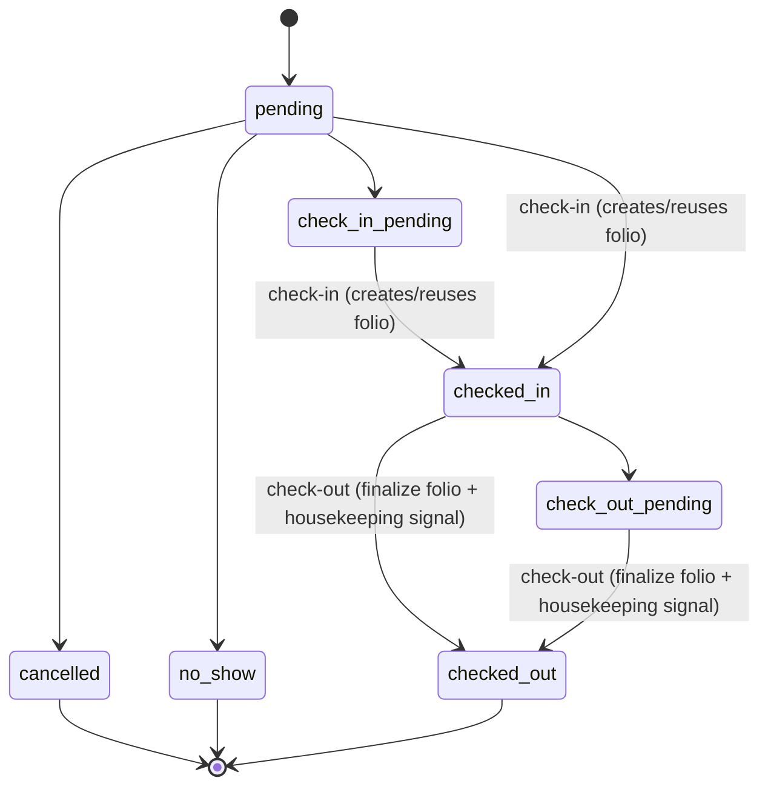

Check-out is rejected unless the reservation is in `checked_in` (or `check_out_pending`) — attempting from `pending`/`check_in_pending` returns a validation error (Req 4.7).

### Folio status

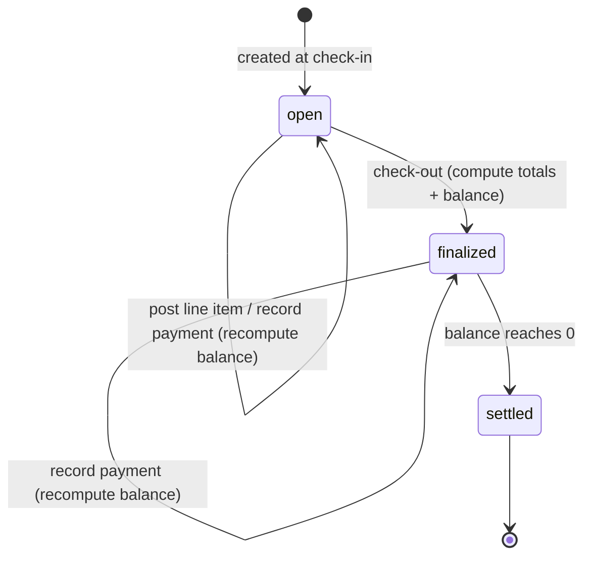

### Guest request status

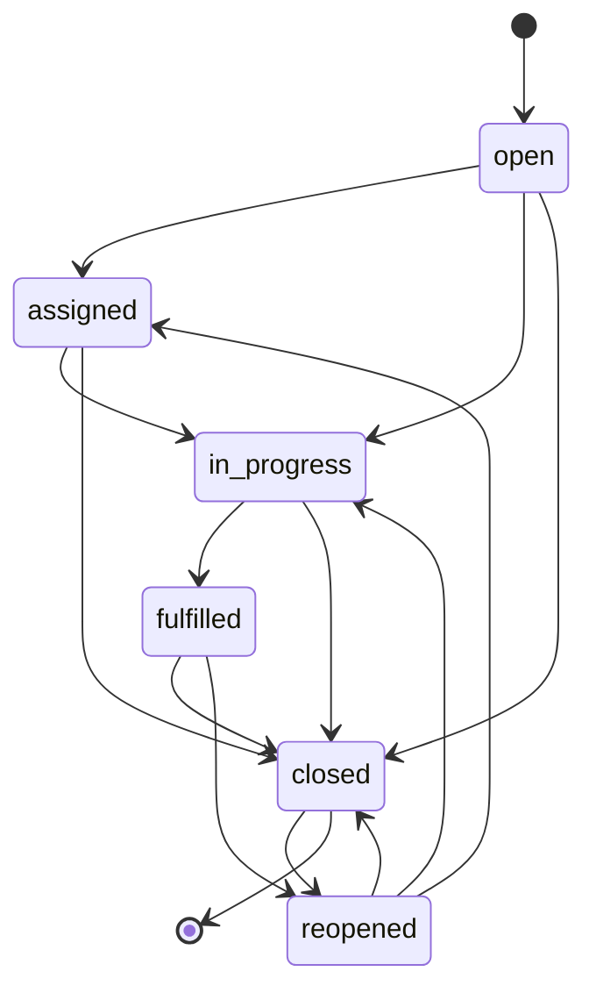

---

## Sequence Diagrams

### Stay Experience create

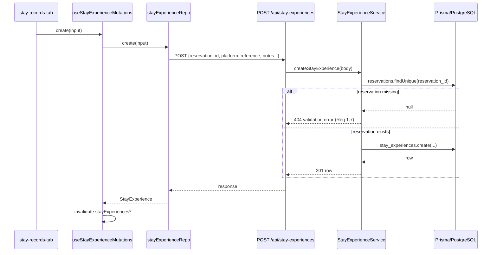

### Check-in (with folio create)

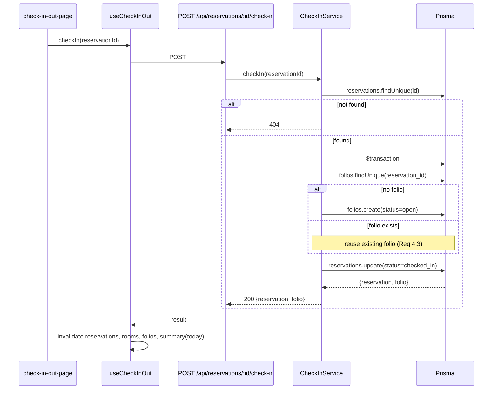

### Check-out (with folio finalize + housekeeping signal)

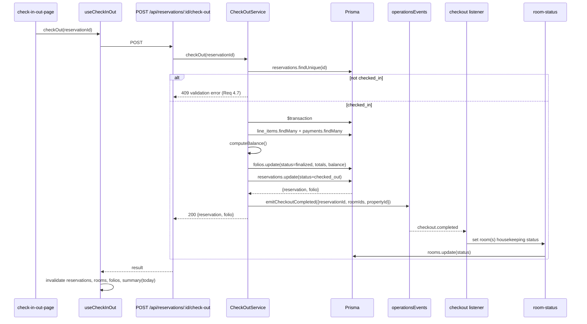

### Folio post charge

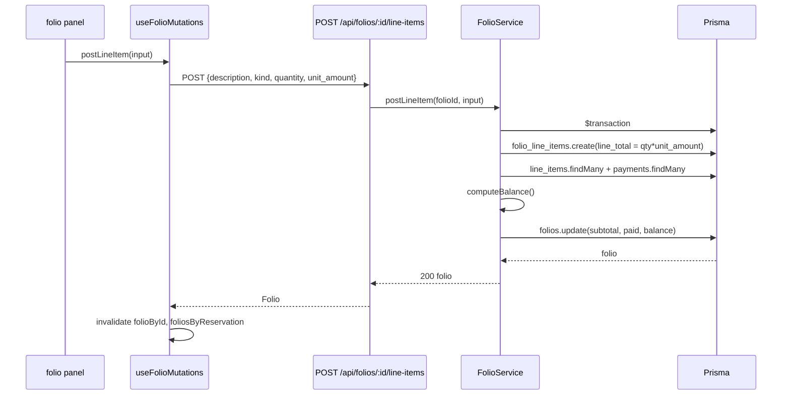

### Folio settle payment

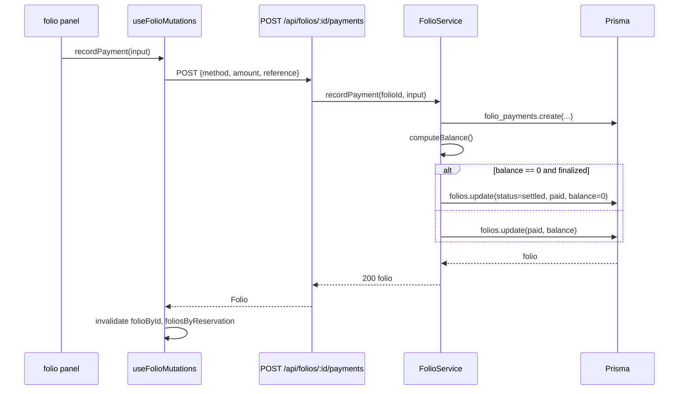

### New Event create

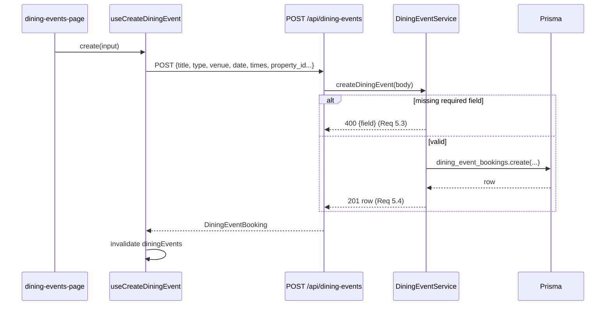

### Add Staff create

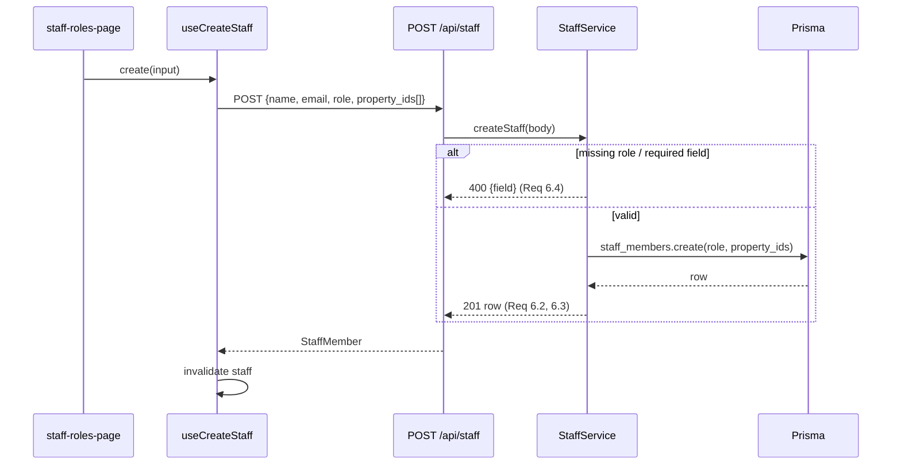

### Guest Request lifecycle

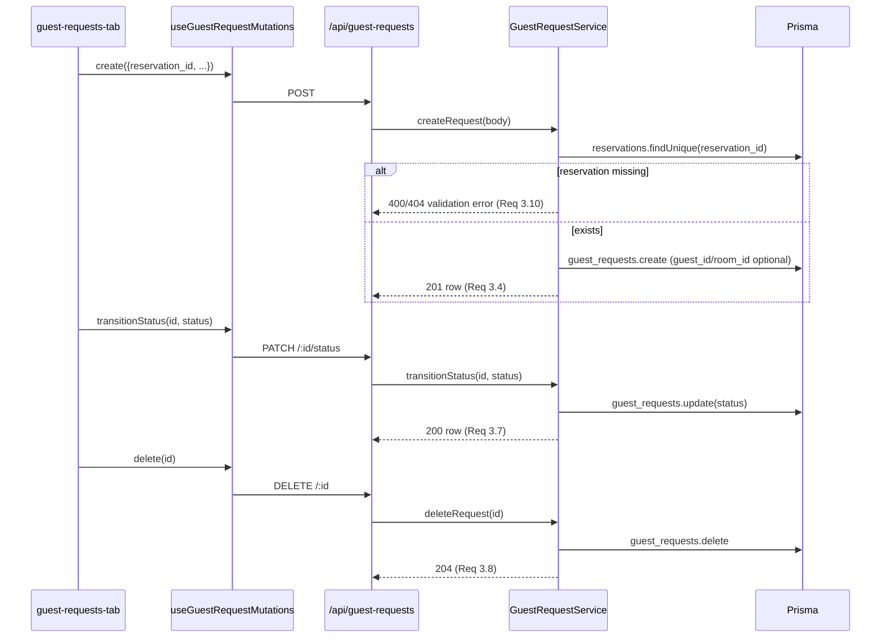

---

## Error Handling

- **Validation errors** return `400` with `{ error, errors: [{ field, message }] }`, matching the existing reservations endpoint convention.
- **Missing referenced entities** (e.g. `reservation_id` not found) return `404`/`400` with a field-scoped message (Req 1.7, 3.10, 5.3, 6.4).
- **Illegal lifecycle transitions** (check-out before check-in) return `409` (Req 4.7).
- **Mutations are transactional**: folio creation at check-in, folio finalization at check-out, and balance recomputation on line-item/payment changes run inside `$transaction` so reservation/folio state never diverges.
- **Event listener isolation**: the `checkout.completed` listener wraps its room-status update in try/catch and logs failures; a housekeeping-signal failure does not roll back the committed check-out (the signal is fire-and-forget after commit).
- **Frontend**: repository helpers already throw on non-OK responses; hooks surface errors through TanStack Query state for the presentation layer to render.

---

---

## Correctness Properties

*A property is a characteristic or behavior that should hold true across all valid executions of a system — a formal statement about what the system should do. Properties bridge the human-readable spec and machine-verifiable correctness guarantees. Each property below uses universal quantification and is derived from the prework classification.*

### Property 1: Stay-experience create requires an existing reservation

*For any* stay-experience create payload, if `reservation_id` does not resolve to an existing reservation, the service rejects it with a validation error (404) and persists no row; if it resolves, exactly one row is created and linked to that reservation.

**Validates: Requirements 1.7, 1.1**

### Property 2: Stay-experience preserves references and free-form content

*For any* valid stay-experience create payload, the persisted row echoes the supplied `reservation_id`, `channel_id`, and `external_ref_id` references unchanged, and stores `experience_notes` / `guest_request_content` byte-for-byte (including empty and unicode strings).

**Validates: Requirements 1.2, 1.3, 1.4, 1.5**

### Property 3: Stay Records grouping partitions without loss

*For any* set of stay-experience rows, grouping into short-term / long-term views yields disjoint groups whose union equals the input set (no row is dropped or duplicated).

**Validates: Requirements 2.1**

### Property 4: Guest request create is reservation-anchored with optional guest/room

*For any* guest-request create payload, the request succeeds only when `reservation_id` resolves to an existing reservation; `guest_id` and `room_id` may be null and the request still succeeds; an unresolved `reservation_id` is rejected with a field-scoped validation error.

**Validates: Requirements 3.2, 3.3, 3.4, 3.10**

### Property 5: Guest request status transitions obey the transition table

*For any* pair of (current status, target status), a transition succeeds if and only if the edge exists in the allowed transition table; rejected transitions leave the request unchanged.

**Validates: Requirements 3.7**

### Property 6: Check-in yields exactly one folio and a checked-in reservation

*For any* reservation, performing check-in one or more times results in exactly one folio for that reservation (created once, reused thereafter) and leaves the reservation in `checked_in`.

**Validates: Requirements 4.1, 4.2, 4.3, 7.2**

### Property 7: Check-out finalizes the folio and transitions the reservation

*For any* reservation in `checked_in` (or `check_out_pending`) with any set of line items and payments, check-out sets the folio to `finalized` with computed totals/balance and transitions the reservation to `checked_out`.

**Validates: Requirements 4.4, 4.5**

### Property 8: Check-out is rejected outside the checked-in lifecycle

*For any* reservation whose status is not `checked_in` (and not `check_out_pending`), check-out is rejected (409) and neither reservation nor folio state changes.

**Validates: Requirements 4.7**

### Property 9: Folio balance equals the derived ledger formula

*For any* sequence of line-item and payment mutations on a folio, after each mutation the persisted `balance_amount` equals `sum(charge line_totals) - sum(credit line_totals) - sum(payments)`, and `subtotal_amount` / `paid_amount` equal their respective sums.

**Validates: Requirements 7.5**

### Property 10: Settled folios stay settled at zero balance

*For any* finalized folio, once recorded payments bring the balance to zero the folio transitions to `settled`; no further automatic transition reduces it below `settled` while the balance remains zero.

**Validates: Requirements 7.1, 7.5**

### Property 11: Dining-event create validates required fields then persists

*For any* dining-event create payload missing a required field, the service rejects it (400) identifying the missing field; for any complete payload, exactly one booking is created and echoes the submitted values.

**Validates: Requirements 5.3, 5.4**

### Property 12: Staff create requires role and preserves assignment

*For any* staff create payload missing `role` (or another required field), the service rejects it (400) identifying the field; for any valid payload, the created staff member preserves `role` and the full `property_ids` array.

**Validates: Requirements 6.2, 6.3, 6.4**

### Property 13: Tax-export totals match folio line items with reservation fallback

*For any* reservation with a finalized folio, the exported tax items' totals equal the sum of that folio's `folio_line_items`; for any reservation without a folio, export falls back to the reservation-derived path and still produces items.

**Validates: Requirements 7.6**

---

## Testing Strategy

The pipeline uses a dual approach: **property-based tests** for the universal invariants above and **example/integration tests** for setup, side effects, and infrastructure that do not vary meaningfully with input.

### Property-based tests

- Cover Properties 1–13 above. Each property test runs a **minimum of 100 generated iterations**.
- Each test is tagged **Feature: operations-pipeline, Property {number}: {property_text}** and references the design property it validates.
- Services take Prisma by injection (`{ status, body }` return shape), so property tests run against an in-memory / mock Prisma double for speed and determinism; balance arithmetic (Property 9) and the guest-request transition table (Property 5) are pure and tested directly.
- Generators must exercise edge cases: empty and unicode strings (Property 2), null `guest_id`/`room_id` (Property 4), every reservation status (Properties 6–8), and random charge/credit/payment sequences including zero and large VND integers (Properties 9–10).

### Example-based unit tests

- Check-out side effect (Req 4.6): spy on `operationsEvents` and assert a single `checkout.completed` carrying the reservation's room ids; assert the listener's room-status update is isolated (a listener failure does not roll back the committed check-out).
- Contract reconciliation: `guestRequestRepo.update` must call `PATCH /api/guest-requests/:id` (the route is `PATCH`, not `PUT`).
- Folio settle edge: paying exactly the balance vs overpaying vs underpaying.

### Integration / smoke tests (NOT property-based)

- Additive-migration constraints (Req 1.8, 9.x): `db:validate` + `db:verify:migration` plus a migration diff review asserting only additive DDL and that `stay_registrations` / `guests` are untouched.
- Tax-export end-to-end (Req 7.6): 1–3 representative runs verifying folio-derived export and the reservation-derived fallback wire through the existing tax-export route/repository contract.
- Operations documentation (Req 8): file-presence check under `docs/`.

### Verification commands

- Frontend: `npm run typecheck` then `npm run build`.
- Backend: `cd backend && npm run build`; for schema work also `npm run db:generate`, `npm run db:validate`, `npm run db:verify:migration`.
