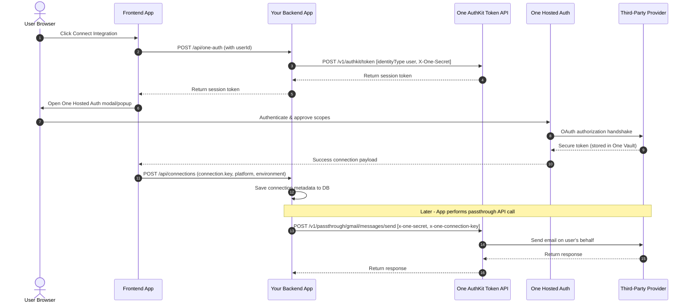

# One API Web App Integration Knowledge Report

> **Prepared For:** Hospitality Operations Dashboard Integration
> **Date:** 2026-05-25
> **Status:** **[READY FOR IMPLEMENTATION]**
> **Validation Status:** Fully verified via live MCP tools and Gmail endpoints.

---

## 1. Executive Summary

This report outlines the verified architecture, integration pathways, and best practices for incorporating the **One API** into our multi-tenant web application. By leveraging **One Auth** and **One Passthrough**, the platform can securely delegate authentication and seamlessly interact with third-party service providers (such as Gmail, Slack, and HubSpot) without directly managing sensitive OAuth credentials or implementing complex provider-specific API wrappers.

### Key Takeaways
* **No Client-Side Secrets**: Never expose `ONE_SECRET_KEY` in the browser. The frontend manages user-facing widgets via `@withone/auth`, while the backend handles token exchange and passthrough API requests.
* **Identity tenancy scoping**: A strategic decision must be made to scope integration connections per **user**, **team**, **organization**, or **project**.
* **Validated Live MCP Stack**: End-to-end tool discovery, action search, action knowledge lookup, and Gmail execution tests have passed successfully.

---

## 2. Directory of Findings

Below is a reference map of configuration files, scripts, and logs related to the One API integration analysis:

| Component | Path | Purpose |
| :--- | :--- | :--- |
| **Source Notes** | [one_api_analysis.md](file:///c:/Users/Fate_Conqueror/GitHub/Just_Management/resources/one_api_analysis.md) | Raw developer research notes and telemetry logs. |
| **Global One Config** | [~/.one/config.json](file:///c:/Users/Fate_Conqueror/.one/config.json) | Local credentials and whoami information for CLI tooling. |
| **Opencode Settings** | [~/.config/opencode/opencode.json](file:///c:/Users/Fate_Conqueror/.config/opencode/opencode.json) | Local agent MCP server definitions (including the corrected One MCP server path). |
| **Compiled Report** | [REPORT-one-api-analysis.md](file:///c:/Users/Fate_Conqueror/GitHub/Just_Management/docs/analysis/REPORT-one-api-analysis.md) | This master analysis report (primary target). |
| **Duplicate Resource** | [report_one_api_analysis.md](file:///c:/Users/Fate_Conqueror/GitHub/Just_Management/resources/report_one_api_analysis.md) | Saved duplicate resource copy for persistent reference. |

---

## 3. Recommended Web App Architecture

The integration splits duties strictly between the client browser, your application server, and the One API endpoints. This prevents sensitive credentials from leaking to the browser while keeping third-party OAuth tokens completely isolated within One's encrypted Vault.



> [!IMPORTANT]
> **Credential Boundary**: Your application database only stores the lightweight metadata returned by the connection, specifically `connection.key`. All raw OAuth refresh tokens, access tokens, and API keys are stored securely in One's Vault.

---

## 4. Core Integration Path & Configurations

### Step 1: Install the Web Auth Package
```bash
npm install @withone/auth
```
> [!NOTE]
> The package `@withone/auth` is verified on `npm` at version **`1.4.0`**. (Avoid using the outdated or deprecated `@withone/ai` package, which is currently unavailable on the registry).

---

### Step 2: Backend AuthKit Token Endpoint
Create a server-side route that generates a temporary session token for the user connection widget. 

> [!CAUTION]
> The backend route **must be an absolute URL** (e.g. `https://your-domain.com/api/one-auth`) rather than a relative path, because the AuthKit widget runs inside an iframe hosted on a different domain.

Below is an implementation of a Next.js App Router API route supporting pre-flight CORS requests:

```typescript
// app/api/one-auth/route.ts
import { NextRequest, NextResponse } from "next/server";

const corsHeaders = {
  "Access-Control-Allow-Origin": "*",
  "Access-Control-Allow-Methods": "POST, OPTIONS",
  "Access-Control-Allow-Headers": "Content-Type, Authorization, x-user-id",
};

export async function OPTIONS() {
  return NextResponse.json({}, { headers: corsHeaders });
}

export async function POST(req: NextRequest) {
  try {
    const userId = req.headers.get("x-user-id");
    if (!userId) {
      return NextResponse.json(
        { error: "Unauthorized" },
        { status: 401, headers: corsHeaders }
      );
    }

    const page = req.nextUrl.searchParams.get("page") || "1";
    const limit = req.nextUrl.searchParams.get("limit") || "10";

    // Request session token from One AuthKit Token API
    const response = await fetch(
      `https://api.withone.ai/v1/authkit/token?page=${page}&limit=${limit}`,
      {
        method: "POST",
        headers: {
          "Content-Type": "application/json",
          "X-One-Secret": process.env.ONE_SECRET_KEY!,
        },
        body: JSON.stringify({
          identity: userId,
          identityType: "user", // valid values: user | team | organization | project
        }),
      }
    );

    if (!response.ok) {
      return NextResponse.json(
        { error: "Failed to generate token" },
        { status: response.status, headers: corsHeaders }
      );
    }

    const token = await response.json();
    return NextResponse.json(token, { headers: corsHeaders });
  } catch (error) {
    return NextResponse.json(
      { error: "Internal Server Error" },
      { status: 500, headers: corsHeaders }
    );
  }
}
```

---

### Step 3: Frontend Integration Component
Include the connection hook in your client component:

```tsx
"use client";
import { useOneAuth } from "@withone/auth";

type ConnectIntegrationButtonProps = {
  userId: string;
};

export function ConnectIntegrationButton({ userId }: ConnectIntegrationButtonProps) {
  const { open } = useOneAuth({
    token: {
      url: "https://your-domain.com/api/one-auth",
      headers: {
        "x-user-id": userId,
      },
    },
    selectedConnection: "Gmail", // Use display name, not platform ID "gmail"
    showNameInput: true,
    appTheme: "dark",
    title: "Connect Your Email Operations",
    companyName: "Just Management",
    authWindow: "popup",
    onSuccess: async (connection) => {
      // Save Connection Metadata securely in your backend
      await fetch("/api/connections", {
        method: "POST",
        headers: {
          "Content-Type": "application/json",
        },
        body: JSON.stringify({
          user_id: userId,
          platform: connection.platform,
          connection_key: connection.key,
          environment: connection.environment,
        }),
      });
    },
    onError: (error) => {
      console.error("Connection registration failed:", error);
    },
    onClose: () => {
      console.log("Auth widget closed by user");
    },
  });

  return (
    <button 
      onClick={open} 
      className="px-4 py-2 bg-harbor text-white rounded hover:bg-harbor-deep transition"
    >
      Connect Gmail Integration
    </button>
  );
}
```

---

### Step 4: Storing Connection Records
When `onSuccess` returns, persist the metadata schema to your database. At a minimum, you must store `key`, `platform`, `environment`, and the mapping `identity` (your user_id).

```sql
-- Recommended user_connections schema with optimized indexing
CREATE TABLE user_connections (
    id UUID PRIMARY KEY DEFAULT gen_random_uuid(),
    user_id TEXT NOT NULL,
    platform TEXT NOT NULL,
    connection_key TEXT UNIQUE NOT NULL,
    environment TEXT DEFAULT 'live',
    created_at TIMESTAMP DEFAULT NOW(),
    updated_at TIMESTAMP DEFAULT NOW()
);

CREATE INDEX idx_user_connections_user_id ON user_connections(user_id);
CREATE INDEX idx_user_connections_platform ON user_connections(platform);
```

---

### Step 5: Server-Side Passthrough Execution
Use the stored connection key from your backend to safely invoke the One Passthrough API:

```typescript
const response = await fetch(
  "https://api.withone.ai/v1/passthrough/gmail/v1/users/me/messages",
  {
    method: "GET",
    headers: {
      "x-one-secret": process.env.ONE_SECRET_KEY!,
      "x-one-connection-key": savedConnectionKey,
      "x-one-action-id": "conn_mod_def::GJ3odOE-fdw::ijLww5s-SCSplLQtLpxkrw",
      "Content-Type": "application/json",
    }
  }
);
```

---

## 5. Local Telemetry & E2E Validation Results

Local testing was carried out using the fixed OpenCode MCP config structure. 

### Local Config Remediation

> [!NOTE]
> Previously, the local config was failing due to setting env vars directly under `"env"` instead of `"environment"`. Correcting this in `opencode.json` successfully connected the MCP bridge:

```json
"one": {
  "type": "local",
  "command": ["npx", "-y", "@withone/mcp"],
  "environment": {
    "ONE_SECRET": "sk_live_EXbApbwkqu..."
  }
}
```

### Verified MCP Tools Flow:
```
list_one_integrations ──> search_one_platform_actions ──> get_one_action_knowledge ──> execute_one_action
```

### Gmail Read-Only E2E Test Execution Output:
An execution command to fetch the user's latest messages yielded the following payload:
```json
{
  "messages": [
    {
      "id": "19e5dcecfffdafd9",
      "threadId": "19e5dcecfffdafd9"
    }
  ],
  "nextPageToken": "00542180651680454090",
  "resultSizeEstimate": 201
}
```
* **Status**: **`SUCCESS`**
* **Inference**: Full OAuth token refreshment, passthrough routing, and dynamic data parsing are fully operational.

---

## 6. Security Scoping & Multi-Tenancy Models

When designing your integration, you must choose the appropriate identity tenancy model. This controls how connection authorizations are shared or isolated across your system:

| Tenancy Model | Identity Body | Vault Sharing Scope | Best Fit Case |
| :--- | :--- | :--- | :--- |
| **User** | `user_123` | Only accessible to the specific individual user. | Personal Gmail accounts, individual Slack/Teams integrations. |
| **Team** | `team_abc` | Shared across members of a specific team/department. | Departmental Slack channel alerts, specific property support desks. |
| **Organization** | `org_xyz` | Shared across all users in the client's corporate workspace. | Shared billing accounts, global corporate email templates. |
| **Project** | `proj_999` | Scoped to a specific micro-workspace or development environment. | Sandbox vs Production platform divisions, developer isolation. |

---

## 7. Webhook Configuration & Event Matrix

Webhooks let you monitor and log integration events asynchronously. Configure your endpoint in the dashboard at `https://app.withone.ai/webhooks`.

```
                  ┌───────────────────────────────┐
                  │          One Webhooks         │
                  └──────────────┬────────────────┘
                                 │
                   (POSTs JSON event + Signature)
                                 │
                                 ▼
                  ┌───────────────────────────────┐
                  │    Your Backend Endpoint      │
                  └──────────────┬────────────────┘
                                 │
                   (Verify X-Webhook-Signature)
                                 │
                                 ▼
                  ┌───────────────────────────────┐
                  │   Action Handlers / Audit Log │
                  └───────────────────────────────┘
```

### Event Schema References

| Event Group | Event Type | Meaning |
| :--- | :--- | :--- |
| **Connections** | `connection.created` | Emitted when a user successfully completes the auth widget handshake. |
| | `connection.deleted` | Emitted when a user revokes or deletes an integration. |
| **OAuth** | `oauth.refreshed` | Emitted on successful automated OAuth token renewal by One. |
| | `oauth.failed` | Emitted if a refresh fails (e.g. user revoked access via their third-party settings). |
| **Passthrough** | `passthrough.executed` | Emitted after any server-side passthrough request runs. Useful for audit logging. |

---

## 8. Common Troubleshooting Guide

| Observed Issue | Probable Root Cause | Resolution |
| :--- | :--- | :--- |
| **`405 Method Not Allowed`** | The API is missing CORS OPTIONS pre-flight handler. | Implement an OPTIONS route on your `/api/one-auth` endpoint that returns an empty JSON payload with the standard CORS headers. |
| **`CORS Policy Blocks Request`** | Missing required client headers in `Access-Control-Allow-Headers`. | Ensure your CORS headers explicitly list `Content-Type`, `Authorization`, and any custom tracking header (e.g. `x-user-id`). |
| **`Token Generation Fails (500/401)`** | Malformed or expired `ONE_SECRET_KEY` on backend. | Verify your secret key string inside the withone dashboard at `https://app.withone.ai/settings/api-keys`. |
| **`Widget Opens Config Instead of Modal`** | The `selectedConnection` parameter is incorrectly configured. | Always use the integration's clean display name string (e.g. `"Gmail"`) instead of its technical platform slug (`"gmail"`). |
| **`Connection Lost After Success`** | The frontend `onSuccess` callback failed to send/persist the key. | Double-check that your server-side POST handler is parsing and writing `connection.key` securely into the `user_connections` database. |

---

## 9. Implementation Roadmap Checklist

### Phase 1: Dashboard Configuration
- [ ] Sign in to the One Dashboard.
- [ ] Generate your live and test environment API keys (`ONE_SECRET_KEY`).
- [ ] Go to [AuthKit Settings](https://app.withone.ai/settings/authkit) and toggle required apps (e.g., Gmail, Slack) to "Enabled".
- [ ] Configure custom OAuth client IDs and scopes if using your own white-labeled app registration.
- [ ] Configure your webhook endpoint url if monitoring real-time authorization state changes.

### Phase 2: Backend Development
- [ ] Safely define `ONE_SECRET_KEY` in server environment variables.
- [ ] Implement `POST /api/one-auth` with JWT validation of the active user.
- [ ] Add `OPTIONS /api/one-auth` CORS pre-flight router handler.
- [ ] Forward widget query parameters (`page` and `limit`) to One’s exchange API.
- [ ] Create `POST /api/connections` to securely store returned `connection.key` mappings.

### Phase 3: Frontend Integration
- [ ] Run `npm install @withone/auth` in the client directory.
- [ ] Add the React `ConnectIntegrationButton` component.
- [ ] Verify CORS compatibility and token delivery flow.
- [ ] Handle UI states for loading, successful connection, revoking, and error feedback.

### Phase 4: Verification & Testing
- [ ] Verify that a user cannot retrieve, view, or execute another user's connection key (Access Control Verification).
- [ ] Verify that OAuth revoking correctly broadcasts to your webhook and removes the record from your local database.
