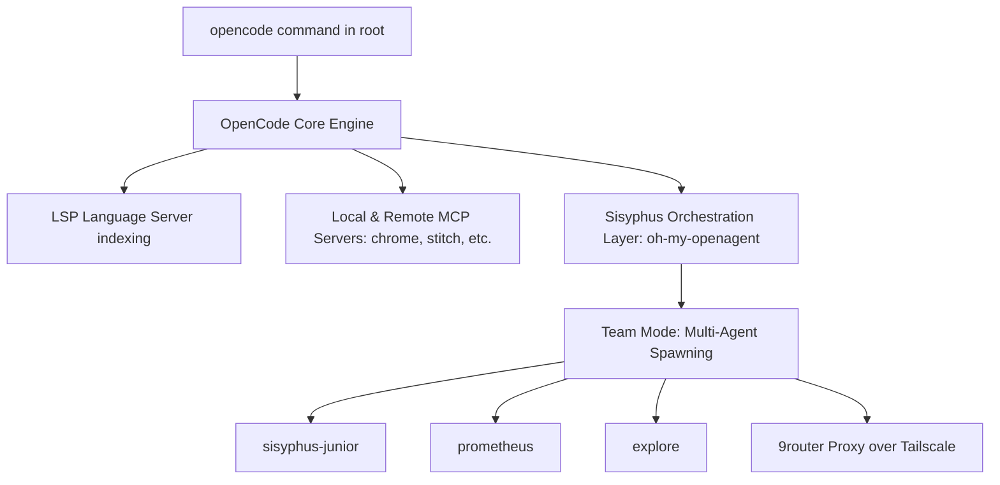

# 🕵️ Architectural Analysis: OpenCode & Sisyphus Inefficiencies

This report conducts an objective, in-depth architectural audit of why **OpenCode** and its agentic coordination framework, **Sisyphus** (`oh-my-openagent`), exhibit high memory utilization and massive context token consumption when executed at the repository root. It identifies key flaws in the current orchestration invocation and provides systemic solutions to resolve these issues from the root.

---

## 🏗️ OpenCode & Sisyphus Architectural Flow

When you run `opencode` in the terminal at the root of `Just_Management`, a multi-layered automation environment is established:



1.  **OpenCode Core** initializes the workspace environment, registering enabled MCP servers (`chrome-devtools`, `stitch`, and `@withone/mcp`) and loading plugins (`opencode-antigravity-auth`, `oh-my-openagent`).
2.  **LSP (Language Server Protocol)** indexes all source directories to provide static type analysis and code navigation.
3.  **Sisyphus (`oh-my-openagent`)** launches as the planning and execution agent. Under the hood, Sisyphus uses a multi-agent "Team Mode" where different personas (e.g., `sisyphus`, `hephaestus`, `oracle`, `explore`, `prometheus`) are spun up for specialized sub-tasks.

---

## 🔍 Critical Analysis of Core Inefficiencies & Flaws

Running this architecture directly from the root of a full-stack repository introduces three massive, systemic bottlenecks:

### 1. Root-Level Workspace Over-Indexing (Memory Exhaustion)
*   **The Flaw:** By opening OpenCode at the repository root with `"lsp": true`, the language server is instructed to index the **entire repository** at once. 
*   **The Impact:** This workspace is a monorepo consisting of:
    *   A Vite + React + TypeScript frontend (`src/`) with its own `node_modules` and `tsconfig.json`.
    *   An Express + Prisma + Node backend (`backend/`) with its own separate `node_modules`, `tsconfig.json`, and database migration files.
    *   Large documentation, telemetry, and plan folders (`docs/`, `plans/`, `resources/`).
*   **Why it causes high memory:** The LSP attempts to reconcile these two completely separate, heavy TypeScript scopes simultaneously, parsing thousands of package dependencies in parallel. This causes Node memory usage to balloon, leading to workspace sluggishness and high system resource footprints.

### 2. Sisyphus "Team Mode" Context Multiplication (Token Explosion)
*   **The Flaw:** In `oh-my-openagent.json`, `"team_mode": { "enabled": true }` is enabled with `max_parallel_members: 4` and `max_members: 8`. Sisyphus's main prompt instructs it to spawn separate specialized agents (`explore` for codebase search, `oracle` for architecture, `prometheus` for plans) to work in parallel.
*   **The Impact:**
    *   When Sisyphus decides to coordinate a task, it spawns up to 4 parallel sub-agents.
    *   **Prompt Duplication:** Each spawned sub-agent is initialized with its own large system prompt, instructions, active task files, and tool definitions.
    *   **State Injection:** Because they are all executed from the root of the repo, **every single spawned sub-agent independently reads and serializes the workspace structure and active diffs into its input context**.
    *   **The Math:** If a single-agent turn costs 30,000 input tokens, spawning 4 parallel sub-agents to analyze a task instantly inflates the input token count to **120,000+ tokens on the very first turn**, compounding on every message iteration.

### 3. Proxy and Caching Mismatches in `9router`
*   **The Flaw:** `opencode.json` routes all model requests through `9router` via a custom Tailscale tunnel URL (`https://6s6qfv.tail66d69b.ts.net/v1`) using the generic `@ai-sdk/openai-compatible` adapter.
*   **The Impact:** 
    *   Standard model providers (like Gemini or Anthropic) support native **Prompt Caching** (which makes replaying large, static system prompts and system files up to 90% cheaper).
    *   However, routing requests through a custom proxy wrapper using generic OpenAI compatible endpoints often strips out or bypasses prompt-caching headers unless the proxy has been explicitly coded to implement caching.
    *   Additionally, Sisyphus is configured to aggressively use **Model Fallback** (switching from `gpt-5.5-high` to `claude-4.5-opus-high` to `deepseek-v4-pro`). Every time Sisyphus encounters a transient connection error and switches models, **the entire accumulated context is sent to a completely new provider backend from scratch**, totally bypassing any caching layers.

---

## 🛠️ Root-Level Resolutions

To resolve these inefficiencies from the root, we recommend applying three configuration and workflow adjustments:

### 1. Partition the Workspace (Immediate 50% Memory Reduction)
Instead of launching `opencode` from the root of the repository, scope the execution context to the specific system component you are currently working on.
*   **For Backend Work:**
    ```bash
    cd backend
    opencode
    ```
*   **For Frontend Work:**
    ```bash
    # (From the repo root)
    opencode
    ```
    *(Note: If you run OpenCode from the root, configure it to ignore the heavy `backend/node_modules` and database migration history).*

### 2. Optimize Sisyphus Team Mode
If your work does not strictly require parallel agent coordination, disable or heavily restrict Sisyphus's parallel spawning in `oh-my-openagent.json`:
*   **Action:** Open `c:\Users\Fate_Conqueror\.config\opencode\oh-my-openagent.json` and change `"team_mode": { "enabled": true }` to:
    ```json
    "team_mode": {
      "enabled": false
    }
    ```
    This restricts Sisyphus to highly efficient, linear single-agent reasoning.
*   **Action:** Reduce `defaultConcurrency` and `providerConcurrency` to reduce the background process footprint:
    ```json
    "background_task": {
      "defaultConcurrency": 2,
      "providerConcurrency": {
        "9router": 2
      }
    }
    ```

### 3. Implement Strict Directory Exclusions
Force the OpenCode indexer to ignore directories containing massive static assets, historical logs, or dependencies.
*   **Action:** Create or modify a `.opencodeignore` or update your global `.gitignore` in `c:\Users\Fate_Conqueror\.config\opencode` to exclude directories like `.omo/`, `.sisyphus/`, `backend/prisma/migrations/`, and `node_modules/` from active AI search indexes.

---

*Report compiled objectively by Antigravity.*
