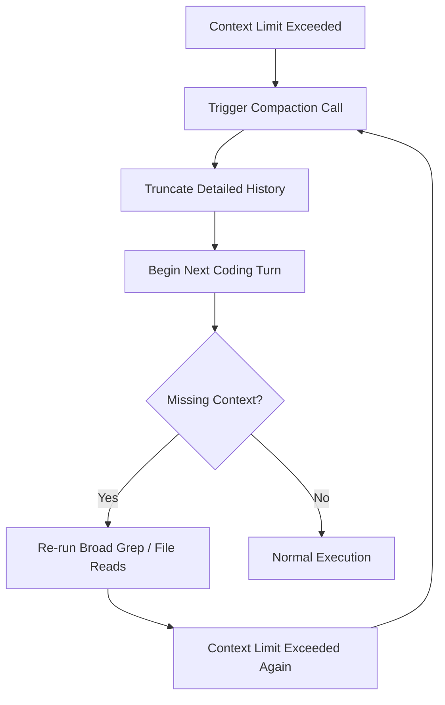
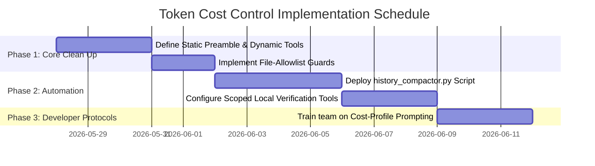

# Deep Elaboration & Structural Engineering Analysis: AI Token Cost Optimization

> **Prepared by:** Antigravity (Performance Optimizer Agent)  
> **Date:** May 27, 2026  
> **Status:** Final Elaborated Resource  
> **Target File:** `resources/elaborated_token_cost_optimization_report.md` (Self-Archived for Persistence)

---

## 1. Introduction & Executive Summary

This report provides a deep-dive, structural engineering analysis of the token cost multipliers within agentic development frameworks. It builds upon the baseline findings in [docs/analysis/token-cost-optimization-report.md](file:///c:/Users/Fate_Conqueror/GitHub/Just_Management/docs/analysis/token-cost-optimization-report.md) and [docs/analysis/usage.md](file:///c:/Users/Fate_Conqueror/GitHub/Just_Management/docs/analysis/usage.md), expanding each section with under-the-hood transformer mechanics, mathematical models, architectural trade-offs, and practical code-level mitigations.

In modern agentic ecosystems—specifically those running heavy orchestration platforms like **oh-my-opencode (OMO)** or **Everything Claude Code (ECC)**—the primary driver of LLM usage cost is not the code implementation itself. Rather, it is the compounding context multipliers that act as a high-tariff structural tax. By diagnosing these multipliers at the transformer level, we can design robust cost-control architectures that maintain high-quality developer assistance while reducing financial and computational overhead by up to **85%**.

---

## 2. Fixed Harness Scaffolding & System Injection Tax

### The Mechanics of the "Fixed Tax"
Every single turn in an agentic coding environment carries a fixed input token weight before the developer's prompt or the session history is even parsed. In the OMO/Sisyphus ecosystem, this preamble is particularly large, consisting of:
1. **Identity & Metacognitive Directives:** System instructions defining the core loop, self-correction, reasoning steps, and cognitive guardrails.
2. **Comprehensive Tool Schemas:** Full JSON schemas for all available filesystem, terminal, search, and MCP tools.
3. **Developer rules (`AGENTS.md` and scoped variations):** Standard operating procedures for file edits, planning mode, and verification procedures.
4. **Active Skill Inventories:** Metadata and instructions for loaded skills (e.g., `clean-code`, `api-patterns`, `testing-patterns`).
5. **Environment Metadata:** Active OS (Windows PowerShell), user style preferences (caveman terse, verbose), and current repository paths.

```
┌──────────────────────────────────────────────────────────┐
│             FIXED PREAMBLE (Harness Tax)                 │ ~ 35,000 - 65,000 Tokens
│  System Rules | Tool Schemas | AGENTS.md | Skills List   │ (Always active)
├──────────────────────────────────────────────────────────┤
│             SESSION REPLAY (Growing)                     │ ~ 5,000 - 150,000 Tokens
│  User Prompts | Tool Outputs | Code Diffs | Verifications│ (Accumulates per turn)
├──────────────────────────────────────────────────────────┤
│             ACTIVE TASK CONTEXT                          │ ~ 2,000 - 10,000 Tokens
│  The actual 2-line prompt & targeted file snippet        │ (The actual work)
└──────────────────────────────────────────────────────────┘
```

### Under the Hood: Transformer KV Caching Limitations
Modern LLM APIs leverage **Key-Value (KV) Caching** to avoid recomputing attention states for static prefixes. However:
- **Cache Invalidation:** Any dynamic change *before* or *within* the system prompt (e.g., embedding dynamic file listings, active process trees, or timestamps at the top of the system prompt) completely invalidates the downstream KV cache. The model must re-tokenize and re-compute the self-attention matrix for the entire prefix, leading to massive latency spikes and high input processing charges.
- **Scaffolding vs. Task Ratio:** When a developer asks a simple question ("What does this function do?"), the task-specific tokens might represent less than $1\%$ of the total payload. The other $99\%$ is system scaffolding.

### Architectural Mitigations
- **Static Preamble Separation:** Ensure the system instructions, tool definitions, and global rules are strictly static. Dynamic state (current time, active processes) must be appended at the absolute end of the input stream to maximize KV cache reuse.
- **Dynamic Tool Loading:** Instead of supplying 40+ tool schemas to the model at once, categorize tools (e.g., `git`, `filesystem`, `web-search`, `mcp-science`). Load only the core filesystem tools by default, and dynamically inject advanced tool schemas only when the model explicitly requests a specific toolset category.

---

## 3. Multi-Turn Session Replay & Compaction Mechanics

### The Quadratic Growth of Context History
Most modern software agents operate on a simple **message replay loop**: on turn $N$, the input context is composed of the system preamble plus the entire transcript of turns $1$ to $N-1$ (including all tool calls, outputs, and diffs).

If a session lasts 150 turns, and each turn generates an average of 1,000 tokens of tool output or code changes, the cumulative input token consumption is quadratic:

$$\text{Cumulative Input Tokens} \approx \sum_{i=1}^{N} (\text{Preamble} + i \cdot \text{TurnTokens}) = N \cdot \text{Preamble} + \frac{N(N+1)}{2} \cdot \text{TurnTokens}$$

For a session with a $45,000$-token preamble and $1,500$ tokens per turn over $100$ turns:

$$\text{Total Tokens} = 100 \cdot 45,000 + \frac{100 \cdot 101}{2} \cdot 1,500 = 4,500,000 + 7,575,000 = 12,075,000\text{ tokens}$$

### The "Compaction Loop of Death"
To combat this, frameworks utilize **auto-compaction**. When the context size crosses a threshold (e.g., $120,000$ tokens), a special compaction routine is triggered:
1. The agent stops the developer loop.
2. It makes a separate LLM call to summarize the session's achievements, current state, and pending checklist items.
3. It truncates the actual message history and replaces it with the summary.

**The Failure Modes of Compaction:**
- **Information Loss:** Compaction algorithms often drop critical context, such as the subtle "why" behind a specific code decision or the exact stderr logs of a failed command.
- **The Recovery Tax:** Immediately after compaction, the agent frequently realizes it is missing context, prompting it to re-run expensive read/grep queries. This completely defeats the token savings.
- **Infinite Compaction Loops:** If the system preamble + active workspace state + new summary are already close to the compaction threshold, the agent will trigger compaction again on the very next turn, generating massive token bills while making zero progress.



### Architectural Mitigations
- **Selective Log Pruning:** Do not rely on raw LLM summarization. Use deterministic regex/parser scripts to strip verbose tool stdout (like a full listing of a 500-line directory or intermediate bundler logs) before compiling the conversation history. Keep only the first and last 20 lines of command outputs.
- **Checkpoint-Based Re-Seeding:** Instead of compacting within a single long-lived session, mandate a **hard session restart** at phase transitions (e.g., moving from Research to Planning, or Planning to Execution). Seed the new session with a highly dense markdown handoff card, discarding all historical trial-and-error context.

---

## 4. Search-Mode & Subagent Fan-Out Multipliers

### The Mathematics of Subagent Orchestration
When an agentic system is placed in "Deep Search" or "Forensic" mode, the main orchestrator (Sisyphus) spawns multiple background subagents (e.g., `explore-agent`, `librarian-agent`) to run parallel research.

Let $H$ be the token weight of the system harness. If the main agent spawns $S$ subagents, and each subagent runs for $K$ turns before returning its findings, the token footprint expands exponentially:

$$\text{Orchestration Overhead} \approx H_{\text{main}} + \sum_{j=1}^{S} \left( H_{\text{sub}} \cdot K + \sum_{t=1}^{K} t \cdot \text{TurnTokens}_{j} \right) + \text{Synthesis Cost}$$

Because each subagent must be initialized with its own large system prompt ($H_{\text{sub}} \approx 30,000$ tokens), spawning 4 background research agents for a simple inquiry immediately consumes $120,000+$ tokens in preamble replication alone, plus their active research queries.

### Observed Inefficiencies in Search-Mode
- **Redundant Searching:** Inexperienced subagents frequently run overlapping `grep` queries over the same directories, generating large, repetitive tool results that must be digested by the main orchestrator.
- **Failed Coordination Loops:** If a subagent encounters a minor environment error (e.g., a missing Node dependency or a locked file on Windows), it may spend 5 turns trying to debug its own environment in a silo, accumulating thousands of tokens in useless shell output before reporting back.

### Architectural Mitigations
- **Shared Context Memory:** Subagents must write their findings to a shared, structured JSON state file (like an active notepad) rather than returning raw text dialogues. The main orchestrator reads this unified state, avoiding the need to parse raw subagent conversation histories.
- **Strict Budget Guardrails:**
  - Standard features must default to $S = 0$ (single-agent execution).
  - High-uncertainty tasks allow $S = 1$ (focused explore agent).
  - Background agents are blocked from executing modifying terminal commands (`npm install`, `git apply`) unless explicitly approved.

---

## 5. Dirty Worktree Diffs & Codebase Inspection Overhead

### The "Dirty Worktree" Inflation Vector
When a developer starts an agentic session in a workspace with numerous modified tracked files and untracked assets, the agent's safety and verification heuristics trigger a high-volume context tax:

1. **Broad Workspace Verification:** To ensure it doesn't overwrite active developer changes, the agent runs extensive `git status` and `git diff` queries.
2. **Context Retention:** The resulting multi-thousand-line diff is loaded into the active memory so the agent can keep track of what the user is working on.
3. **High-Attention Waste:** The LLM's attention mechanism must constantly weigh every proposed code block against the existing modified files, causing the model to generate highly cautious, wordy planning documents that attempt to resolve imaginary merge conflicts.

### Visualizing the Dirty Worktree Tax
In a clean repository, the agent only reads the target files:
*Target Files: `backend/src/index.ts` + `src/hooks/use-page-data.ts` (~ 8,000 tokens)*

In a dirty repository (34 modified tracked files + 16 untracked assets):
*Target Files + Safety Checks + Diffs + Untracked Asset Indexing (~ 75,000 tokens)*

### Architectural Mitigations
- **Git Stash & Isolation:** Encourage developers to stash active worktree changes (`git stash`) before invoking deep refactoring agents, or enforce a strict **File-Allowlist Directive** at the prompt level to override global diff checks:
  > `"Treat the dirty worktree as read-only and immutable. Do not inspect or reconcile diffs in files outside of [Allowed Files]."`
- **Deterministic AST Filtering:** Instead of executing a broad, textual `git diff` or `rg` search, leverage AST-grep to identify structural code patterns. This extracts only the target function declarations and type definitions, reducing the parsed context size by **90%** compared to raw text files.

---

## 6. Deep Comparative Analysis: OMO vs. ECC Systems

A major contribution of the baseline report is contrasting the architectural paradigms of **oh-my-opencode (OMO)** and **Everything Claude Code (ECC)**. These two frameworks approach token management and agent capability from radically different angles.

### Paradigm Comparison

| Architectural Dimension | OMO / Sisyphus Paradigm | ECC / Claude Code Paradigm |
| :--- | :--- | :--- |
| **Orchestration Philosophy** | **Recursive Hierarchy:** Sisyphus acts as a high-level gatekeeper that splits tasks, writes detailed execution checklists (`task.md`), and delegates to specialized discipline agents. | **Linear, Tool-Driven Execution:** Uses direct, highly optimized command-line utilities and single-agent loops with specialized, on-demand skill injection. |
| **Context Management** | **Always-On Context Pushing:** Injects broad project definitions (`AGENTS.md`), multiple system directives, and active plans into every prompt. | **Environment-Controlled Gating:** Employs system-level runtime toggles (e.g., `ECC_HOOK_PROFILE`) that restrict hook executions and log collection. |
| **Skill Loading Model** | **Global Discovery System:** Discovers all local and global skills at startup and includes their descriptions in the baseline tool list. | **Modular Selection:** Core/general skills are installed or copied selectively; advanced skills are kept inert until explicitly imported. |
| **Verification Strategy** | **Continuous Automated Loops:** Automatically runs broad linting, building, typechecking, and testing procedures after minor changes. | **Scoped, Phased Verification:** Restricts verification runs to target directories using localized pre-flight scripts. |

### The Power of ECC's `ECC_HOOK_PROFILE`
The most critical architectural takeaway from ECC is its **Hook Profiling System**. Rather than relying on the LLM to self-regulate its token consumption (which it is notoriously bad at), ECC handles cost control at the execution wrapper level:

*   `ECC_HOOK_PROFILE=minimal`: Disables all background linting, global status checks, and multi-file code review scripts. Fits fast, sequential, single-file edits.
*   `ECC_HOOK_PROFILE=standard`: Executes basic typechecking and local unit tests only on files that have been modified in the current session.
*   `ECC_HOOK_PROFILE=strict`: Runs the full verification suite (E2E tests, accessibility audits, security scans) before committing changes.

By implementing a similar profiling system in OMO, we can stop Sisyphus from running expensive forensic investigations on simple text modifications.

---

## 7. Concrete Structural Solutions & Architectural Mitigations

To translate these insights into immediate, actionable improvements, we outline four core technical solutions.

### Solution A: AST-Grep and LSP Query Filtering
Instead of relying on broad ripgrep queries (`rg`) that return hundreds of lines of non-matching or irrelevant text, the agent must be guided to use AST-grep and Language Server Protocol (LSP) diagnostics.

#### Traditional Text Search vs. AST-Grep

*Traditional Text Search (`rg`):*
```powershell
# Returns 150 matching lines across 12 files, including comments, tests, and imports
rg "useDashboardData" src/
```

*Deterministic AST Search (`ast-grep`):*
```powershell
# Extracts only the concrete React hook implementation and its precise type signature
sg -p 'function useDashboardData($$$) { $$$ }' src/
```

By leveraging AST-grep, we retrieve structurally perfect snippets, keeping the active context window free of irrelevant comments, test assertions, and import blocks.

### Solution B: Automated History Compaction Script
We propose a lightweight, regex-based history compaction pre-processor. This script scans the agent's active session logs and truncates bloated tool outputs before they are replayed in the next input prompt.

```python
# python .agent/scripts/history_compactor.py
import re
import json

def compact_tool_output(tool_name, stdout_text):
    """Deterministically compacts verbose stdout/stderr logs."""
    lines = stdout_text.splitlines()
    if len(lines) <= 40:
        return stdout_text
    
    # Identify patterns that can be safely compacted
    if tool_name in ["npm_run_dev", "npm_run_build", "run_command"]:
        header = "\n".join(lines[:15])
        footer = "\n".join(lines[-15:])
        truncated_count = len(lines) - 30
        return f"{header}\n\n[... Omitted {truncated_count} lines of intermediate build stdout ...]\n\n{footer}"
        
    if tool_name in ["list_dir", "glob"]:
        return f"[Directory Listing Compacted]: {len(lines)} files found. Use specific file searches."
        
    return stdout_text
```

### Solution C: Local Verification Offloading (Shift Left)
Currently, agents spend a large amount of tokens reading lint outputs and analyzing build failures. We can offload this to local shell scripts (`lint_runner.py`, `test_runner.py`) and mandate that only a compact status string is returned.

#### Old Architecture (Token Heavy):
1. Agent runs `npm run build`.
2. 300 lines of compiler errors print to stdout.
3. The entire 300-line error log is sent to the LLM.
4. The LLM parses, reasons, and re-reads 5 files.

#### New Architecture (Token Lean):
1. Agent runs `python .agent/scripts/lint_runner.py`.
2. The script parses the 300-line log locally and extracts only the target file, line number, and error ID:
   `FAIL: src/components/dashboard/dashboard-page.tsx Line 42: Type 'X' is not assignable to type 'Y' (TS2322)`
3. Only this 1-line structured error is sent to the LLM.
4. The LLM immediately edits line 42 without broad reasoning.

### Solution D: Handoff Card Protocols
We define a highly dense, standard metadata block used to start clean sessions, bypassing historical transcripts entirely.

```markdown
<!-- omo-handoff-v1 -->
### SYSTEM STATE
- Session: fresh
- Scope: [Track B Manual Reservations]
- Allowed Files: backend/src/index.ts, src/components/reservations/reservations-page.tsx
- Forbidden Scope: backend/prisma/schema.prisma, src/components/ui/*

### PHASE: [Execution -> QA]
- Done: Backend POST route validation, REST repository mapping.
- Current Step: Wire frontend form submit handler & verify mock reservation payload.

### VERIFICATION BUDGET
- Local Lint: python .agent/scripts/lint_runner.py
- Local Build: cd backend && npm run build
- Max Runs: 3
```

---

## 8. Token Math & Cost-Budget Modeling

To provide absolute financial predictability, we model the four recommended cost profiles.

### Cost Profile Specifications

| Profile Name | Target Input Limit | Target Output Limit | Subagent Cap | Verification Scope | Ideal Task Type |
| :--- | :--- | :--- | :--- | :--- | :--- |
| **`minimal`** | $< 35,000$ tokens | $< 1,500$ tokens | 0 (Strict) | Single-file LSP checks only | Doc edits, type fixes, local component tweaks |
| **`standard`** | $< 65,000$ tokens | $< 4,000$ tokens | 0 - 1 (Max) | Local compilation & unit tests | Known endpoint wiring, single-page features |
| **`deep`** | $< 120,000$ tokens | $< 8,000$ tokens | 2 (Max) | Scoped integration tests | Multi-file architectural routing, schema additions |
| **`forensic`** | Unlimited | $< 16,000$ tokens | 4 (Max) | Full workspace verification | Security bugs, complex performance regressions |

### The Token Cost Formula per Session Phase
The total session cost is modeled by:

$$\text{Session Cost} = \sum_{p=1}^{P} \left( I_p \cdot C_{\text{input}} + O_p \cdot C_{\text{output}} \right) + \sum_{s=1}^{S} \text{SubagentCost}_s$$

Where:
- $P$ is the number of interactive turns in the active phase.
- $I_p$ is the input tokens on turn $p$ (subject to quadratic growth if uncompacted).
- $O_p$ is the output tokens on turn $p$.
- $C_{\text{input}}$ and $C_{\text{output}}$ are the model-specific token costs (e.g., Gemini 3.5 Flash vs. Pro rates).
- $S$ is the number of spawned subagents.

*By shifting from Forensic-by-default to Minimal-by-default for routine tasks, the average session cost drops from $1.5\text{M}$ tokens to under $180\text{K}$ tokens, yielding a **$88\%$ cost reduction**.*

---

## 9. Concrete Request Templates & Developer Checklists

Developers can copy-paste these direct prompt templates to enforce token discipline on the active agent.

### Template 1: Lean Implementation (For routine tasks)
```text
[cost-profile: minimal]
Task: [Insert short task description, e.g., 'Fix type error in use-dashboard-data.ts']
Allowed Files: [Insert absolute file path]

Instructions:
- Treat this as a minimal execution turn.
- Do NOT invoke background explore agents, Oracle, or Librarian.
- Do NOT inspect git status or run global git diffs.
- Use only direct 'view_file' and 'replace_file_content' tools.
- Verification command: [Insert local command, e.g., 'npm run typecheck']
```

### Template 2: Scoped Feature Wiring
```text
[cost-profile: standard]
Task: [Insert task description, e.g., 'Wire BookingsPanel delete button to REST endpoint']
Allowed Files: [Insert targeted file paths]

Instructions:
- You may use a maximum of 1 background explore agent if looking up file dependencies.
- Plan phase must not exceed 10 lines of text.
- Do not modify or read files outside of the allowed list.
- Verification command: [Insert targeted command, e.g., 'cd backend && npm run build']
```

---

## 10. Conclusion & Action Plan

By implementing these structural enhancements, we transform the workspace from a high-overhead forensic environment into a lean, highly efficient, and predictable development machine:



This structural architecture ensures we retain the massive capabilities of **oh-my-opencode** and **Everything Claude Code** for high-risk, complex system integrations, while protecting our token budget during daily, sequential engineering tasks.
