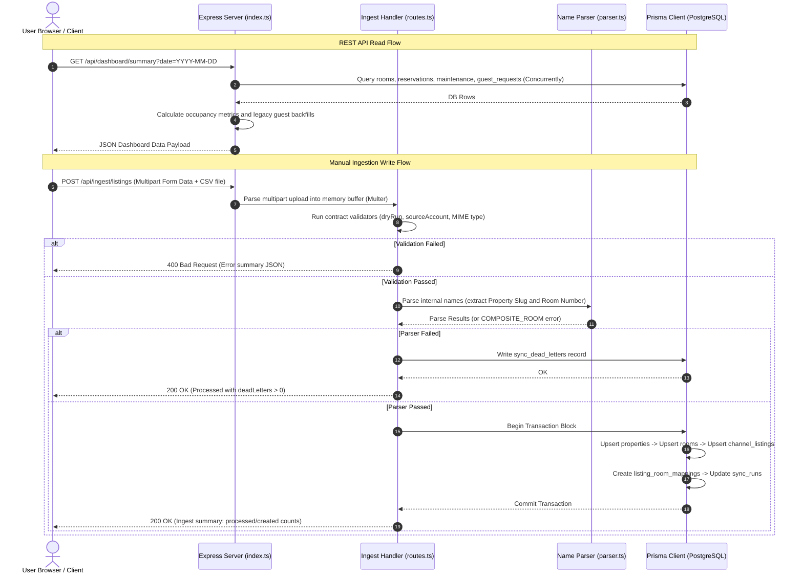
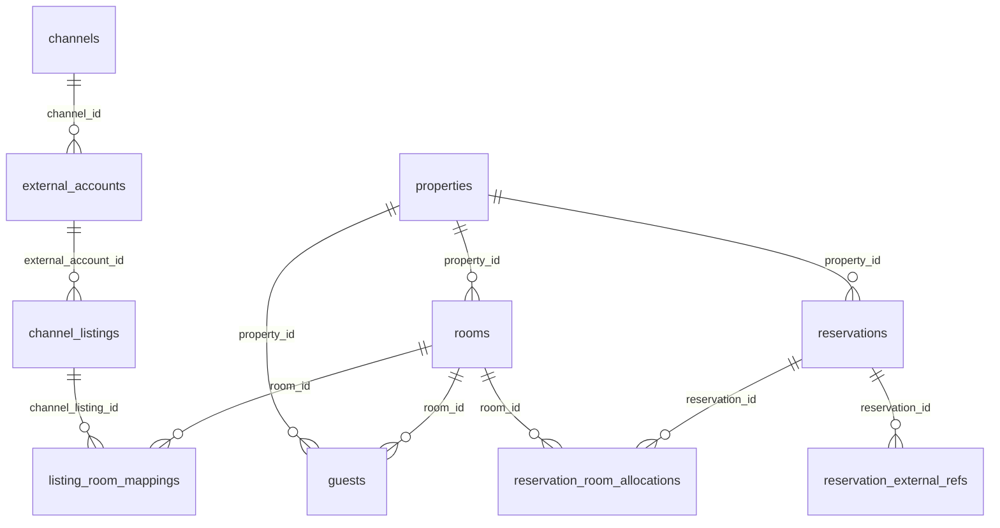

# Just Management — Comprehensive Track B Backend Analysis

This document provides a highly detailed, source-grounded technical analysis of the **Track B Backend** implemented in the `Just_Management` workspace. Grounded strictly in current source files, this report maps runtime foundations, directory structure, database schemas, HTTP APIs, file ingestion services, and operational safety guardrails.

---

## 1. Directory Structure

Below is the complete file tree of the backend subsystem, mapping every source file, migration, script, and test fixture:

```text
backend/
├── prisma/
│   ├── AGENTS.md                                # Database schema rules & conventions
│   ├── schema.prisma                            # Canonical Track B Prisma database schema
│   └── migrations/
│       ├── 20260502000000_init_track_b/
│       │   └── migration.sql                    # Initial database tables and trigger functions
│       ├── 20260504122217_add_sync_metadata/
│       │   └── migration.sql                    # Migration adding ingestion and dead-letter tables
│       ├── 20260520000000_add_api_performance_indexes/
│       │   └── migration.sql                    # Compound indices for query optimization
│       └── migration_lock.toml                  # Prisma lock file for database sync
├── src/
│   ├── index.ts                                 # Server entrypoint, Express middleware, and REST routes
│   └── ingest/
│       ├── AGENTS.md                            # Ingestion subsystem rules & conventions
│       ├── contracts.ts                         # Whitelists, types, error codes, and limits
│       ├── normalizer.ts                        # Unicode normalization and spreadsheet conversion
│       ├── parser.ts                            # Listing title regex parser and prefix mapping
│       ├── routes.ts                            # HTTP boundary for listings, bookings, and Sheets
│       └── services/
│           ├── listings.ts                      # Transactional listing sync service
│           ├── reservations.ts                  # Transactional reservation/booking sync service
│           └── sheets.ts                        # Google Sheets API connector & range fetcher
├── scripts/
│   ├── classify-airbnb-listings.ts              # Offline listing visibility classifier
│   ├── verify-azure-migration.mjs               # Pre-flight linter checking migrations for Azure compatibility
│   └── verify-ingestion.ts                      # Integration test runner mapping local scenarios
├── fixtures/
│   ├── Main-happy.csv                           # Happy-path listing CSV sample
│   ├── Main-malformed.csv                       # Missing-columns listing CSV sample
│   ├── Reservations-happy.csv                   # Happy-path booking CSV sample
│   └── Ruby-ambiguous.csv                       # Duplicate/ambiguous listing CSV sample
├── package.json                                 # Dependency specifications and dev scripts
├── package-lock.json                            # Dependency lock file
└── tsconfig.json                                # TypeScript compiler configuration
```

---

## 2. Scope and Boundaries

This analysis represents an exhaustive review of the Track B backend codebase in the current workspace.

### In Scope
- **Core HTTP & Express Service**: Mapping routes, middleware execution, cache patterns, timezone contexts, and response builders in [backend/src/index.ts](file:///c:/Users/Fate_Conqueror/GitHub/Just_Management/backend/src/index.ts).
- **Prisma Database Layer**: Full architecture of database tables, constraints, foreign key cascades, and compound index specifications in [backend/prisma/schema.prisma](file:///c:/Users/Fate_Conqueror/GitHub/Just_Management/backend/prisma/schema.prisma).
- **Spreadsheet/Provider Ingestion Subsystem**: The contracts, spreadsheet parsers, normalizers, and service reconciliation flows in [backend/src/ingest](file:///c:/Users/Fate_Conqueror/GitHub/Just_Management/backend/src/ingest).
- **Verification Harnesses**: Test-driven script architectures for DB validation, ingestion pipelines, and database migrations in [backend/scripts/verify-ingestion.ts](file:///c:/Users/Fate_Conqueror/GitHub/Just_Management/backend/scripts/verify-ingestion.ts) and [backend/scripts/verify-azure-migration.mjs](file:///c:/Users/Fate_Conqueror/GitHub/Just_Management/backend/scripts/verify-azure-migration.mjs).

### Out of Scope
- Runtime diagnostics or tracing of live Azure PostgreSQL instances.
- Historical analysis of the deprecated/unused Supabase Track A runtime layer.
- Upstream authentication/authorization middleware implementation (which is absent in the direct codebase).

---

## 3. System Architecture & Visualization

The backend operates as a lightweight monolithic application. The diagram below illustrates how client requests and data ingestion packages flow through the system:



---

## 4. Capability Inventory & Endpoint Operations

All HTTP endpoints are registered in [backend/src/index.ts](file:///c:/Users/Fate_Conqueror/GitHub/Just_Management/backend/src/index.ts). Below is a mapping of their roles, cache policies, and exact operational paths.

| Method / Surface | File | Line(s) | Purpose / Operational Performance |
|---|---|---|---|
| GET `/health` | [index.ts](file:///c:/Users/Fate_Conqueror/GitHub/Just_Management/backend/src/index.ts) | [L289-L291](file:///c:/Users/Fate_Conqueror/GitHub/Just_Management/backend/src/index.ts#L289-L291) | System health probe, bypassed from database querying. |
| GET `/api/properties` | [index.ts](file:///c:/Users/Fate_Conqueror/GitHub/Just_Management/backend/src/index.ts) | [L297-L312](file:///c:/Users/Fate_Conqueror/GitHub/Just_Management/backend/src/index.ts#L297-L312) | Fetches Viet properties ordered by name. Employs a 5-minute private cache header. |
| GET `/api/dashboard/summary` | [index.ts](file:///c:/Users/Fate_Conqueror/GitHub/Just_Management/backend/src/index.ts) | [L314-L519](file:///c:/Users/Fate_Conqueror/GitHub/Just_Management/backend/src/index.ts#L314-L519) | Aggregated single-request endpoint for dashboard composition. Fetches properties, rooms, requests, maintenance, and reservations concurrently. Resolves occupancy charts and legacy guest backfills on the fly. No-store cache instruction. |
| GET `/api/reservations` | [index.ts](file:///c:/Users/Fate_Conqueror/GitHub/Just_Management/backend/src/index.ts) | [L525-L603](file:///c:/Users/Fate_Conqueror/GitHub/Just_Management/backend/src/index.ts#L525-L603) | Filterable reservation database querying. Supports pagination (`limit` & `offset`) and date boundaries. `X-Total-Count` headers are generated on demand via `include_count` parameter flags to avoid duplicate count queries. |
| GET `/api/stats/occupancy` | [index.ts](file:///c:/Users/Fate_Conqueror/GitHub/Just_Management/backend/src/index.ts) | [L605-L715](file:///c:/Users/Fate_Conqueror/GitHub/Just_Management/backend/src/index.ts#L605-L715) | Daily occupancy percentage calculations over dynamic time bounds. Performs in-memory occupancy window aggregations. |
| GET `/api/reservations/:id` | [index.ts](file:///c:/Users/Fate_Conqueror/GitHub/Just_Management/backend/src/index.ts) | [L717-L728](file:///c:/Users/Fate_Conqueror/GitHub/Just_Management/backend/src/index.ts#L717-L728) | Detail retrieval for reservations, deep-joining nested `reservation_external_refs` and `reservation_room_allocations`. |
| GET `/api/rooms` | [index.ts](file:///c:/Users/Fate_Conqueror/GitHub/Just_Management/backend/src/index.ts) | [L733-L758](file:///c:/Users/Fate_Conqueror/GitHub/Just_Management/backend/src/index.ts#L733-L758) | Room registry fetch with property boundary. Implements a 60-second cache header. |
| GET `/api/maintenance` | [index.ts](file:///c:/Users/Fate_Conqueror/GitHub/Just_Management/backend/src/index.ts) | [L764-L791](file:///c:/Users/Fate_Conqueror/GitHub/Just_Management/backend/src/index.ts#L764-L791) | Maintenance tickets ordered newest-first. No-store cache instruction. |
| GET `/api/channels` | [index.ts](file:///c:/Users/Fate_Conqueror/GitHub/Just_Management/backend/src/index.ts) | [L797-L825](file:///c:/Users/Fate_Conqueror/GitHub/Just_Management/backend/src/index.ts#L797-L825) | Channel registry lookup joining child external accounts. Uses a 5-minute cache. |
| GET `/api/external-accounts` | [index.ts](file:///c:/Users/Fate_Conqueror/GitHub/Just_Management/backend/src/index.ts) | [L827-L848](file:///c:/Users/Fate_Conqueror/GitHub/Just_Management/backend/src/index.ts#L827-L848) | External provider accounts filtered by channel identity. 5-minute cache. |
| GET `/api/guest-requests` | [index.ts](file:///c:/Users/Fate_Conqueror/GitHub/Just_Management/backend/src/index.ts) | [L854-L883](file:///c:/Users/Fate_Conqueror/GitHub/Just_Management/backend/src/index.ts#L854-L883) | Active guest requests filtered by property, guest, or reservation constraints. |
| GET `/api/guests` | [index.ts](file:///c:/Users/Fate_Conqueror/GitHub/Just_Management/backend/src/index.ts) | [L889-L919](file:///c:/Users/Fate_Conqueror/GitHub/Just_Management/backend/src/index.ts#L889-L919) | Legacy guest surface compatibility data source (e.g., guest name, check-in status). |

---

## 5. Deep-Dive Findings

### 5.1 Prisma Database Schema Design
The canonical schema is maintained in [backend/prisma/schema.prisma](file:///c:/Users/Fate_Conqueror/GitHub/Just_Management/backend/prisma/schema.prisma). It maps the Track B Azure PostgreSQL database architecture.



#### 5.1.1 Inventory Foundations
- **Properties**: Stores the core Vietnamese property records ([schema.prisma#L14-L28](file:///c:/Users/Fate_Conqueror/GitHub/Just_Management/backend/prisma/schema.prisma#L14-L28)). Property IDs are raw UUIDs generated via database-level cryptographic routines (`@db.Uuid`).
- **Rooms**: Physical inventory connected to property identities via a strict restricted delete foreign key constraint ([schema.prisma#L30-L51](file:///c:/Users/Fate_Conqueror/GitHub/Just_Management/backend/prisma/schema.prisma#L30-L51)). It implements a compound unique index key `@@unique([id, property_id])` to support cross-table mapping validation.
- **Listing Room Mappings**: Connects external provider listings to physical room rows, supporting compound B-tree index structures to maximize join throughput during guest check-in matches ([schema.prisma#L198-L214](file:///c:/Users/Fate_Conqueror/GitHub/Just_Management/backend/prisma/schema.prisma#L198-L214)).

#### 5.1.2 Reservation Infrastructure
- **Reservations**: The booking source of truth, storing guest contacts, check-in/out timestamps, occupant counts, and notes ([schema.prisma#L216-L249](file:///c:/Users/Fate_Conqueror/GitHub/Just_Management/backend/prisma/schema.prisma#L216-L249)). To accelerate range searches and dashboard metrics, compound indices map property IDs, status flags, and check-in/out boundaries ([schema.prisma#L243-L248](file:///c:/Users/Fate_Conqueror/GitHub/Just_Management/backend/prisma/schema.prisma#L243-L248)).
- **Reservation External Refs**: Maps internal reservations to provider-specific keys (like Airbnb confirmation codes) ([schema.prisma#L251-L278](file:///c:/Users/Fate_Conqueror/GitHub/Just_Management/backend/prisma/schema.prisma#L251-L278)). Cascade deletes (`onDelete: Cascade`) bind this mapping to parent reservations, ensuring that cleaning database bookings automatically purges provider aliases.
- **Reservation Room Allocations**: Resolves multi-room bookings by linking reservations to distinct room IDs ([schema.prisma#L280-L295](file:///c:/Users/Fate_Conqueror/GitHub/Just_Management/backend/prisma/schema.prisma#L280-L295)). Unique constraints enforce physical room exclusivities: `@@unique([reservation_id, room_id])`.

#### 5.1.3 Legacy & Ingestion Logging
- **Guests**: Preserved for backward compatibility with old client views ([schema.prisma#L53-L73](file:///c:/Users/Fate_Conqueror/GitHub/Just_Management/backend/prisma/schema.prisma#L53-L73)).
- **Sync Runs & Dead Letters**: Provides structural traceability for spreadsheet import events ([schema.prisma#L356-L389](file:///c:/Users/Fate_Conqueror/GitHub/Just_Management/backend/prisma/schema.prisma#L356-L389)). If a row contains malformed data or fails name parsing, it triggers a dead-letter record storing normalized JSON payloads alongside execution error summaries.

### 5.2 Ingestion System Architecture
The ingestion pipeline converts CSV or Excel files (and Google Sheets exports) into properties, rooms, listings, and reservations.

#### 5.2.1 Ingestion Contracts ([contracts.ts](file:///c:/Users/Fate_Conqueror/GitHub/Just_Management/backend/src/ingest/contracts.ts))
- **Constraints**: Maximum upload size is strictly capped at 10MB ([contracts.ts#L21](file:///c:/Users/Fate_Conqueror/GitHub/Just_Management/backend/src/ingest/contracts.ts#L21)).
- **MIME whitelist**: Restricts file formats to CSV (`text/csv`), JSON, or legacy/modern Excel structures (`.xls`, `.xlsx`) ([contracts.ts#L22-L29](file:///c:/Users/Fate_Conqueror/GitHub/Just_Management/backend/src/ingest/contracts.ts#L22-L29)).
- **Error Categories**: Formalized codes isolate schema violations:
  - `MISSING_DRY_RUN`: Rejects requests lacking dry-run flags.
  - `MALFORMED_FILE`: Indicates spreadsheet parsing or MIME errors.
  - `UNRESOLVED_LISTING`: Denotes a booking that cannot be associated with any listing.
  - `AMBIGUOUS_LISTING_MATCH`: Flagged when alias titles resolve to multiple candidate rows.

#### 5.2.2 Normalization Subsystem ([normalizer.ts](file:///c:/Users/Fate_Conqueror/GitHub/Just_Management/backend/src/ingest/normalizer.ts))
- **Unicode NFC Sanity**: Row values pass through `normalizeString()` to strip Byte Order Marks (BOM) and convert text to standard Unicode NFC representations ([normalizer.ts#L29-L33](file:///c:/Users/Fate_Conqueror/GitHub/Just_Management/backend/src/ingest/normalizer.ts#L29-L33)).
- **Excel Serial Dates**: Resolves the classic Excel epoch serialized float representations (converting Excel floats back to valid standard UTC string datestamps) ([normalizer.ts#L52-L68](file:///c:/Users/Fate_Conqueror/GitHub/Just_Management/backend/src/ingest/normalizer.ts#L52-L68)).

#### 5.2.3 Internal Name Parsing ([parser.ts](file:///c:/Users/Fate_Conqueror/GitHub/Just_Management/backend/src/ingest/parser.ts))
- **Property-Room Extraction**: A regular expression maps listing titles against known property abbreviations:
  - Prefix List: `LL`, `TheO`, `MH`, `CC`, `TC`, `23`, `TA`, `Ruby` ([parser.ts#L12](file:///c:/Users/Fate_Conqueror/GitHub/Just_Management/backend/src/ingest/parser.ts#L12)).
- **Composite Room Safeguard**: If composite designations (containing `&` or `and`) are detected, the parser immediately throws a `COMPOSITE_ROOM` exception. Under strict conventions, **parser ambiguity prevents inventory creation** to keep property/room counts pristine ([parser.ts#L54-L63](file:///c:/Users/Fate_Conqueror/GitHub/Just_Management/backend/src/ingest/parser.ts#L54-L63)).

#### 5.2.4 Ingest Routes & Services ([routes.ts](file:///c:/Users/Fate_Conqueror/GitHub/Just_Management/backend/src/ingest/routes.ts))
- **Listing Sync Service** ([listings.ts](file:///c:/Users/Fate_Conqueror/GitHub/Just_Management/backend/src/ingest/services/listings.ts)): Runs rows inside a single database transaction blocks to prevent partial-write anomalies ([listings.ts#L97-L225](file:///c:/Users/Fate_Conqueror/GitHub/Just_Management/backend/src/ingest/services/listings.ts#L97-L225)). It upserts properties and rooms, maps the listing rows, and creates cross-table listings-to-room mappings.
- **Reservation Sync Service** ([reservations.ts](file:///c:/Users/Fate_Conqueror/GitHub/Just_Management/backend/src/ingest/services/reservations.ts)): Resolves booking rows against listing names and aliases. Normalizes raw provider statuses into internal booking statuses:
  - `currently hosting`, `ongoing`, `arriving today` $\rightarrow$ `checked_in`
  - `confirmed`, `upcoming` $\rightarrow$ `pending`
  - `past guest`, `checkout today` $\rightarrow$ `checked_out`
  - `cancelled`, `canceled` $\rightarrow$ `cancelled` ([reservations.ts#L192-L198](file:///c:/Users/Fate_Conqueror/GitHub/Just_Management/backend/src/ingest/services/reservations.ts#L192-L198)).
- **Google Sheets Gateway** ([sheets.ts](file:///c:/Users/Fate_Conqueror/GitHub/Just_Management/backend/src/ingest/services/sheets.ts)): Uses `GoogleAuth` with OAuth 2.0 service account credentials to fetch spreadsheet data, converts rows into a CSV buffer, and delegates processing to core listings or reservations services ([sheets.ts#L28-L111](file:///c:/Users/Fate_Conqueror/GitHub/Just_Management/backend/src/ingest/services/sheets.ts#L28-L111)).

---

## 6. Data Flow and Control Flow (Original Analysis)

### 6.1 Frontend → REST backend flow

[src/lib/repositories/rest-repositories.ts](file:///c:/Users/Fate_Conqueror/GitHub/Just_Management/src/lib/repositories/rest-repositories.ts):

- Base API URL: `VITE_TRACK_B_API_URL ?? "http://localhost:3001"` at [rest-repositories.ts#L21-L24](file:///c:/Users/Fate_Conqueror/GitHub/Just_Management/src/lib/repositories/rest-repositories.ts#L21-L24).
- Fetch wrapper throws on non-2xx at [rest-repositories.ts#L42-L48](file:///c:/Users/Fate_Conqueror/GitHub/Just_Management/src/lib/repositories/rest-repositories.ts#L42-L48).
- Repositories call matching Express endpoints:
  - Properties: [rest-repositories.ts#L50-L59](file:///c:/Users/Fate_Conqueror/GitHub/Just_Management/src/lib/repositories/rest-repositories.ts#L50-L59)
  - Rooms: [rest-repositories.ts#L61-L73](file:///c:/Users/Fate_Conqueror/GitHub/Just_Management/src/lib/repositories/rest-repositories.ts#L61-L73)
  - Reservations: [rest-repositories.ts#L75-L100](file:///c:/Users/Fate_Conqueror/GitHub/Just_Management/src/lib/repositories/rest-repositories.ts#L75-L100)
  - Guest requests: [rest-repositories.ts#L102-L114](file:///c:/Users/Fate_Conqueror/GitHub/Just_Management/src/lib/repositories/rest-repositories.ts#L102-L114)
  - Maintenance: [rest-repositories.ts#L116-L131](file:///c:/Users/Fate_Conqueror/GitHub/Just_Management/src/lib/repositories/rest-repositories.ts#L116-L131)
  - Stats: [rest-repositories.ts#L133-L143](file:///c:/Users/Fate_Conqueror/GitHub/Just_Management/src/lib/repositories/rest-repositories.ts#L133-L143)
  - Factory: [rest-repositories.ts#L145-L153](file:///c:/Users/Fate_Conqueror/GitHub/Just_Management/src/lib/repositories/rest-repositories.ts#L145-L153)

[src/hooks/use-dashboard-data.ts](file:///c:/Users/Fate_Conqueror/GitHub/Just_Management/src/hooks/use-dashboard-data.ts):

- Uses `createRestRepositories()` directly at [use-dashboard-data.ts#L109-L110](file:///c:/Users/Fate_Conqueror/GitHub/Just_Management/src/hooks/use-dashboard-data.ts#L109-L110).
- Loads dashboard data through TanStack Query at [use-dashboard-data.ts#L111-L142](file:///c:/Users/Fate_Conqueror/GitHub/Just_Management/src/hooks/use-dashboard-data.ts#L111-L142).
- Converts reservations into guest-shaped dashboard compatibility objects at [use-dashboard-data.ts#L65-L80](file:///c:/Users/Fate_Conqueror/GitHub/Just_Management/src/hooks/use-dashboard-data.ts#L65-L80).

[vite.config.ts](file:///c:/Users/Fate_Conqueror/GitHub/Just_Management/vite.config.ts):

- Dev proxy maps `/api` to `http://localhost:3001` at [vite.config.ts#L14-L23](file:///c:/Users/Fate_Conqueror/GitHub/Just_Management/vite.config.ts#L14-L23).

### 6.2 Listing ingest data flow

```text
POST /api/ingest/listings
  → routes.validateIngestRequest()
  → multer memory file buffer
  → processListingSync(buffer, mimeType, sourceAccount, dryRun)
  → parseSourceFile()
  → extractListings()
  → parseInternalName()
  → channel/external_account upsert
  → property upsert
  → room find/create
  → channel_listing upsert OR title-only alias matching
  → listing_room_mappings create
  │ (Fail)
  └──► sync_dead_letters (Row fail audit details)
  │ (Pass)
  └──► sync_runs (Run processed/created/updated totals)
```

### 6.3 Reservation ingest data flow

```text
POST /api/ingest/reservations
  → routes.validateIngestRequest()
  → multer memory file buffer
  → processReservationSync(buffer, mimeType, sourceAccount, dryRun)
  → parseSourceFile()
  → extractReservations()
  → channel/external_account upsert
  → resolve listing via alias OR exact listing title
  → resolve first mapped room + property
  │ (Fail)
  └──► sync_dead_letters (Row fail audit details)
  │ (Pass)
  └──► find existing reservation_external_ref by channel/account/confirmation_code
       ├──► (Ref Exists)  ──► update reservation & ref & room allocation
       └──► (Ref Absent)  ──► create reservation & ref & room allocation
```

### 6.4 Google Sheets ingest data flow

```text
POST /api/ingest/google-sheets
  → validate spreadsheetId + targetKind
  → service account credentials
  → Google Sheets API values.get(A:ZZ)
  → convert values to CSV buffer
  → processListingSync OR processReservationSync
```

---

## 7. Detailed Feature End-to-End Processes

### 7.1 Dashboard Summary Aggregation
When the client fetches `GET /api/dashboard/summary`, the system processes the request as follows:
1. **Query Dispatching**: Employs `Promise.all` to query seven tables in parallel ([index.ts#L355-L444](file:///c:/Users/Fate_Conqueror/GitHub/Just_Management/backend/src/index.ts#L355-L444)).
2. **Filtering Check-Ins**: Filters today's arrivals (status matching `pending` or `check_in_pending`) and today's departures (status matching `check_out_pending` or `checked_out`) ([index.ts#L446-L460](file:///c:/Users/Fate_Conqueror/GitHub/Just_Management/backend/src/index.ts#L446-L460)).
3. **Calculating Room Metrics**: Iterates over property records, matching the total room count against currently checked-in rooms to derive the occupancy rate dynamically ([index.ts#L462-L486](file:///c:/Users/Fate_Conqueror/GitHub/Just_Management/backend/src/index.ts#L462-L486)).
4. **Generating Occupancy Series**: Resolves aggregate active stays over the requested calendar window (e.g., 7 days) and formats dates in standard ISO representations ([index.ts#L511-L518](file:///c:/Users/Fate_Conqueror/GitHub/Just_Management/backend/src/index.ts#L511-L518)).
5. **JSON Delivery**: Packages these outputs into a single JSON payload to construct the dashboard view in the client.

### 7.2 In-Memory Staged Occupancy Calculations
When the client calls `GET /api/stats/occupancy`:
1. **Date Boundary Clamping**: Parses the `end_date` parameter, fallbacks to today in Vietnam timezone, and sets the query window start to `endDate - (days - 1)` ([index.ts#L607-L621](file:///c:/Users/Fate_Conqueror/GitHub/Just_Management/backend/src/index.ts#L607-L621)).
2. **Active Bookings Query**: Queries all database reservations overlapping this time range whose status is not `cancelled` or `no_show` ([index.ts#L646-L664](file:///c:/Users/Fate_Conqueror/GitHub/Just_Management/backend/src/index.ts#L646-L664)).
3. **Daily Intersection Loop**: Instantiates a date iterator. For each date in the window, it builds an occupied room set ([index.ts#L675-L712](file:///c:/Users/Fate_Conqueror/GitHub/Just_Management/backend/src/index.ts#L675-L712)):
   - Checks if reservations overlap the date.
   - If a reservation contains room allocations, it registers those rooms as occupied.
   - If not, it falls back to primary room assignments or creates a reservation-bound placeholder.
4. **Stats Return**: Returns a JSON array containing `{ date, occupied, available, totalRooms }`.

### 7.3 Manual File Ingestion Paths (CSV/Excel Uploads)
When a user uploads a sheet to `POST /api/ingest/listings` or `POST /api/ingest/reservations`:
1. **Buffer Stage**: Multer captures the multipart request, extracting the raw byte stream into memory ([routes.ts](file:///c:/Users/Fate_Conqueror/GitHub/Just_Management/backend/src/ingest/routes.ts)).
2. **Schema Verification**: Runs validation filters to enforce file size boundaries and support whitelisted MIME structures ([routes.ts#L87-L117](file:///c:/Users/Fate_Conqueror/GitHub/Just_Management/backend/src/ingest/routes.ts#L87-L117)).
3. **Row Normalization**: Passes rows to `normalizer.ts` to strip Byte Order Marks (BOM), normalize Unicode, and convert Excel date integers to standard dates ([normalizer.ts](file:///c:/Users/Fate_Conqueror/GitHub/Just_Management/backend/src/ingest/normalizer.ts)).
4. **Reconciliation Transaction**:
   - **Listings Ingest** ([listings.ts](file:///c:/Users/Fate_Conqueror/GitHub/Just_Management/backend/src/ingest/services/listings.ts)): Extracts the known prefix (e.g. `LL`, `TheO`). Parser failures trigger a dead-letter log. Safe rows upsert the parent property, create physical rooms if absent, upsert the channel listing, and generate a mappings record.
   - **Reservations Ingest** ([reservations.ts](file:///c:/Users/Fate_Conqueror/GitHub/Just_Management/backend/src/ingest/services/reservations.ts)): Resolves the listing title against stored aliases. Validates confirmation codes and date intervals. If a booking reference is found, it updates the status; otherwise, it inserts a new reservation, external ref, and room allocation.
5. **Sync Log Update**: Writes failures to `sync_dead_letters` and sets the `sync_runs` audit record to `completed` ([listings.ts#L241-L261](file:///c:/Users/Fate_Conqueror/GitHub/Just_Management/backend/src/ingest/services/listings.ts#L241-L261)).

### 7.4 Automated Google Sheets Pipeline
When a request is posted to `POST /api/ingest/google-sheets`:
1. **Auth & Setup**: Resolves the credentials path (from `GOOGLE_SERVICE_ACCOUNT_FILE`) and connects to Google Sheets API v4 using service account permissions ([sheets.ts#L9-L40](file:///c:/Users/Fate_Conqueror/GitHub/Just_Management/backend/src/ingest/services/sheets.ts#L9-L40)).
2. **Sheet Range Read**: Fetches cell values from column `A` through `ZZ` from the requested sheet (or the first sheet in the spreadsheet metadata if not specified) ([sheets.ts#L41-L66](file:///c:/Users/Fate_Conqueror/GitHub/Just_Management/backend/src/ingest/services/sheets.ts#L41-L66)).
3. **CSV Parsing Conversion**: Transforms the spreadsheet cells into a CSV string buffer using `xlsx.utils.aoa_to_sheet` and `xlsx.utils.sheet_to_csv` ([sheets.ts#L69-L73](file:///c:/Users/Fate_Conqueror/GitHub/Just_Management/backend/src/ingest/services/sheets.ts#L69-L73)).
4. **Dispatch Pipeline**: Forwards the generated CSV buffer directly to `processListingSync` or `processReservationSync` for transactional database reconciliation, executing without any intermediate file writes.

---

## 8. CSV Ingestion & Runtime Mechanics

### 8.1 Where are CSV files supposed to be located to have them ingested?
- **Manual Upload Mode**: At runtime, **there is no specific folder location requirement on the server** for manual file uploads. The backend does not watch or read a local directory. Instead, files are uploaded directly from the client's local operating system through standard browser multipart/form-data HTTP forms.
- **Google Sheets Ingest**: Sheets are retrieved entirely over the web via the Google Sheets API. There is no physical file on disk; data flows directly from Google cloud servers into the application's memory buffer.
- **Harness & Verification Testing**: For integration test scenarios, CSV files are stored as static test fixtures inside the [backend/fixtures/](file:///c:/Users/Fate_Conqueror/GitHub/Just_Management/backend/fixtures) folder. When running `npm run verify-ingestion` or `npm run verify:all`, the test suite reads files directly from this directory ([verify-ingestion.ts#L34-L38](file:///c:/Users/Fate_Conqueror/GitHub/Just_Management/backend/scripts/verify-ingestion.ts#L34-L38)) and pushes them as buffers to simulate active uploads.

### 8.2 Does the current program rely on the user uploading those files during runtime?
- **Yes, the current program is designed around interactive runtime uploads.** The application expects an end-user or external cron-job client to actively upload a CSV/Excel file or trigger a Google Sheets synchronization event during runtime:
  1. The user goes to the dashboard or ingestion interface.
  2. The user selects a local file and clicks "Upload" (firing a `POST` request with the file attachment).
  3. Or, the user clicks "Sync Sheets" (firing a `POST` request specifying a `spreadsheetId`).
- The backend operates strictly on demand: it remains dormant until one of these endpoints is actively invoked. It does not monitor a directory on disk or run a background folder listener.

---

## 9. Migration + Azure Safety

Migration guard lives in [backend/scripts/verify-azure-migration.mjs](file:///c:/Users/Fate_Conqueror/GitHub/Just_Management/backend/scripts/verify-azure-migration.mjs).

| Check | Evidence | Meaning |
|---|---|---|
| Migration dir exists | [verify-azure-migration.mjs#L12-L15](file:///c:/Users/Fate_Conqueror/GitHub/Just_Management/backend/scripts/verify-azure-migration.mjs#L12-L15) | Checks `backend/prisma/migrations`. |
| Banned Supabase roles/RLS | [verify-azure-migration.mjs#L16-L21](file:///c:/Users/Fate_Conqueror/GitHub/Just_Management/backend/scripts/verify-azure-migration.mjs#L16-L21) | Rejects `TO anon`, `TO authenticated`, `TO service_role`, `ENABLE ROW LEVEL SECURITY`. |
| Required Azure-safe primitives | [verify-azure-migration.mjs#L23-L26](file:///c:/Users/Fate_Conqueror/GitHub/Just_Management/backend/scripts/verify-azure-migration.mjs#L23-L26) | Requires `pgcrypto` and `set_updated_at_timestamp`. |
| Migration SQL loading | [verify-azure-migration.mjs#L45-L66](file:///c:/Users/Fate_Conqueror/GitHub/Just_Management/backend/scripts/verify-azure-migration.mjs#L45-L66) | Reads all migration SQL directories. |
| Table creation check | [verify-azure-migration.mjs#L88-L93](file:///c:/Users/Fate_Conqueror/GitHub/Just_Management/backend/scripts/verify-azure-migration.mjs#L88-L93) | Ensures at least one `CREATE TABLE`. |

Initial migration evidence:
- `pgcrypto` extension and trigger function exist in `20260502000000_init_track_b/migration.sql`.
- Later migration `20260504122217_add_sync_metadata` adds `sync_runs` and `sync_dead_letters`.
- Later migration `20260520000000_add_api_performance_indexes` adds API-oriented performance indexes.

---

## 10. Risks, Gaps, or Unknowns

An architectural review of the Track B backend reveals several security, concurrency, and data integrity concerns.

### 10.1 Security Exposures
- **Absence of Backend Auth Middleware**: The active middleware stack handles CORS, JSON parsing, compression, and ingestion dispatch ([index.ts#L41-L54](file:///c:/Users/Fate_Conqueror/GitHub/Just_Management/backend/src/index.ts#L41-L54)). No authentication or session validation guards the `/api/` endpoints. **Recommendation**: Implement JWT or session-based route protection middleware prior to public deployment.
- **Unprotected Ingestion Pipelines**: The `/api/ingest/` write routes are open to unauthenticated clients ([routes.ts#L195-L270](file:///c:/Users/Fate_Conqueror/GitHub/Just_Management/backend/src/ingest/routes.ts#L195-L270)). Any HTTP client reaching the backend port can execute non-dry-run imports and modify core tables.
- **Privileged Passcode Leaks**: The `/api/rooms` endpoint selects and returns the room `passcode` string directly in its public payload ([index.ts#L744-L754](file:///c:/Users/Fate_Conqueror/GitHub/Just_Management/backend/src/index.ts#L744-L754)). This leaks sensitive physical room keys to any consumer fetching room details.

### 10.2 Data Integrity Gaps
- **Lack of Database-Enforced Idempotency Constraints**: The `reservation_external_refs` model does not implement a unique index over confirmation codes at the database level ([schema.prisma#L274-L278](file:///c:/Users/Fate_Conqueror/GitHub/Just_Management/backend/prisma/schema.prisma#L274-L278)). Instead, concurrency safety relies on runtime `findFirst` checks inside Express transactions ([reservations.ts#L183-L190](file:///c:/Users/Fate_Conqueror/GitHub/Just_Management/backend/src/ingest/services/reservations.ts#L183-L190)). Simultaneous execution of imports with duplicate confirmation codes can cause duplicate reservation inserts. **Recommendation**: Add a database-level `@@unique([channel_id, external_account_id, confirmation_code])` constraint.
- **Prisma Connection Pooling Drift**: The API server ([index.ts#L15](file:///c:/Users/Fate_Conqueror/GitHub/Just_Management/backend/src/index.ts#L15)), listings ingest ([listings.ts#L6](file:///c:/Users/Fate_Conqueror/GitHub/Just_Management/backend/src/ingest/services/listings.ts#L6)), and reservations ingest ([reservations.ts#L5](file:///c:/Users/Fate_Conqueror/GitHub/Just_Management/backend/src/ingest/services/reservations.ts#L5)) instantiate separate `PrismaClient` objects. This creates multiple connection pools on the system, which can exhaust Azure PostgreSQL connection limits under heavy concurrent API and ingest load. **Recommendation**: Share a single Prisma Client singleton across all services.

---

## 11. Summary Table

| Area | Primary Files | Key Finding / Structural Role |
|---|---|---|
| **Core Service** | [backend/src/index.ts](file:///c:/Users/Fate_Conqueror/GitHub/Just_Management/backend/src/index.ts) | Express.js runtime, warm-up handlers, dynamic timing instrumentation, CORS configurations, and REST read paths. |
| **Data Schema** | [backend/prisma/schema.prisma](file:///c:/Users/Fate_Conqueror/GitHub/Just_Management/backend/prisma/schema.prisma) | Canonical Track B schema mapping Azure PostgreSQL. Features compound relationships and explicit cascades, alongside backwards-compatible legacy models. |
| **Ingestion Pipeline** | [backend/src/ingest/](file:///c:/Users/Fate_Conqueror/GitHub/Just_Management/backend/src/ingest/) | Multi-layered file sync subsystem. Coordinates file validation, spreadsheet parsing, Unicode normalization, room name parsing, and transactional writes. |
| **Migration Safety** | [backend/scripts/verify-azure-migration.mjs](file:///c:/Users/Fate_Conqueror/GitHub/Just_Management/backend/scripts/verify-azure-migration.mjs) | Validates that generated database migrations are free of Supabase-specific SQL syntax (like RLS or default roles) that would fail on Azure PostgreSQL. |
| **System Validation** | [backend/scripts/verify-ingestion.ts](file:///c:/Users/Fate_Conqueror/GitHub/Just_Management/backend/scripts/verify-ingestion.ts) | Integration test runner that spins up a test service on a random port, triggers mock/happy-path listings, reservations, and sheets sync runs, and asserts correct database side effects. |
