# Frontend Pages Reference

Repo: `Just_Management`
Source of truth: `frontend/src/router.tsx`, `frontend/src/components/app-sidebar.tsx`, `frontend/src/components/*/*-page.tsx`, `frontend/src/pages/settings/integrations-page.tsx`
Audience: Business stakeholders, product owners, frontend developers, backend developers
Coverage: 17 currently routed frontend pages

## Purpose

This document translates the current frontend into stakeholder-readable user stories and developer-traceable Mermaid diagrams. It shows what each page is for, which user actions are currently implemented, and how each major user-visible flow moves from user interaction to frontend page logic and backend APIs.

## Scope

- Covers only pages currently routed in `frontend/src/router.tsx`
- Uses current code as truth
- Describes user-visible behavior only
- References backend/API touchpoints only where they affect visible outcomes

## Non-Goals

- This is not a future-state product roadmap
- This is not a full API specification
- This does not document internal hook/component implementation in exhaustive detail

## Business Area Navigation Map

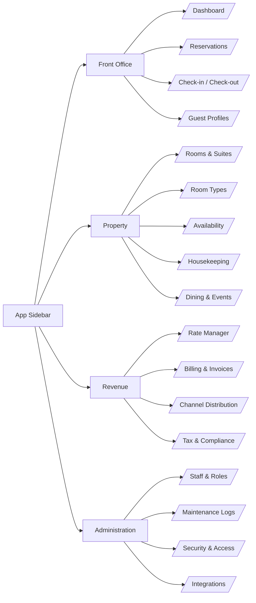

## Route Inventory

| Route | Sidebar Group | Page Component | Purpose |
|---|---|---|---|
| `/` | Front Office | `DashboardPage` | Portfolio operations overview |
| `/reservations` | Front Office | `ReservationsPage` | Reservation management, creation, CSV ingest, tax export entry |
| `/check-in-out` | Front Office | `CheckInOutPage` | Daily arrivals and departures board |
| `/guests` | Front Office | `GuestsPage` | Guest and tenant operations hub |
| `/rooms` | Property | `RoomsPage` | Floor-plan and room status view |
| `/rooms/types` | Property | `RoomTypesPage` | Room category inventory and occupancy overview |
| `/rooms/availability` | Property | `AvailabilityPage` | 14-day room availability grid |
| `/housekeeping` | Property | `HousekeepingPage` | Cleaning and turnover operations board |
| `/dining-events` | Property | `DiningEventsPage` | Dining and events schedule |
| `/rate-manager` | Revenue | `RateManagerPage` | Multi-day rate grid by room type |
| `/billing` | Revenue | `BillingInvoicesPage` | Reservation-derived billing view |
| `/channels` | Revenue | `ChannelDistributionPage` | OTA channel and account status |
| `/tax-export` | Revenue | `TaxExportPage` | Tax export prep, review, and job history |
| `/staff` | Administration | `StaffRolesPage` | Staff directory and role view |
| `/maintenance` | Administration | `MaintenancePage` | Maintenance issue log and create flow |
| `/security` | Administration | `SecurityAccessPage` | Security audit log |
| `/settings/integrations` | Administration | `IntegrationsPage` | Integrations, connections, CSV upload, and pipeline operations |

## Shared Shell Pattern

All routed pages render inside the shared shell from `frontend/src/router.tsx`:

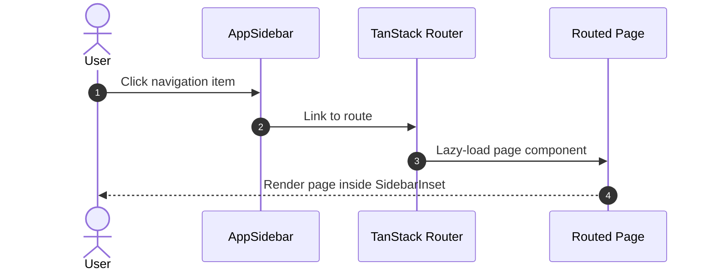

---

# Front Office

## Dashboard

- **Route:** `/`
- **Primary users:** General manager, operations manager, front-office lead
- **Feature inventory:** KPI summary, occupancy chart, room calendar, revenue panel, arrivals, departures, checkouts, maintenance, bookings sidebar, dashboard/split layout toggle, manual sync trigger

### User Stories

- As an operations manager, I want one dashboard that summarizes occupancy, arrivals, departures, and maintenance so that I can assess hotel health quickly.
- As a manager, I want to switch between dashboard and split layouts so that I can optimize how much space bookings and calendar views receive.
- As a manager, I want to trigger a sync from the toolbar so that dashboard data can be refreshed without leaving the page.

### Sequence Diagram

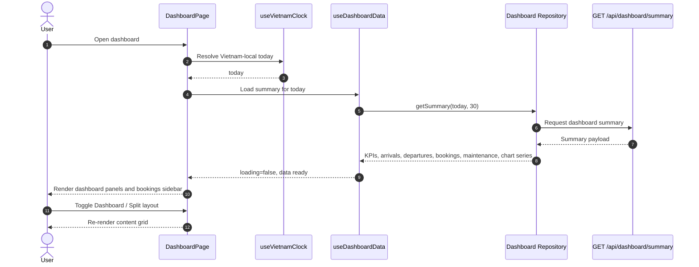

## Reservations

- **Route:** `/reservations`
- **Primary users:** Reservations agent, front-desk lead, finance support
- **Feature inventory:** Reservation KPIs, searchable/sortable table, status/property filters, manual reservation dialog, CSV upload with dry-run summary, row-level tax export trigger

### User Stories

- As a reservations agent, I want to search and filter bookings so that I can find guest records quickly.
- As a reservations agent, I want to create a reservation manually so that off-platform bookings can still be tracked.
- As an operations user, I want to upload reservation CSV files with a dry-run option so that I can validate imports before creating records.
- As a finance user, I want to trigger tax export from a reservation row so that tax documentation can start from booking data.

### Sequence Diagram

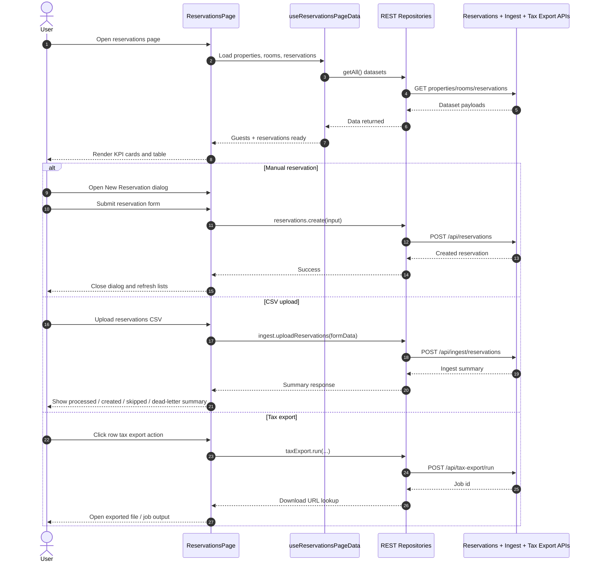

## Check-in / Check-out

- **Route:** `/check-in-out`
- **Primary users:** Front-desk staff
- **Feature inventory:** Arrivals/departures KPIs, property filter, separate paginated lists for arrivals and departures, card-level action buttons

### User Stories

- As front-desk staff, I want today's arrivals and departures on one board so that I can manage guest movement efficiently.
- As staff, I want to filter the board by property so that I can focus on the site I am currently operating.

### Sequence Diagram

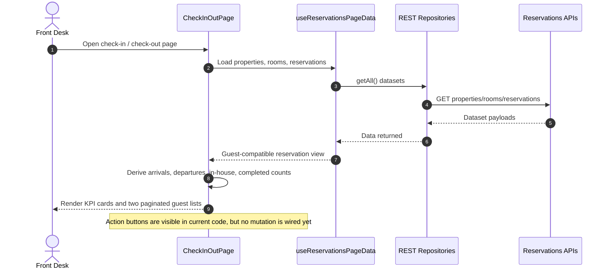

## Guests

- **Route:** `/guests`
- **Primary users:** Front-office staff, residence/tenant operations staff
- **Feature inventory:** Property selector, Stay Registration tab, Stay Records tab, Guest Requests tab

### User Stories

- As staff, I want a single guest operations hub so that registration, stay tracking, and requests are managed in one place.
- As staff, I want to register stays so that guest occupancy can be tracked by tenant and dates.
- As staff, I want to review stay history and tenant records so that long-term and short-term occupancy are both visible.
- As staff, I want to create and transition guest requests so that service issues can be managed through their lifecycle.

### Sequence Diagram

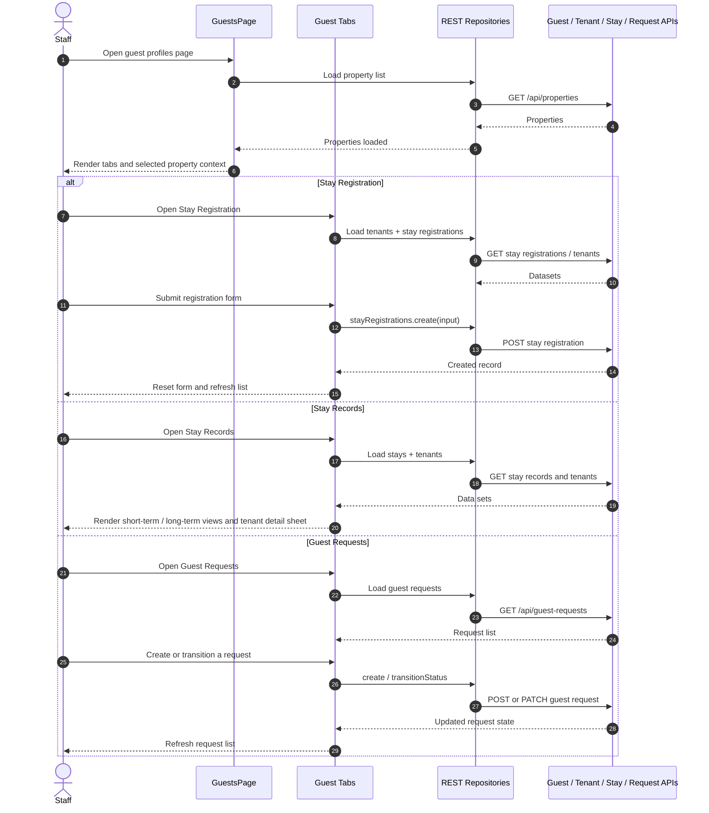

---

# Property

## Rooms & Suites

- **Route:** `/rooms`
- **Primary users:** Operations, housekeeping, front office
- **Feature inventory:** Property/status/type filters, KPI strip, floor-grouped room cards, room status chooser, navigation to room types page

### User Stories

- As operations staff, I want a floor-plan style room overview so that room state can be scanned visually.
- As staff, I want to update a room's status so that downstream dashboards reflect operational reality.

### Sequence Diagram

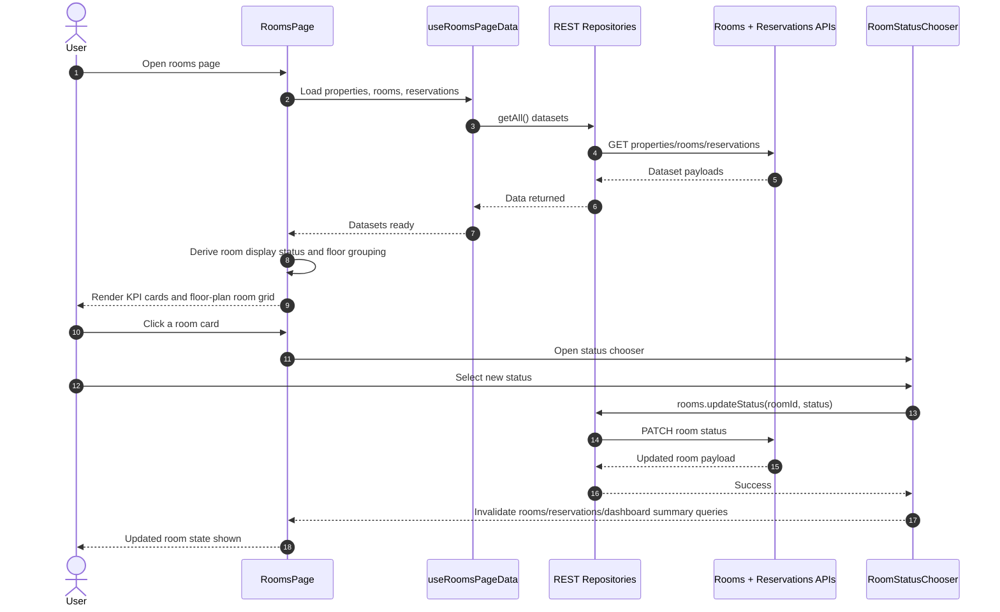

## Room Types

- **Route:** `/rooms/types`
- **Primary users:** Operations, revenue, management
- **Feature inventory:** KPI strip, property filter, per-room-type cards, occupancy percentage bars

### User Stories

- As management, I want to see room inventory by type so that I understand category distribution across properties.
- As management, I want occupancy by room type so that performance can be compared between categories.

### Sequence Diagram

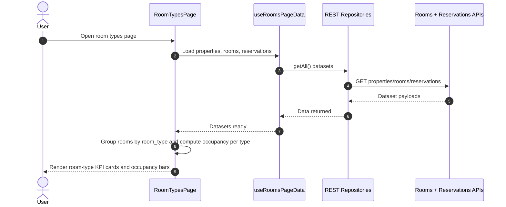

## Availability

- **Route:** `/rooms/availability`
- **Primary users:** Front office, reservations, management
- **Feature inventory:** 14-day room/date grid, property filter, week navigation, daily occupancy KPIs

### User Stories

- As a reservations user, I want a forward-looking availability grid so that I can plan occupancy by date and room.
- As a user, I want to navigate between date windows so that near-term availability can be reviewed quickly.

### Sequence Diagram

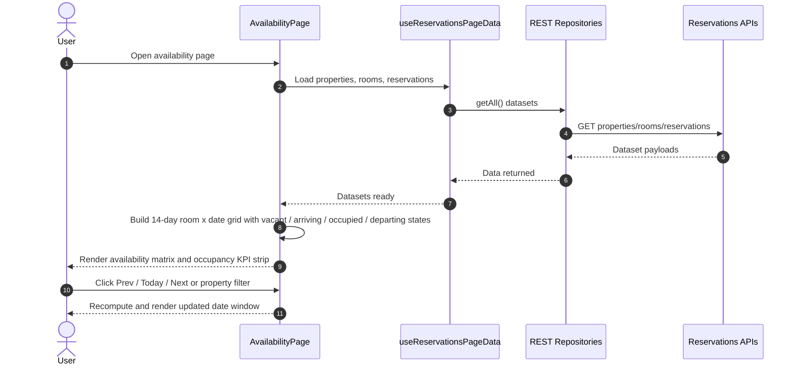

## Housekeeping

- **Route:** `/housekeeping`
- **Primary users:** Housekeeping lead, operations lead
- **Feature inventory:** Dirty/cleaning/inspected/ready KPIs, property filter, state filter, priority-sorted room cards

### User Stories

- As a housekeeping lead, I want room cleaning states grouped in one board so that turnover can be prioritized.
- As a lead, I want rooms sorted by operational urgency so that the team works in the best order.

### Sequence Diagram

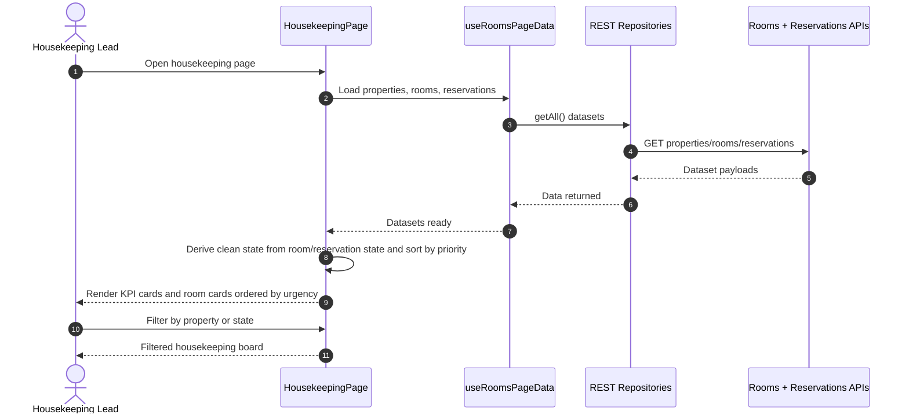

## Dining & Events

- **Route:** `/dining-events`
- **Primary users:** F&B manager, events coordinator
- **Feature inventory:** Event KPIs, property filter, per-event cards with type, venue, guest count, and status

### User Stories

- As an F&B manager, I want the current dining and events schedule so that venue usage and guest volume are visible.
- As an events coordinator, I want to filter by property so that I can focus on one location at a time.

### Sequence Diagram

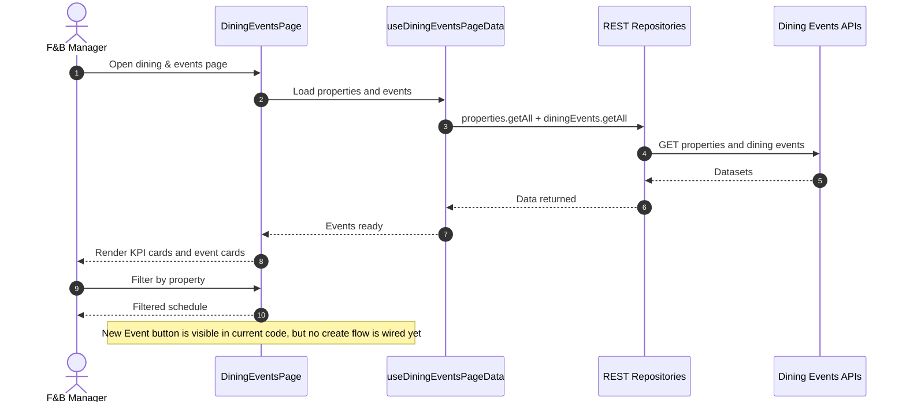

---

# Revenue

## Rate Manager

- **Route:** `/rate-manager`
- **Primary users:** Revenue manager
- **Feature inventory:** KPI strip, date window navigation, property filter, room-type x date rate grid, override indicator

### User Stories

- As a revenue manager, I want a multi-day rate grid so that I can compare room-type pricing over time.
- As a revenue manager, I want property filtering and week navigation so that I can review each site and date band quickly.

### Sequence Diagram

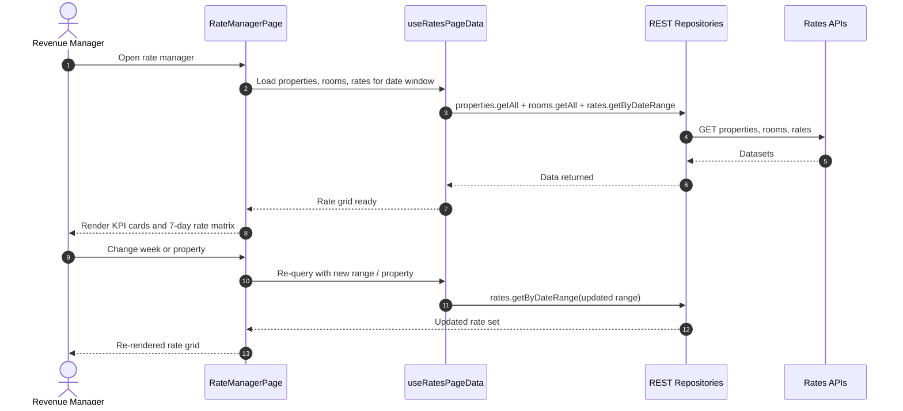

## Billing & Invoices

- **Route:** `/billing`
- **Primary users:** Finance operations, management
- **Feature inventory:** Billing KPIs, search, status/property filters, sortable paginated invoice table

### User Stories

- As a finance user, I want a billing list view so that invoice-like reservation revenue can be reviewed operationally.
- As a user, I want to filter by status and property so that outstanding or paid revenue can be isolated.

### Sequence Diagram

```mermaid
sequenceDiagram
  autonumber
  actor U as Finance User
  participant Page as BillingInvoicesPage
  participant Hook as useReservationsPageData
  participant Repo as REST Repositories
  participant API as Reservations APIs

  U->>Page: Open billing & invoices page
  Page->>Hook: Load properties, rooms, reservations
  Hook->>Repo: getAll() datasets
  Repo->>API: GET properties/rooms/reservations
  API-->>Repo: Dataset payloads
  Repo-->>Hook: Data returned
  Hook-->>Page: Reservations-ready state
  Page->>Page: Generate invoice-like rows from reservations
  Page-->>U: Render KPI cards and billing table with filters
  Note over Page: Current code derives billing rows from reservation data; no true invoice/folio mutation exists yet
```

## Channel Distribution

- **Route:** `/channels`
- **Primary users:** Revenue operations, integrations operators
- **Feature inventory:** Channel/account KPIs, per-channel cards, account-level connection/error badges

### User Stories

- As a revenue operations user, I want to see channel and external account health so that OTA connectivity issues are visible.
- As an operator, I want account-level status badges so that I can spot failing channel accounts quickly.

### Sequence Diagram

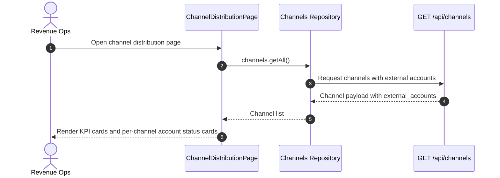

## Tax & Compliance

- **Route:** `/tax-export`
- **Primary users:** Finance, tax operations
- **Feature inventory:** Same-day checkout preview, ready/review KPIs, export job history, item review workflow, settings management

### User Stories

- As a finance operator, I want a preview of same-day checkout tax-export items so that I know what is ready or blocked.
- As a finance operator, I want to run export jobs and download results so that regulatory output can be produced.
- As a reviewer, I want to edit or mark review items so that blocked invoice lines can be resolved.
- As an administrator, I want to save export settings so that recurring export behavior remains consistent.

### Sequence Diagram

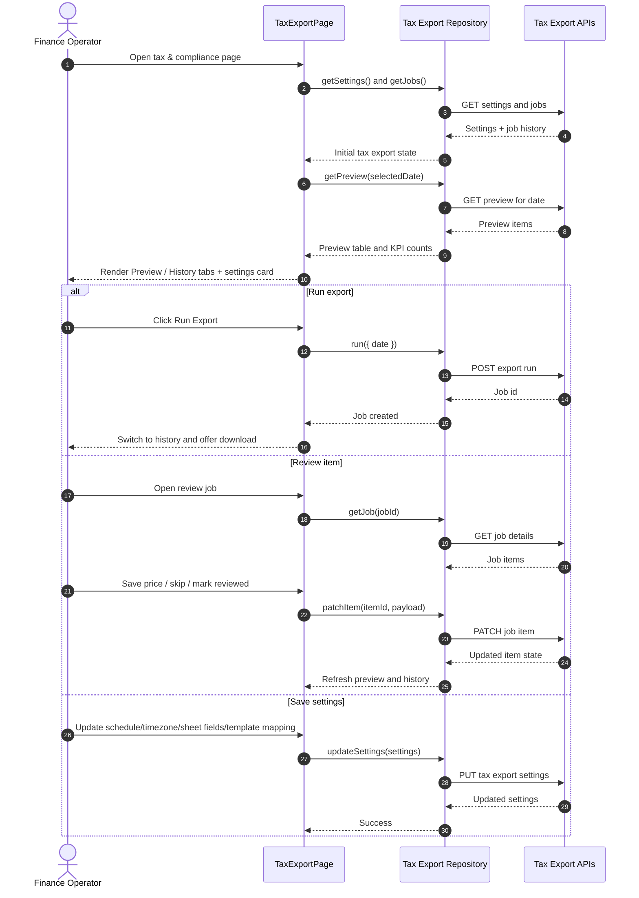

---

# Administration

## Staff & Roles

- **Route:** `/staff`
- **Primary users:** Admin, HR/operations support
- **Feature inventory:** Staff KPIs, search, role filter, staff rows with avatars, role badges, assigned property names

### User Stories

- As an administrator, I want a staff directory with role context so that role coverage is easy to review.
- As an administrator, I want to filter by role so that admin, manager, and team counts can be inspected separately.

### Sequence Diagram

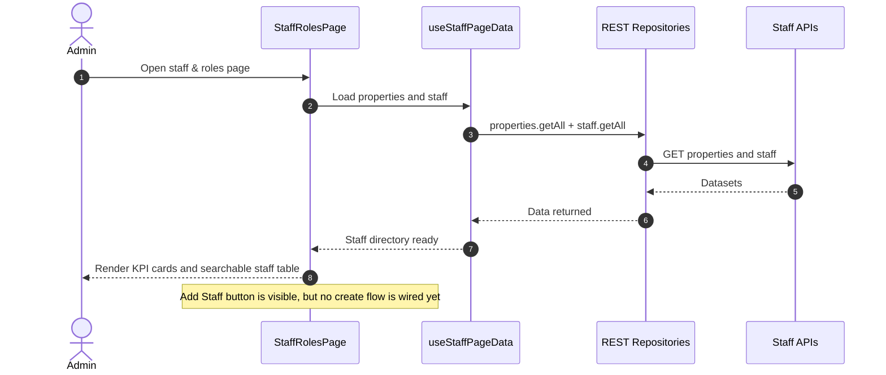

## Maintenance Logs

- **Route:** `/maintenance`
- **Primary users:** Maintenance lead, operations lead
- **Feature inventory:** Issue KPIs, search, property/status/severity filters, sorted issue table, create issue dialog

### User Stories

- As a maintenance lead, I want a filtered issue log so that open and critical issues are easy to prioritize.
- As staff, I want to log a maintenance issue from the UI so that operational defects can enter the queue immediately.

### Sequence Diagram

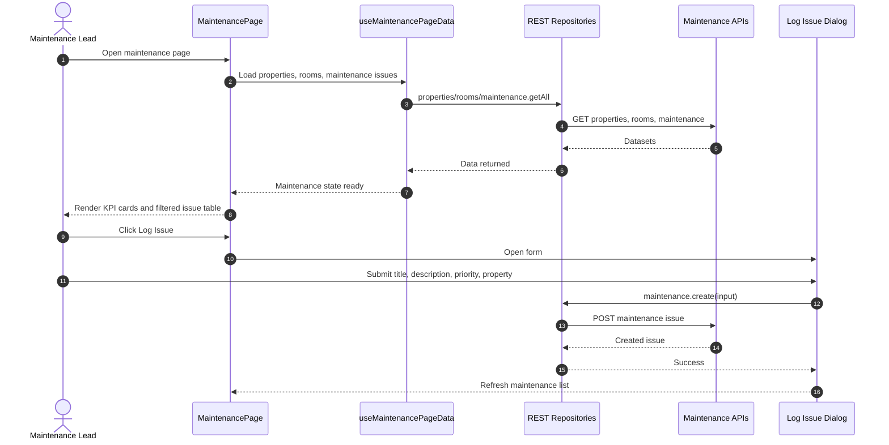

## Security & Access

- **Route:** `/security`
- **Primary users:** Security officer, administrator
- **Feature inventory:** Audit KPIs, search, severity filter, chronological log list

### User Stories

- As a security officer, I want a searchable access log so that suspicious or critical events can be reviewed quickly.
- As an administrator, I want KPI counts by severity so that audit volume is easy to summarize.

### Sequence Diagram

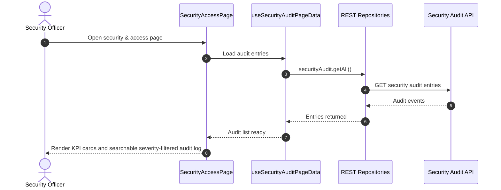

## Integrations

- **Route:** `/settings/integrations`
- **Primary users:** Admin, integrations operator
- **Feature inventory:** WithOne provider health, saved connections list, disconnect flow, pipeline status table, manual CSV upload, manual pipeline run, ingest summary panels

### User Stories

- As an integrations operator, I want to see provider health and saved connections so that I know whether Google-based ingest can run.
- As an operator, I want to upload source CSVs manually so that emergency ingest can happen from one screen.
- As an operator, I want to run pipeline modes manually so that email, folder-watch, and Google Sheet ingestion can be tested and executed on demand.
- As an admin, I want to disconnect saved connections so that obsolete or broken authorizations can be removed.

### Sequence Diagram

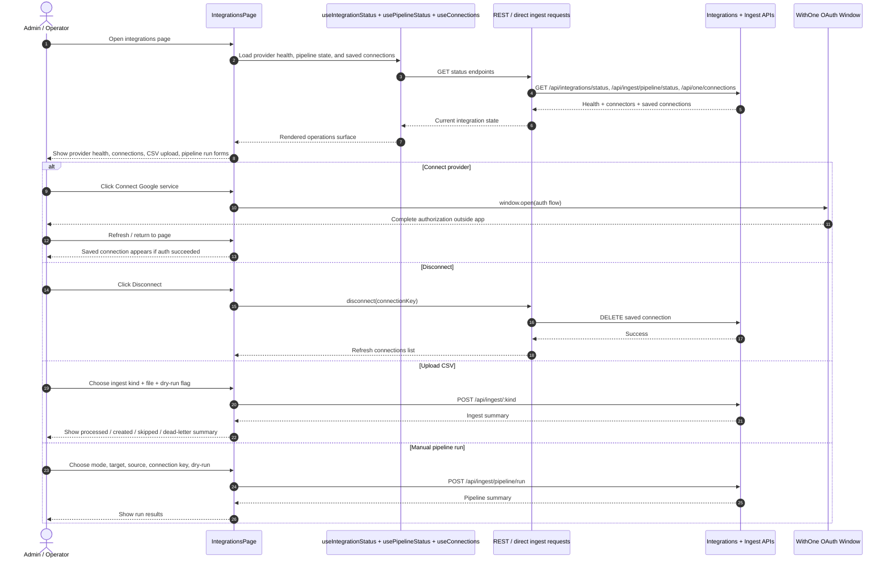

---

## Coverage Matrix

| Check | Status |
|---|---|
| 17 routed frontend pages covered | Yes |
| 4 sidebar business groups represented | Yes |
| Every routed page has at least 1 user story | Yes |
| Every routed page has a Mermaid sequence diagram | Yes |
| Shared shell/navigation flow documented | Yes |

## Implementation Notes For Developers

- Current frontend runtime is Track B REST-first. Use `createRestRepositories()` and existing page hooks as the canonical data access pattern.
- Pages that primarily read data generally use `frontend/src/hooks/use-page-data.ts` or `frontend/src/hooks/use-dashboard-data.ts`.
- Current code contains several visible CTA stubs without implemented mutations: check-in/check-out actions, new event, add staff. These are documented as visible-but-not-wired, not as completed flows.
- `frontend/src/components/guests/vip-guests-page.tsx` exists but is not routed in `frontend/src/router.tsx`; it is intentionally excluded from the 17-page coverage count.

## Stakeholder Notes

- The application already exposes a broad operational surface across front office, property, revenue, and administration.
- Many pages are read-only insight surfaces today; the strongest implemented write flows are reservations create/import, guest-request lifecycle, room-status update, maintenance issue logging, tax export review/run, and integrations operations.
- Billing remains reservation-derived in the UI rather than a dedicated folio/accounting model.
