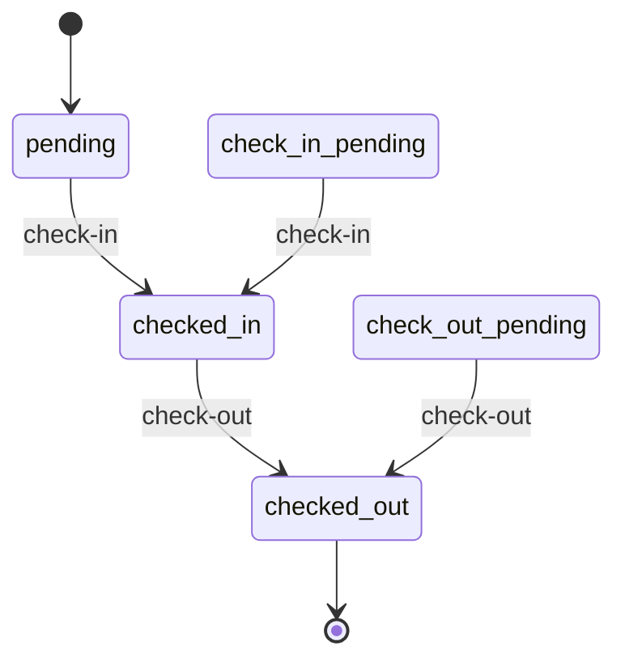
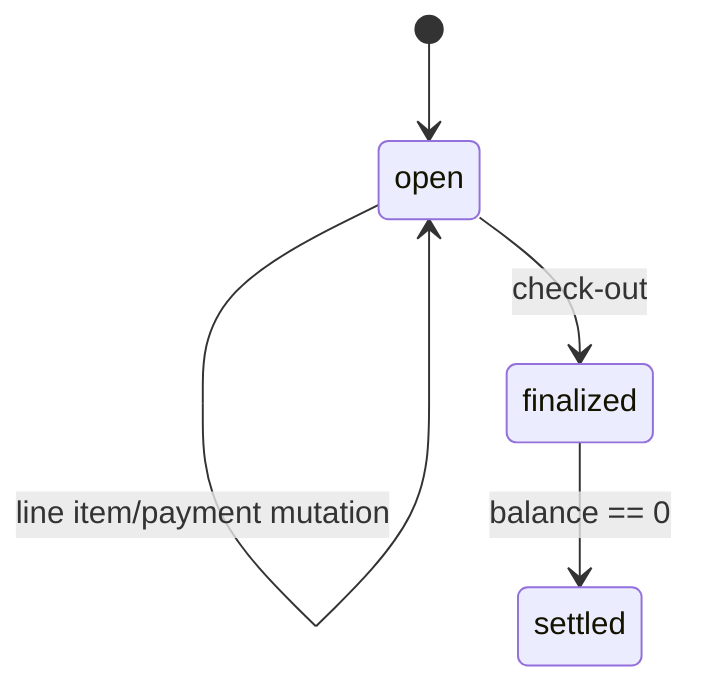

# Operations Pipeline Task Analysis

Source inputs: `design_plan.md`, `tasks.md`, current `backend/prisma/schema.prisma`.

Purpose: pre-implementation impact analysis before carrying out the Operations Pipeline plan. This document translates the task list into concrete backend, frontend, database, API, test, and documentation changes, and previews the new Azure PostgreSQL schema surface that will exist after implementation.

## Executive Summary

The implementation turns read-only or stubbed operational screens into REST-backed workflows and introduces a folio-based billing ledger. The work remains Track B only: React frontend → REST repositories → Express routes/services → Prisma → Azure PostgreSQL.

Primary changes:

1. Create and expose reservation-linked stay-experience records.
2. Make guest requests reservation-anchored, with optional legacy `guest_id` and `room_id` links.
3. Add check-in/check-out mutation endpoints that create/reuse/finalize folios.
4. Add the folio database domain: `folios`, `folio_line_items`, `folio_payments`.
5. Move tax export toward folio line items while preserving reservation fallback.
6. Add create flows for dining events and staff.
7. Add frontend repository contracts, REST adapters, TanStack Query hooks, and component bindings.
8. Add property tests for lifecycle and ledger invariants.
9. Add operations documentation under `docs/`.

Current schema note: `StayType` and `stay_experiences` already exist in `backend/prisma/schema.prisma` at the time of this analysis. The implementation should verify whether the migration history already contains `add_stay_experiences`; if yes, task 1.1 becomes a validation task rather than a new schema edit.

## Current vs Target State

| Area | Current state from tasks/schema | Target state after implementation |
|---|---|---|
| Stay experiences | `stay_experiences` model currently exists in Prisma schema; route/service/frontend wiring still planned. | Reservation-linked CRUD via `/api/stay-experiences`; Stay Records UI groups short-term/long-term rows. |
| Guest requests | `guest_requests.guest_id` and `room_id` are required; `reservation_id` is optional. | `guest_id` and `room_id` become nullable; service requires valid `reservation_id` on create. |
| Check-in/out | Room status patch exists; no explicit reservation check-in/out service or folio lifecycle. | `POST /api/reservations/:id/check-in`; `POST /api/reservations/:id/check-out`; operations event emitted after checkout. |
| Folios | No folio tables in current schema. | New folio ledger with one folio per reservation, line items, payments, persisted balances. |
| Tax export | `tax_export_items` points to `reservation_id`; no folio line item link. | Nullable `folio_line_item_id` added; finalized folios become preferred export source; reservation fallback retained. |
| Dining events | GET-only list path. | `POST /api/dining-events` service + frontend create dialog. |
| Staff | GET-only list path. | `POST /api/staff` service + frontend create dialog. |
| Frontend data layer | Existing REST repository factory; no folio/check-in/stay-experience repos. | RepositoryFactory gains `stayExperiences`, `folios`, `checkInOut`; hooks own all mutations/invalidation. |
| Tests | Existing test surface unknown for these flows. | Property tests cover 13 invariants from the design plan. |

## Implementation Waves

The task dependency graph maps to these implementation waves.

| Wave | Tasks | Output | Gate |
|---|---|---|---|
| 0 | 1.1 | Stay-experience schema verified/generated. | `db:generate`, `db:validate`, `db:verify:migration`. |
| 1 | 1.2, 3.1 | Guest request nullability migration; operations event emitter. | Schema migration review; backend type import check. |
| 2 | 1.3 | Folio domain schema + migration. | Migration SQL additive review. |
| 3 | 1.4, 3.2, 3.3 | Tax export folio link; stay-experience service; guest-request service changes. | Backend service unit/property test readiness. |
| 4 | 3.4-3.8 | Check-in/out, folio, dining-event, staff services. | Backend service compile + behavioral tests. |
| 5 | 4.1-4.6 | Express routes registered. | `cd backend && npm run build`; endpoint smoke tests. |
| 6 | 6.1 | Frontend domain DTOs. | Typecheck changed frontend files. |
| 7 | 6.2 | Repository interfaces extended. | Typecheck repository consumers. |
| 8 | 6.3, 7.1 | REST adapters + query keys. | Typecheck + mocked/manual API call review. |
| 9 | 7.2-7.5 | Hooks for stay records, check-in/out, folios, create flows. | Hook-level compile + mutation invalidation review. |
| 10 | 8.1-8.5 | Component bindings/dialogs. | Frontend typecheck/build + browser QA. |
| 11 | 10.1-10.13, 11.1 | Property tests + operations docs. | Test suite + docs review. |

## Database Schema Preview

All schema changes are additive relative to the active REST/Prisma/Azure runtime. Do not drop `guests`, `stay_registrations`, compatibility backfills, or provider import tables.

### Existing stay-experience domain to verify

`schema.prisma` already contains this target shape:

```prisma
enum StayType {
  short_term
  long_term
}

model stay_experiences {
  id                    String    @id @default(uuid()) @db.Uuid
  reservation_id        String    @db.Uuid
  channel_id            String?   @db.Uuid
  external_ref_id       String?   @db.Uuid
  platform_reference    String?
  stay_type             StayType?
  experience_notes      String    @default("")
  guest_request_content String    @default("")
  created_at            DateTime  @default(now()) @db.Timestamptz(6)
  updated_at            DateTime  @default(now()) @updatedAt @db.Timestamptz(6)

  reservation  reservations               @relation(fields: [reservation_id], references: [id], onDelete: Cascade)
  channel      channels?                  @relation(fields: [channel_id], references: [id], onDelete: SetNull)
  external_ref reservation_external_refs? @relation(fields: [external_ref_id], references: [id], onDelete: SetNull)

  @@unique([reservation_id, platform_reference])
  @@index([reservation_id])
  @@index([channel_id])
  @@index([stay_type])
}
```

Implementation action: confirm migration history matches this model. If not, generate the `add_stay_experiences` migration from current `schema.prisma` rather than hand-copying SQL.

### Guest request nullability migration

Target model changes:

```prisma
model guest_requests {
  id             String   @id @default(uuid()) @db.Uuid
  guest_id       String?  @db.Uuid
  room_id        String?  @db.Uuid
  reservation_id String?  @db.Uuid
  property_id    String?  @db.Uuid
  // existing request fields retained

  guest       guests?       @relation(fields: [guest_id], references: [id], onDelete: SetNull)
  room        rooms?        @relation(fields: [room_id], references: [id], onDelete: SetNull)
  reservation reservations? @relation(fields: [reservation_id], references: [id], onDelete: SetNull)
  property    properties?   @relation(fields: [property_id], references: [id], onDelete: SetNull)
}
```

Expected migration DDL shape:

```sql
ALTER TABLE "guest_requests" ALTER COLUMN "guest_id" DROP NOT NULL;
ALTER TABLE "guest_requests" ALTER COLUMN "room_id" DROP NOT NULL;
```

If Prisma requires FK recreation because `onDelete` changes from `Restrict` to `SetNull`, the migration remains additive/non-destructive because existing IDs are preserved and only future nulling behavior changes.

### New folio domain

Target schema:

```prisma
enum FolioStatus {
  open
  finalized
  settled
}

enum FolioLineItemKind {
  charge
  credit
}

model folios {
  id              String      @id @default(uuid()) @db.Uuid
  reservation_id  String      @db.Uuid
  property_id     String      @db.Uuid
  status          FolioStatus @default(open)
  currency        String      @default("VND")
  subtotal_amount Int         @default(0)
  paid_amount     Int         @default(0)
  balance_amount  Int         @default(0)
  opened_at       DateTime    @default(now()) @db.Timestamptz(6)
  finalized_at    DateTime?   @db.Timestamptz(6)
  settled_at      DateTime?   @db.Timestamptz(6)
  created_at      DateTime    @default(now()) @db.Timestamptz(6)
  updated_at      DateTime    @default(now()) @updatedAt @db.Timestamptz(6)

  reservation reservations       @relation(fields: [reservation_id], references: [id], onDelete: Restrict)
  property    properties         @relation(fields: [property_id], references: [id], onDelete: Restrict)
  line_items  folio_line_items[]
  payments    folio_payments[]

  @@unique([reservation_id])
  @@index([property_id])
  @@index([status])
}

model folio_line_items {
  id          String            @id @default(uuid()) @db.Uuid
  folio_id    String            @db.Uuid
  description String
  kind        FolioLineItemKind @default(charge)
  quantity    Int               @default(1)
  unit_amount Int
  line_total  Int
  tax_rate    Int               @default(8)
  source      String            @default("manual")
  created_at  DateTime          @default(now()) @db.Timestamptz(6)
  updated_at  DateTime          @default(now()) @updatedAt @db.Timestamptz(6)

  folio folios @relation(fields: [folio_id], references: [id], onDelete: Cascade)

  @@index([folio_id])
}

model folio_payments {
  id          String   @id @default(uuid()) @db.Uuid
  folio_id    String   @db.Uuid
  method      String   @default("Chuyển khoản")
  amount      Int
  reference   String?
  received_at DateTime @default(now()) @db.Timestamptz(6)
  created_at  DateTime @default(now()) @db.Timestamptz(6)

  folio folios @relation(fields: [folio_id], references: [id], onDelete: Cascade)

  @@index([folio_id])
}
```

Required back-relations:

```prisma
model reservations {
  folio folios?
}

model properties {
  folios folios[]
}
```

Operational meaning:

- One folio per reservation via `@@unique([reservation_id])`.
- Amounts are integer VND.
- `line_total = quantity * unit_amount`; credits are subtracted in service-level balance computation by `kind`.
- Persisted totals are denormalized read fields; source of truth is line items + payments.

### Tax export folio linkage

Target additive change:

```prisma
model tax_export_items {
  // existing fields retained
  folio_line_item_id String?           @db.Uuid
  folio_line_item    folio_line_items? @relation(fields: [folio_line_item_id], references: [id], onDelete: SetNull)

  @@index([folio_line_item_id])
}

model folio_line_items {
  tax_export_items tax_export_items[]
}
```

Operational meaning:

- `reservation_id` remains required for historical and fallback export behavior.
- New exports prefer finalized folio line items when present.
- Reservations without a folio continue using the existing reservation-derived export path.

## Backend Change Map

| Task | New/changed file | Change |
|---|---|---|
| 3.1 | `backend/src/events/operations-events.ts` | Typed in-process event emitter for `checkout.completed`. |
| 3.2 | `backend/src/services/stay-experience-service.ts` | CRUD service; validates reservation existence; returns existing `{ status, body }` shape. |
| 3.3 | `backend/src/services/guest-request-service.ts` | Accept nullable guest/room; require valid reservation on create; enforce status transition graph. |
| 3.4 | `backend/src/services/check-in-service.ts` | Finds reservation; transactionally creates/reuses folio; sets reservation `checked_in`. |
| 3.5 | `backend/src/services/check-out-service.ts` | Requires checked-in state; finalizes folio; sets reservation `checked_out`; emits housekeeping event. |
| 3.6 | `backend/src/services/folio-service.ts` | Ledger operations, `computeBalance`, line-item/payment mutations, folio detail/list. |
| 3.7 | `backend/src/services/dining-event-service.ts` | Required-field validation + booking create. |
| 3.8 | `backend/src/services/staff-service.ts` | Required-field validation + staff create with `property_ids`. |
| 4.1 | `backend/src/routes/stay-experiences.ts` | Register stay-experience CRUD endpoints. |
| 4.2 | `backend/src/routes/check-in-out.ts` | Register reservation check-in/check-out endpoints. |
| 4.3 | `backend/src/routes/folios.ts` | Register folio read/mutation endpoints. |
| 4.4-4.6 | `backend/src/index.ts`, existing routes | Add POST routes for dining/staff and register new route modules/listener. |

Backend validation pattern remains explicit field checks; no Zod dependency is introduced.

## API Surface After Implementation

| Method | Endpoint | Change type | Main behavior |
|---|---|---|---|
| POST | `/api/stay-experiences` | New | Create reservation-linked stay experience. |
| GET | `/api/stay-experiences` | New | List, filter by `property_id`, `reservation_id`, `stay_type`. |
| GET | `/api/stay-experiences/:id` | New | Detail with reservation context. |
| PATCH | `/api/stay-experiences/:id` | New | Partial update. |
| DELETE | `/api/stay-experiences/:id` | New | Delete. |
| POST | `/api/guest-requests` | Modified | Reservation-anchored create; `guest_id`/`room_id` optional. |
| PATCH | `/api/guest-requests/:id` | Existing/fixed client contract | Frontend adapter must use PATCH, not PUT. |
| PATCH | `/api/guest-requests/:id/status` | Existing/strengthened | Enforces full transition table. |
| POST | `/api/reservations/:id/check-in` | New | Transition reservation to checked-in; create/reuse folio. |
| POST | `/api/reservations/:id/check-out` | New | Finalize folio; transition reservation; emit room housekeeping signal. |
| GET | `/api/folios` | New | List by reservation/property. |
| GET | `/api/folios/:id` | New | Folio detail with line items/payments. |
| POST | `/api/folios/:id/line-items` | New | Add charge/credit; recompute totals. |
| POST | `/api/folios/:id/payments` | New | Record payment; settle if finalized balance reaches zero. |
| POST | `/api/dining-events` | New | Create dining/event booking. |
| POST | `/api/staff` | New | Create staff member. |

## Frontend Change Map

| Task | File | Change |
|---|---|---|
| 6.1 | `frontend/src/types/database.ts` | Add DTOs for stay experiences, folios, line items, payments, create inputs, check-in/out result. |
| 6.2 | `frontend/src/lib/repositories/types.ts` | Add `StayExperienceRepository`, `FolioRepository`, `CheckInOutRepository`; extend dining/staff repos. |
| 6.3 | `frontend/src/lib/repositories/rest-repositories.ts` | Implement REST adapters; fix guest-request update to PATCH. |
| 7.1 | `frontend/src/lib/query-keys.ts` | Add stay-experience and folio query keys. |
| 7.2 | `frontend/src/hooks/use-stay-records-data.ts` | Load/group stay experiences; mutations invalidate stay-experience caches. |
| 7.3 | `frontend/src/hooks/use-check-in-out.ts` | Check-in/out mutations invalidate reservations, rooms, folios, dashboard summary. |
| 7.4 | `frontend/src/hooks/use-folio-data.ts` | Load folio by reservation; line-item/payment mutation hooks. |
| 7.5 | `frontend/src/hooks/use-page-data.ts` | Add dining/staff/guest-request mutation hooks. |
| 8.1 | `frontend/src/components/guests/stay-records-tab.tsx` | Render stay-experience groups and empty states. |
| 8.2 | `frontend/src/components/check-in-out/check-in-out-page.tsx` | Bind buttons to mutations; show folio summary. |
| 8.3 | `frontend/src/components/guests/guest-requests-tab.tsx` | Bind create/update/status/delete controls; reservation-first form. |
| 8.4 | `frontend/src/components/dining-events/dining-events-page.tsx` | Add New Event dialog. |
| 8.5 | `frontend/src/components/admin/staff-roles-page.tsx` | Add Add Staff dialog. |

Layering rule: components call hooks only; hooks call repositories; repositories construct HTTP requests. No component should call `fetch` or know Prisma model details.

## Lifecycle Rules to Preserve

### Reservation check-in/check-out



Implementation guardrails:

- Check-in creates a folio only if one does not already exist.
- Check-out rejects reservations outside `checked_in`/`check_out_pending`.
- Check-out emits `checkout.completed` only after the DB transaction commits.

### Folio status



Balance formula:

```text
subtotal_amount = sum(charge.line_total) - sum(credit.line_total)
paid_amount = sum(payments.amount)
balance_amount = subtotal_amount - paid_amount
```

### Guest request status

Allowed transitions:

```text
open        -> assigned | in_progress | closed
assigned    -> in_progress | closed
in_progress -> fulfilled | closed
fulfilled   -> closed | reopened
closed      -> reopened
reopened    -> assigned | in_progress | closed
```

Rejected transitions must leave the row unchanged.

## Verification Plan

### Schema gates

From `backend/`:

```bash
npm run db:generate
npm run db:validate
npm run db:verify:migration
```

Review migration SQL for:

- No drops.
- No Supabase RLS syntax.
- `guests` and `stay_registrations` untouched.
- Guest request migration limited to nullability/FK behavior.
- Folio tables created with indexes and FKs.
- Tax export gets nullable `folio_line_item_id` only.

### Backend gate

```bash
cd backend
npm run build
```

Manual endpoint smoke tests once backend is running:

- `POST /api/reservations/:id/check-in` returns one reservation + one folio.
- Repeating check-in reuses the folio.
- `POST /api/reservations/:id/check-out` finalizes folio and emits housekeeping signal.
- `POST /api/folios/:id/line-items` changes `balance_amount`.
- `POST /api/folios/:id/payments` reduces balance and can settle finalized folio.
- `POST /api/dining-events` and `POST /api/staff` reject missing required fields and accept valid payloads.

### Frontend gate

From the frontend workspace/root per package scripts:

```bash
npm run typecheck
npm run build
```

Browser QA:

- Stay Records shows short-term and long-term grouping.
- Guest request create works with reservation only; no guest/room required.
- Check-in/out buttons mutate state and update folio summary.
- New Event dialog creates a booking and refreshes list.
- Add Staff dialog creates a staff member and refreshes list.

### Property-test gate

The 13 property tests in `tasks.md` should map directly to the 13 correctness properties in `design_plan.md`:

1. Stay-experience create requires existing reservation.
2. Stay-experience preserves refs/free-form content.
3. Stay Records grouping partitions without loss.
4. Guest request create is reservation-anchored with optional guest/room.
5. Guest request transitions obey table.
6. Check-in yields exactly one folio.
7. Check-out finalizes folio and transitions reservation.
8. Check-out rejected outside checked-in lifecycle.
9. Folio balance equals ledger formula.
10. Settled folios stay settled at zero balance.
11. Dining-event create validates required fields.
12. Staff create requires role and preserves assignment.
13. Tax-export totals match folio line items with fallback.

## Risks and Pre-Implementation Decisions

| Risk | Why it matters | Decision / mitigation |
|---|---|---|
| Stay-experience schema already exists | Task 1.1 may duplicate work or migration history may drift. | Verify migrations before editing schema; convert task 1.1 to validation if already applied. |
| Reservation status uses raw `String` | No Prisma enum enforces lifecycle. | Services must centralize allowed statuses and reject illegal checkout states. |
| Guest request nullability changes FK behavior | Existing `Restrict` relations cannot set null on deletion. | Prefer optional relations with `onDelete: SetNull`; review generated migration. |
| Folio totals are persisted denormalizations | Can drift if line-item/payment mutations bypass service. | Only expose mutations through FolioService; recompute inside transactions. |
| Checkout event is post-commit | Housekeeping update can fail after successful checkout. | Log listener failure; do not roll back completed checkout. |
| Tax export fallback path | Historical exports and reservations without folios must keep working. | Add nullable folio link; preserve `reservation_id` and existing derivation. |
| Frontend invalidation breadth | Operations touch reservations, rooms, folios, summary lists. | Hooks own mutation invalidation; components stay presentation-only. |

## Files Expected to Change During Implementation

Schema/migrations:

- `backend/prisma/schema.prisma`
- `backend/prisma/migrations/*add_stay_experiences*` if not already present
- `backend/prisma/migrations/*guest_requests_nullable_guest_room*`
- `backend/prisma/migrations/*add_folio_domain*`
- `backend/prisma/migrations/*tax_export_items_add_folio_line_item*`

Backend:

- `backend/src/events/operations-events.ts`
- `backend/src/services/stay-experience-service.ts`
- `backend/src/services/guest-request-service.ts`
- `backend/src/services/check-in-service.ts`
- `backend/src/services/check-out-service.ts`
- `backend/src/services/folio-service.ts`
- `backend/src/services/dining-event-service.ts`
- `backend/src/services/staff-service.ts`
- `backend/src/routes/stay-experiences.ts`
- `backend/src/routes/check-in-out.ts`
- `backend/src/routes/folios.ts`
- `backend/src/index.ts`

Frontend:

- `frontend/src/types/database.ts`
- `frontend/src/lib/repositories/types.ts`
- `frontend/src/lib/repositories/rest-repositories.ts`
- `frontend/src/lib/query-keys.ts`
- `frontend/src/hooks/use-stay-records-data.ts`
- `frontend/src/hooks/use-check-in-out.ts`
- `frontend/src/hooks/use-folio-data.ts`
- `frontend/src/hooks/use-page-data.ts`
- `frontend/src/components/guests/stay-records-tab.tsx`
- `frontend/src/components/check-in-out/check-in-out-page.tsx`
- `frontend/src/components/guests/guest-requests-tab.tsx`
- `frontend/src/components/dining-events/dining-events-page.tsx`
- `frontend/src/components/admin/staff-roles-page.tsx`

Docs/tests:

- Property-test files under the existing backend/frontend test structure.
- `docs/operations-pipeline.md`

## Definition of Ready for Implementation

Implementation can begin when these are confirmed:

1. `backend/prisma/schema.prisma` and migration history are reconciled for existing `stay_experiences`.
2. Additive migration policy is accepted for guest request FK nullability and folio tables.
3. Check-out housekeeping target status is chosen consistently with existing room-status semantics.
4. Tax export fallback behavior remains mandatory until all active reservations have folios.
5. Frontend forms remain hook-driven; no fetch logic in presentation components.

## Definition of Done

The Operations Pipeline is complete when:

1. All migrations are generated, reviewed, and verified.
2. Backend builds clean and all new endpoints pass manual smoke tests.
3. Frontend typecheck/build pass.
4. Browser QA confirms the five user-visible flows: Stay Records, Guest Requests, Check-in/out + Folio, New Event, Add Staff.
5. Property tests cover all 13 correctness properties.
6. `docs/operations-pipeline.md` documents final API surface, state machines, data flow, and migration behavior.
