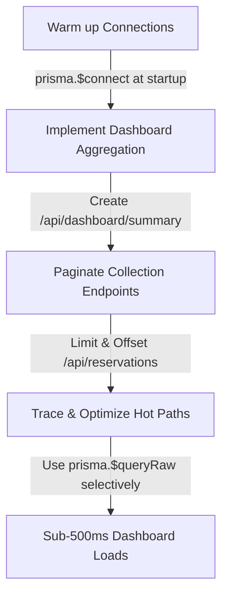

# ORM vs. Raw SQL Validation & In-Depth Architectural Analysis

**Scope:** Evaluating the architectural decision of using Prisma (ORM) versus Raw SQL in the Express backend of the **Just_Management** hospitality operations dashboard.
**Status:** **Prisma validated as primary ORM, with a targeted Hybrid Strategy for specialized queries.**

---

## 🗺️ Architectural Context & Debate

The **Just_Management** project is currently running **Track B**: a robust tech stack comprised of **React 19 + TypeScript + Vite 7** on the frontend, and **Express + Prisma + Azure PostgreSQL** on the backend. 

A debate exists within the project’s design logs (evident in `docs/analysis/prisma-vs-raw-express-sql.md` and `docs/analysis/supabase-vs-azure-pg-prisma.md`) regarding whether replacing Prisma with direct, raw SQL inside Express endpoints would optimize the dashboard and reservations performance (addressing a recorded 5–10 second latency). 

This document analyzes and validates this choice, assessing the performance, safety, velocity, and maintainability trade-offs of both options, and defines the optimal path forward.

---

## 🔎 Comparison Matrix

| Criterion | Prisma (ORM) | Raw SQL (`pg` / `postgres.js`) | Hybrid Strategy (Recommended) |
| :--- | :--- | :--- | :--- |
| **Development Velocity** | 🚀 **Very High** (Autogenerated clients, intuitive CRUD methods) | 🐌 **Low** (Manual queries, schema mappings, boilerplate) | 🏎️ **High** (Fast CRUD + targeted SQL optimization) |
| **Type Safety** | 🛡️ **Highest** (Compiles directly from `schema.prisma` models) | ⚠️ **Low** (Manual row types, high risk of silent schema drift) | 🛡️ **High** (ORM types for CRUD, manual types for raw aggregates) |
| **Migration Path** | 📦 **Canonical** (Prisma Migrate acts as Azure-safe truth) | 🧩 **Fragmented** (Requires separate migration tool, e.g., Dbmate) | 📦 **Canonical** (Prisma Migrate owns the schema & versioning) |
| **Performance Overhead**| 📉 **Low-to-Medium** (Slight client start latency, query opacity) | ⚡ **Negligible** (Direct TCP, zero query builder translation overhead) | ⚡ **Optimized** (Direct SQL on hot paths, ORM on ordinary paths) |
| **Query Control** | ⚙️ **Medium** (Limited for highly nested CTEs/complex reports) | 🎯 **Absolute** (Full access to CTEs, Window functions, Index hints) | 🎯 **Absolute** (Via `prisma.$queryRaw` for critical queries) |
| **Security (SQL Injection)** | 🟢 **Safe by Default** (Parameterized out-of-the-box) | 🔴 **High Risk** (Manual parameter binding, string template bugs) | 🟢 **Safe** (Strictly parameterized template literals) |

---

## 📊 Detailed Trade-off Analysis

### 1. The Performance Illusion: Is Prisma Actually the Bottleneck?
A common anti-pattern in modern backend optimization is blaming the ORM for high response latencies. In **Just_Management**, profiling indicates a **5 to 10 second dashboard load time**. 
* **The ORM Overhead:** Prisma Client translates programmatic queries to SQL, introducing a tiny query translation runtime overhead (<5ms) and a slight cold-start connection latency.
* **The Real Bottleneck:** The real causes of the 5-10s latency are:
  1. **Azure PostgreSQL Cold Connection Overhead:** Serverless or remote cloud databases take time to establish TCP/TLS handshakes and authenticate on the first request if connection pooling/keep-alive is absent.
  2. **Dashboard Over-fetching (Waterfall Queries):** The frontend fetching seven individual datasets concurrently, prompting multiple database queries.
  3. **Lack of Server-side Aggregation:** Fetching massive sets of raw records (`getAll()` pattern) to compute sums and averages client-side instead of executing lightweight SQL database groupings (`GROUP BY`, `COUNT`).
  4. **Missing Pagination:** Fetching thousands of historic reservations instead of slice-loading page-by-page.

**Conclusion:** Wholesale replacement of Prisma with Raw SQL will **not** fix these latency issues. A raw SQL query fetching 10,000 reservation rows sequentially will crawl just as slowly as a Prisma query doing the same.

---

### 2. Type Safety and Compilation Safeguards
Prisma acts as a critical compiler-level compiler safeguard:
* **The Prisma Shield:** Changing a column or constraint in `schema.prisma` instantly propagates new TypeScript interfaces across the entire backend codebase during `prisma generate`. Any mismatches produce immediate TypeScript compile errors.
* **The Raw SQL Risk:** If a raw SQL query references `check_in_date` and the database column gets renamed to `checkin_date`, the TypeScript compiler remains blind to this. The error only manifests as a runtime crash when a user loads a dashboard panel.

---

### 3. Migration Control and Schema Authority
Under Track B, `backend/prisma/schema.prisma` is the **canonical database design source of truth**.
* Prisma Migrate safely versions, scripts, and updates Azure PostgreSQL.
* Transitioning completely to raw SQL requires introducing third-party migration tools (e.g., `dbmate`, `node-pg-migrate`) or manually managing raw SQL scripts in folders, severely complicating container builds, database seeds, and agent-driven schema edits.

---

## 🏛️ Validation and Final Recommendation

### **We Validate the Hybrid Strategy (Option C)**

Instead of a binary "Prisma vs. Raw SQL" choice, the optimal path is a **pragmatic hybrid model**:

1. **Keep Prisma as the Default Backbone:** 
   * Use standard Prisma CRUD operations (`findMany`, `create`, `update`, `delete`) for standard endpoints (e.g., `/api/properties`, `/api/rooms`, `/api/maintenance`).
   * Keep `schema.prisma` as the sole blueprint and Prisma Migrate as the canonical database migration tool.
2. **Selectively Inject Raw SQL via `prisma.$queryRaw`:**
   * Only write raw SQL when complex CTEs (Common Table Expressions), window functions, or specialized report aggregates (such as occupancy rate calendars) are required.
   * Parameterize all queries securely using Prisma's tagged template literal:
     ```ts
     const stats = await prisma.$queryRaw`
       SELECT property_id, COUNT(*)::int AS active_count
       FROM reservations
       WHERE status IN ('confirmed', 'checked_in') AND check_in_date >= ${startDate}::date
       GROUP BY property_id;
     `;
     ```

---

## 🛠️ Step-by-Step Optimization Roadmap for Just_Management

Instead of refactoring data-access layers, perform these four high-yield optimizations:



### Phase 1: Warm-up Connections & Shared Prisma Singleton
* **Current State:** The recent refactor (Task 1 in the Reservations Sync Architecture) successfully established a single **Prisma singleton** (`backend/src/lib/prisma.ts`), eliminating multiple client initializations.
* **Action:** Trigger `prisma.$connect()` at Express startup (in `backend/src/index.ts`) so the connection pool is pre-warmed before the first HTTP request hits the backend.

### Phase 2: Server-side Dashboard Aggregation DTO
* **Current State:** The frontend performs numerous waterfall REST requests to compile metrics.
* **Action:** Build a centralized dashboard aggregation endpoint `/api/dashboard/summary?date=YYYY-MM-DD` that runs a single, combined database scan and returns a tailored, minimal JSON payload containing pre-computed metrics.

### Phase 3: Pagination and Selection Limits
* **Action:** Implement default limits (e.g., `take: 50`) and offsets on all reservation and guest lists. Never allow unbounded table fetches to cross the network.

### Phase 4: Selective Raw SQL Tuning
* **Action:** Audit the `/api/dashboard/summary` query plans. If Prisma's generated query is inefficient, replace that specific method with `prisma.$queryRaw` using optimized PostgreSQL aggregates.
