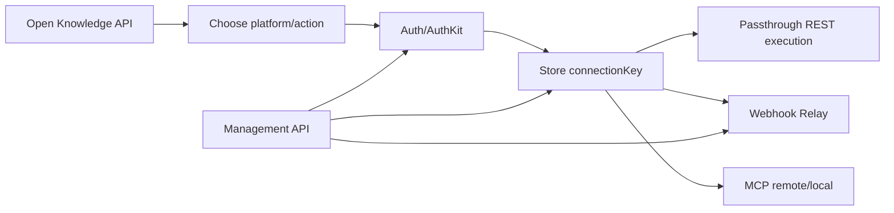
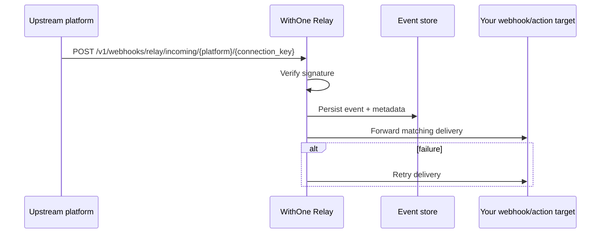
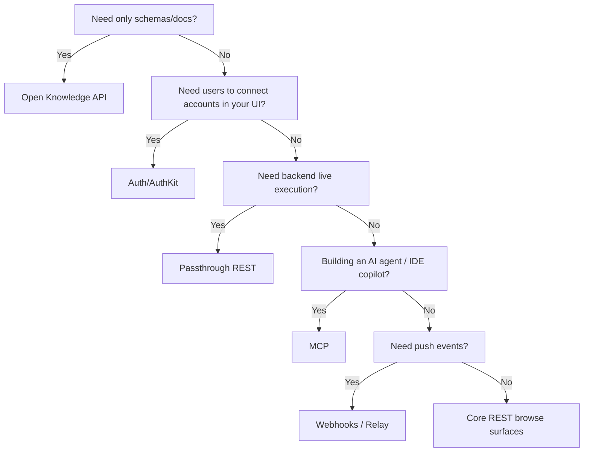

# WithOne APIs Deep Research Guide

## Executive summary

WithOne, marketed as **One**, publicly documents a family of HTTP and event-driven interfaces for connecting AI agents and applications to hundreds of third-party platforms. The surfaces that are clearly documented as of **2026-07-18** are: a **REST/HTTP API** under `https://api.withone.ai` with a `v1` namespace; an **open Knowledge API** under `/open/knowledge/*`; **webhooks** for outbound account events; a **Webhook Relay** API for ingesting and forwarding upstream platform webhooks; an **MCP server** available both locally and as a hosted remote endpoint; and several official client surfaces including the **One CLI**, the **`@withone/mcp`** package, and the **`@withone/auth`** embeddable authentication widget. WithOne also publicly claims integration support for frameworks such as **Vercel AI SDK**, **LangChain**, **OpenAI function calling**, and **Mastra**, but the first-party package documentation that is easiest to verify publicly is strongest for the CLI, MCP package, and Auth widget. citeturn28search0turn39search2turn42search0turn34search0turn35search2

If your use case is ordinary backend integration, the **REST API** is the canonical interface. If you need end-user connection onboarding, add **Auth/AuthKit**. If you need event-driven ingestion from external platforms, add **Webhook Relay**. If you are building an LLM agent or IDE assistant, the **MCP server** is the highest-level interface and is the most differentiated part of the platform, exposing only four universal tools with on-demand action discovery and knowledge loading. If you only need browse/search access to action documentation and schemas, the **open Knowledge API** is the lightest-weight starting point and is explicitly described as free for search and browse. citeturn28search0turn36view0turn21view0turn48view0turn39search2turn41search2

For Just Management, implement **AuthKit + Vault + Passthrough REST**, with Connectors used for discovery. AuthKit creates user-facing connections, Vault is the provider-side connection inventory, and Passthrough executes deterministic Gmail, Google Drive, and Google Sheets operations. Keep Management API limited to project/key provisioning. Defer MCP, CLI runtime integration, and Webhook Relay until the app has an agentic or event-driven requirement.

Current live diagnostics establish only that AuthKit transport works: `POST /v1/authkit/token` returns `200` with the documented paginated object but no visible rows. An empty result does **not** prove a project-key defect. The supported hypotheses are disabled AuthKit integrations, organization/project scope mismatch, or Sandbox/Production mismatch. Existing CLI connections are not evidence that `ONE_SECRET_KEY` sees the same tenant or Vault. Prove scope only by repeating identical requests with a known project-scoped key.

The most important caveat is that several details a production architect would normally expect to find are **not fully specified publicly**. I did **not** find public documentation for a GraphQL API, gRPC API, raw WebSocket API, SSE streaming API, or a formal public deprecation schedule. I also found publicly indexed pages for some **legacy or parallel Bearer-auth `/api/oauth/*` endpoints**—including AuthKit, AI Skills, Connections, and Event Access—but WithOne’s current top-level overview emphasizes the `v1` API family, and the public docs do not clearly state the lifecycle relationship between the `v1` and `/api/oauth/*` surfaces. Exact per-endpoint rate limits are also not publicly disclosed; only some pagination caps, “throughput” fields, and high-level claims about managed rate limiting are visible. citeturn28search0turn29search0turn34search4turn40search1turn40search2turn49view0turn47search7

## Public API catalog

The table below separates **transport/API types** from **product or capability surfaces**, because WithOne mixes both ideas in its docs. The “Status” column reflects what is publicly documented, not what might exist privately.

| Publicly documented type | What it is | Public status | Auth | Primary source |
|---|---|---:|---|---|
| REST/HTTP API | Core API, Passthrough, Vault, Identity, Management, AuthKit, Knowledge endpoints over HTTPS | Clearly documented | `X-One-Secret` API key for `v1`; some indexed legacy pages use `Authorization: Bearer` | citeturn28search0turn49view0turn34search2turn29search0 |
| Open Knowledge API | Browse/search/retrieve tool knowledge programmatically | Clearly documented | `x-one-secret` according to repo README; free browse/search positioning publicly stated | citeturn39search2turn41search2 |
| Webhooks | Outbound POST notifications from One about account events | Clearly documented | Configured in dashboard; optional webhook secret for `X-Webhook-Signature` | citeturn20view0 |
| Webhook Relay | Inbound webhook ingestion from third-party platforms, plus relay management endpoints | Clearly documented | `X-One-Secret` for management endpoints; upstream delivery hits relay URL | citeturn21view0turn22view1turn23view2 |
| MCP | Local and remote MCP server exposing four universal tools | Clearly documented | Local: `ONE_SECRET`; remote: OAuth sign-in via consent flow | citeturn48view0turn42search0 |
| CLI / client packages | Official packages and tooling surfaces | Clearly documented | Depends on package; usually API key or OAuth-backed connection | citeturn34search0turn34search1turn35search2turn32view0 |
| GraphQL | No public GraphQL docs found | **Not publicly specified** | Unspecified | citeturn28search0turn49view0 |
| gRPC / RPC | No public gRPC or RPC docs found | **Not publicly specified** | Unspecified | citeturn28search0turn49view0 |
| WebSocket / SSE streaming | No raw streaming API docs found; remote MCP uses **Streamable HTTP transport**, which is MCP-specific | **Not publicly specified as a separate API** | Unspecified outside MCP | citeturn48view0 |

From an implementation standpoint, WithOne’s documented stack is easiest to think about in layers. The **Knowledge** endpoints tell you what actions exist and what they expect. **Auth/AuthKit** gets and manages real customer connections. **Passthrough** executes against connected platforms. **Management** provisions organizations and projects. **Webhooks and Relay** bring events in and out. **MCP** packages discovery, knowledge retrieval, and execution into an agent-native interface. That layering is an inference from the documentation structure and endpoint semantics, but it matches the way the official docs are organized. citeturn28search0turn36view0turn17view0turn40search0turn20view0turn48view0



The same layering also suggests a practical adoption path: start with **Knowledge** when you are exploring; add **Auth** when your users need to connect accounts; add **Passthrough** when you need live execution; add **Webhooks/Relay** when polling becomes too slow or too expensive; and move to **MCP** when your caller is an AI agent that should dynamically discover and invoke actions at runtime. That migration path is not explicitly published by WithOne, but it is strongly supported by how the public docs describe each surface. citeturn39search2turn36view0turn17view0turn20view0turn48view0

## REST and HTTP APIs

WithOne’s current canonical HTTP API uses **API keys** in the `x-one-secret` header. The public auth page states that the dashboard can mint **Sandbox** and **Production** keys, that connectors are scoped to an environment and cannot be moved between environments, and—importantly—that both environments include **unlimited connections and unlimited API calls**. That is one of the few public statements that resembles a rate-limit policy, although it does not disclose concurrency, burst, or fair-use controls. citeturn49view0

The top-level REST catalog has several major surfaces. The **Core API** includes **Connectors**, **Actions**, **Passthrough**, **Vault**, and **Identity**. The **Management API** covers tenant provisioning of organizations, projects, invitations, members, keys, and AuthKit configuration under `/v1/management/*`. The **Knowledge API** exposes action-grounding documents under `/v1/knowledge`, while the open-source **Knowledge README** separately documents `/open/knowledge/*` endpoints for browse/search/retrieve access. The API overview also lists **AI Agents** and **Skills**, but detailed public `v1` page-level endpoint docs for those were not readily discoverable in public search; I did, however, find indexed `/api/oauth/*` pages for AI Skills and related resources. citeturn28search0turn40search0turn39search2turn29search0

### REST catalog by surface

| Surface | Core purpose | Example patterns | Notable request/response characteristics | Public notes |
|---|---|---|---|---|
| Connectors | Enumerate supported platforms | `GET /v1/available-connectors` | Paged list with `page`, `pages`, `rows`, `total`; filters include `platform`, `key`, `name`, `authkit` | Connector metadata includes `oauth`, `oauthScopes`, `tools`, `status`, `version` citeturn14view0 |
| Actions | Enumerate/search platform actions | `GET /v1/available-actions/{platform}` and `/search/{platform}` | Paged listing for browse, array result for search; filters include `method`, `tags`, `includeDeprecated`; search can include knowledge | Search can optionally use ranking/refinement flags such as `executeAgent` and `knowledgeAgent` citeturn15view0turn16view0 |
| Passthrough | Execute authenticated upstream requests | `POST /v1/passthrough/{key}` | Forwards method/body/query/headers to upstream platform using resolved credentials | Intended when no first-class action exists; supports many HTTP status classes including `429`, `422`, `423`, `502`, `503` citeturn17view0 |
| Vault | Read/update connection metadata | `/v1/vault/connections...` | Connection objects include `identity`, `identityType`, `platform`, `state`, `tags`, `environment` | Primarily for dashboards, inventory, filtering, and metadata management rather than execution citeturn46search0turn46search4 |
| Identity | Inspect current key scope | `GET /v1/whoami` | Returns the user owning the current key and its org/project scope | Very useful for smoke tests and support workflows citeturn46search2 |
| Management | Provision orgs/projects/keys/members | `/v1/management/...` | Bootstraps new org service-account keys and exposes key objects including `throughput`, `environment`, `keyPreview` | Docs explicitly call `POST /v1/management/organizations/setup` the canonical programmatic tenant bootstrap call citeturn40search0turn25search1turn25search3 |
| AuthKit | Mint frontend sessions and configure embeddable auth | `/v1/authkit/token`, `/v1/authkit/.../dashboard` | Session token generation plus integration visibility/config surfaces | Public docs mix dashboard configuration guidance with API reference pages citeturn44view0turn36view1 |
| Knowledge | Get grounding documents for actions | `/v1/knowledge`, `/open/knowledge/...` | Schemas include `ioSchema`, `knowledge`, HTTP method, path, tags, base URL | Open knowledge docs present this as free browse/search functionality citeturn46search3turn39search2turn41search2 |

### Common request and response schema patterns

The `v1` REST endpoints are not described as a single OpenAPI contract in the public docs, but they do show recurring shapes. Paged list endpoints commonly return a wrapper with `page`, `pages`, `rows`, and `total`. Error payloads commonly include `correlationId`, `key`, `message`, `status`, and `type`; some endpoints also include numeric `code`. Connector rows include metadata such as `platform`, `version`, OAuth support, and tool counts. Action rows include `key`, `method`, `path`, `systemId`, `tags`, and `title`. Knowledge rows include `_id`, `ioSchema`, `knowledge`, `method`, `path`, and `baseUrl`. Vault connection rows include `identity`, `identityType`, `environment`, `platform`, `state`, `tags`, and `key`. citeturn14view0turn15view0turn16view0turn46search3turn46search0

Filtering and pagination are fairly consistent where documented. Many list endpoints accept `limit` and `page`; several newer pages also accept `skip`, and some explicitly hard-cap `limit` at **150** with clamping behavior. Search endpoints accept free-text `query`, while resource-specific filters vary by surface: connectors can filter by platform/key/name, actions by method/tags/deprecation, relay events by connection/platform/event time range, and knowledge by platform or action `_id`. citeturn14view0turn15view0turn16view0turn23view0turn46search3

On errors, the public docs show a broad set of possible status codes rather than a narrow, uniform set. Depending on the endpoint, you may see `400`, `401`, `402`, `403`, `404`, `405`, `408`, `409`, `422`, `423`, `429`, `500`, `501`, `502`, or `503`. That strongly suggests WithOne normalizes many categories of upstream and platform-layer failures into structured HTTP errors. The CLI and product pages also emphasize that One manages **rate limits** and returns **structured errors**, but the exact retry headers, quotas, or per-plan concurrency numbers are not publicly specified. citeturn17view0turn21view0turn47search7turn43search3

### REST examples

The following examples follow the documented `x-one-secret` header, URL patterns, and response semantics for the Connectors, Knowledge, and Passthrough surfaces. They are representative implementations derived from the official endpoint docs. citeturn49view0turn14view0turn46search3turn17view0

**cURL: list connectors**

```bash
curl -X GET "https://api.withone.ai/v1/available-connectors?limit=20&page=1" \
  -H "x-one-secret: $ONE_SECRET"
```

**JavaScript: search knowledge documents**

```javascript
const url = new URL("https://api.withone.ai/v1/knowledge");
url.searchParams.set("connectionPlatform", "gmail");
url.searchParams.set("limit", "20");
url.searchParams.set("page", "1");

const res = await fetch(url, {
  headers: {
    "x-one-secret": process.env.ONE_SECRET,
  },
});

if (!res.ok) {
  const err = await res.json().catch(() => ({}));
  throw new Error(`WithOne error ${res.status}: ${err.message ?? "unknown error"}`);
}

const data = await res.json();
console.log(data.rows);
```

**Python: list actions for Gmail**

```python
import os
import requests

resp = requests.get(
    "https://api.withone.ai/v1/available-actions/gmail",
    headers={"x-one-secret": os.environ["ONE_SECRET"]},
    params={"limit": 20, "page": 1, "includeDeprecated": False},
    timeout=30,
)
resp.raise_for_status()
payload = resp.json()
for row in payload.get("rows", []):
    print(row["key"], row["method"], row["title"])
```

**JavaScript: make a Passthrough call**

```javascript
const res = await fetch("https://api.withone.ai/v1/passthrough/gmail/messages/send", {
  method: "POST",
  headers: {
    "x-one-secret": process.env.ONE_SECRET,
    "x-one-connection-key": process.env.GMAIL_CONNECTION_KEY,
    "content-type": "application/json",
  },
  body: JSON.stringify({
    to: "[email protected]",
    subject: "Hello from WithOne",
    body: "This message was sent via Passthrough.",
  }),
});

if (!res.ok) {
  const err = await res.json().catch(() => ({}));
  console.error(err);
  throw new Error(`Passthrough failed with ${res.status}`);
}

console.log(await res.text());
```

**Python: open Knowledge API browse call**

```python
import os
import requests

resp = requests.get(
    "https://api.withone.ai/open/knowledge/airtable",
    headers={"x-one-secret": os.environ["ONE_SECRET"]},
    timeout=30,
)
resp.raise_for_status()
print(resp.json())
```

### Security, performance, versioning, and deprecation

For REST, the key best practices that WithOne documents or strongly implies are: keep `x-one-secret` server-side only; separate Sandbox from Production; scope connections by environment and identity; store connection keys securely; validate ownership before executing calls on behalf of a user; and prefer project-level Auth scoping so different products or customer segments do not accidentally share visible integrations or OAuth credentials. The Auth management guide is explicit about verifying user identity before generating tokens and about never exposing API keys in frontend code. citeturn49view0turn45view0turn44view0

Performance characteristics are only partially public. WithOne’s changelog claims “Improved API Performance” via faster route matching, and its product pages describe sub-100ms p95 behavior for auth token operations and for agent runtime skill execution, but there is no public HTTP API SLA or endpoint-by-endpoint latency chart. Treat those as **vendor performance claims**, not contractual guarantees. citeturn38search0turn43search1turn38search8

Versioning and deprecation are also only partially public. The current API family is clearly namespaced under **`/v1`**, actions support an `includeDeprecated` flag, some payloads contain `warning` or `deprecated` fields, and WithOne publishes a changelog; however, I did not find a formal public statement such as “deprecated endpoints receive N days of support before removal.” There are also publicly indexed `/api/oauth/*` pages, but the docs do not clearly explain whether these are legacy, browser-session, or parallel APIs, so production adopters should treat them cautiously and prefer documented `v1` surfaces unless WithOne support tells you otherwise. citeturn15view0turn22view1turn44view0turn38search0turn29search0turn34search4

## Webhooks and MCP interfaces

WithOne exposes **two different webhook concepts**. First, it can send **outbound account event webhooks** to your endpoint when things happen in your One account. Second, it offers a **Webhook Relay** layer that receives inbound webhooks from upstream platforms, verifies and stores them, and then forwards them or triggers configured actions. These are related but not the same. citeturn20view0turn22view1turn23view2

The outbound webhook system is configured from the dashboard rather than from richly indexed API pages. Public docs say One sends a `POST` request to your endpoint when an event fires, supports a user-supplied secret for request signing in `X-Webhook-Signature`, retries failed deliveries up to **3 times**, and provides event history in the dashboard. Publicly listed event families include passthrough events, connection create/delete events, OAuth refresh/failure events, project and organization lifecycle events, and member changes. citeturn20view0

Webhook Relay is more API-driven. The Relay API includes endpoints to list supported relay platforms, enumerate relay event types, create relay endpoints, list relay endpoints and deliveries, retrieve setup configuration, activate endpoints, and receive inbound upstream deliveries. Public docs show relay platform listing at `GET /v1/webhooks/relay/platforms`, event-type discovery at `GET /v1/webhooks/relay/event-types?platform=...`, endpoint creation at `POST /v1/webhooks/relay`, and the upstream delivery URL pattern `POST /v1/webhooks/relay/incoming/{platform}/{connection_key}`. Docs explicitly state that the incoming endpoint verifies the signature, persists the event, and forwards it to every matching endpoint, and that you do not call it yourself. citeturn22view0turn21view0turn22view1turn23view2

Relay pagination is more explicit than many other surfaces. `GET /v1/webhooks/relay/events` supports `limit`, `page`, `skip`, `connectionId`, `platform`, `eventType`, `after`, and `before`, and the docs state that `limit` defaults to 20 and is hard-capped at **150** with clamping semantics. That makes Relay one of the more operationally mature public surfaces. citeturn23view0

MCP is the most agent-centric interface WithOne offers. The docs describe two deployment modes: a **local MCP server** configured by the CLI and a **hosted remote MCP server** at `https://mcp.withone.ai/mcp`. The remote endpoint uses **Streamable HTTP transport**, authenticates through an OAuth sign-in flow rather than an API key, and supports scoped consent where the user chooses which connections, actions, and permission levels the agent gets. Both local and remote variants expose the same **four tools**. citeturn48view0

Those four tools are `list_one_integrations`, `search_one_platform_actions`, `get_one_action_knowledge`, and `execute_one_action`. The docs further explain that the `list_one_integrations` output includes an `access` field so the agent knows whether a connection is full-access, method-restricted, or action-restricted. The MCP docs also document **knowledge-only mode**, which removes `execute_one_action` entirely so the agent can inspect parameters and schemas without being able to hit live APIs. citeturn48view0turn42search0

WithOne makes unusually concrete performance claims for MCP. Public product docs state a **constant ~3,000 token footprint**, about **18x** lower token overhead than traditional multi-server MCP setups in the cited example, and public infrastructure claims say skill discovery resolves in **under 100ms** while auth is injected at execution time. Security claims for MCP are also explicit: credentials are never exposed to the MCP client or agent, are encrypted at rest with **AES-256** and in transit with **TLS 1.3**, and enterprise plans add private endpoints, SSO, SCIM, and granular access policies. Again, these are vendor claims rather than independently benchmarked figures. citeturn42search0turn43search2



### Webhook and MCP examples

The following examples reflect the documented webhook headers, retry model, relay URL patterns, and MCP configuration rules. citeturn20view0turn23view2turn48view0

**cURL: list relay event types for Stripe**

```bash
curl -X GET "https://api.withone.ai/v1/webhooks/relay/event-types?platform=stripe" \
  -H "x-one-secret: $ONE_SECRET"
```

**JavaScript: verify an outbound One webhook signature**

```javascript
import crypto from "node:crypto";
import express from "express";

const app = express();
app.use(express.json({ verify: (req, _res, buf) => { req.rawBody = buf; } }));

app.post("/withone/webhook", (req, res) => {
  const signature = req.header("x-webhook-signature");
  const secret = process.env.WITHONE_WEBHOOK_SECRET;

  const expected = crypto
    .createHmac("sha256", secret)
    .update(req.rawBody)
    .digest("hex");

  if (!signature || !crypto.timingSafeEqual(Buffer.from(signature), Buffer.from(expected))) {
    return res.status(401).send("invalid signature");
  }

  console.log("event:", req.body);
  res.sendStatus(200);
});
```

**Python: verify an outbound One webhook signature**

```python
import hmac
import hashlib
from flask import Flask, request, abort

app = Flask(__name__)
SECRET = b"your-webhook-secret"

@app.post("/withone/webhook")
def withone_webhook():
    signature = request.headers.get("X-Webhook-Signature")
    raw = request.get_data()

    expected = hmac.new(SECRET, raw, hashlib.sha256).hexdigest()
    if not signature or not hmac.compare_digest(signature, expected):
        abort(401)

    print(request.json)
    return ("", 200)
```

**Remote MCP config**

```json
{
  "mcpServers": {
    "one": {
      "type": "http",
      "url": "https://mcp.withone.ai/mcp"
    }
  }
}
```

**Local MCP config**

```json
{
  "mcpServers": {
    "one": {
      "command": "npx",
      "args": ["@withone/mcp"],
      "env": {
        "ONE_SECRET": "your-one-secret-key"
      }
    }
  }
}
```

**Python operational example to launch the local MCP package**

```python
import os
import subprocess

env = os.environ.copy()
env["ONE_SECRET"] = os.environ["ONE_SECRET"]
env["ONE_KNOWLEDGE_AGENT"] = "true"   # optional

proc = subprocess.Popen(
    ["npx", "@withone/mcp"],
    env=env,
)
print(f"Started One MCP with pid {proc.pid}")
```

That last Python snippet is **not** an official WithOne Python SDK example; it is an operational wrapper around the official npm package because I did not find a first-party Python MCP client library from WithOne. That absence is worth noting if Python-first infrastructure is a hard requirement. citeturn34search1turn48view0

## SDKs, client libraries, and auth components

The most clearly documented official client surfaces are all **JavaScript/TypeScript-centric**. The public GitHub organization and npm pages show `@withone/cli`, `@withone/mcp`, and `@withone/auth` as first-party packages, and the docs explicitly describe the Auth widget as working with **React, Next.js, Vue, Svelte, and any frontend framework**. The GitHub organization also contains an `auth` repo described as a “drop-in authentication widget,” an `mcp` repo, a `cli` repo, a `knowledge` repo, and a `toolkit` repo described as “Pica tools for the Vercel AI SDK.” citeturn32view0turn34search0turn34search1turn35search2turn36view0

Public docs also make broader ecosystem claims. The API overview says Passthrough has support for **Vercel AI SDK, LangChain, MCP, etc.**, while the MCP product page specifically says One works with **Vercel AI SDK, LangChain, OpenAI function calling, Mastra**, and any MCP-compatible client. However, beyond those claims and the `toolkit` repository description, first-party public package-level documentation is not as easy to verify as it is for CLI/MCP/Auth. For a strict enterprise vendor review, that means the framework support story is **credible but not equally documented across all frameworks**. citeturn33search2turn42search0turn32view0

### Official client/library inventory

| Official surface | Language/runtime | Install | What it is for | Public evidence |
|---|---|---|---|---|
| One CLI | Node.js CLI | `npm install -g @withone/cli` | Human or agent-oriented discovery, knowledge inspection, execution, account/workflow management | citeturn18search1turn34search0turn47search7 |
| MCP package | Node.js package / MCP server | `npm install @withone/mcp` or `npx @withone/mcp` | Local MCP server for IDEs and agent frameworks | citeturn48view0turn34search1 |
| Auth widget | Frontend bindings | `npm install @withone/auth` | Embeddable connect flow for end-user integrations | citeturn44view0turn35search2turn36view0 |
| Knowledge repo | Content + open API docs | N/A | Open-source tool/action knowledge and open browse/search endpoints | citeturn39search2 |
| Toolkit repo | TypeScript repo | Public repo exists; package-level docs less prominent | Vercel AI SDK-oriented tooling, apparently legacy “Pica” naming in repo description | citeturn32view0 |
| Python SDK | No first-party package found publicly | N/A | Unspecified | citeturn32view0turn47search7 |

The Auth component deserves special attention because it is the most important “SDK-like” surface for SaaS builders. The setup guide documents a standard pattern: your backend exposes a token endpoint, the frontend opens the Auth modal via `useOneAuth`, and successful connection creation returns a `ConnectionRecord` containing a `key` that you store and later use for Passthrough calls. The docs also emphasize that the token endpoint must be a **full URL**, not a relative path, because the widget runs in an iframe on a different domain. citeturn44view0

The following examples follow the Auth setup guide’s documented frontend and backend flow. The JavaScript example is close to the official shape; the Python example is an equivalent server-side implementation for teams whose application backend is Python. citeturn44view0

**JavaScript / React Auth quickstart**

```javascript
"use client";

import { useOneAuth } from "@withone/auth";

export function ConnectIntegrationButton({ userId }) {
  const { open } = useOneAuth({
    token: {
      url: "https://your-domain.com/api/one-auth",
      headers: {
        "x-user-id": userId,
      },
    },
    onSuccess: (connection) => {
      console.log("Connection created:", connection);
      // Persist connection.key, connection.platform, connection.environment
    },
    onError: (error) => {
      console.error("Connection failed:", error);
    },
  });

  return <button onClick={open}>Connect Integration</button>;
}
```

**Python / FastAPI backend token endpoint**

```python
import os
import httpx
from fastapi import FastAPI, Header, HTTPException, Response

app = FastAPI()

@app.options("/api/one-auth")
async def options():
    response = Response()
    response.headers["Access-Control-Allow-Origin"] = "*"
    response.headers["Access-Control-Allow-Methods"] = "POST, OPTIONS"
    response.headers["Access-Control-Allow-Headers"] = "Content-Type, Authorization, x-user-id"
    return response

@app.post("/api/one-auth")
async def create_one_auth_token(x_user_id: str | None = Header(default=None)):
    if not x_user_id:
        raise HTTPException(status_code=401, detail="Unauthorized")

    async with httpx.AsyncClient(timeout=30) as client:
        resp = await client.post(
            "https://api.withone.ai/v1/authkit/token",
            headers={
                "x-one-secret": os.environ["ONE_SECRET_KEY"],
                "content-type": "application/json",
            },
            json={
                "identity": x_user_id,
                "identityType": "user",
            },
        )

    if resp.status_code >= 400:
        raise HTTPException(status_code=resp.status_code, detail=resp.text)

    return resp.json()
```

Operationally, this means WithOne is strongest today for teams that are comfortable with **TypeScript/Node-based tooling**, even if their application backend is in another language. Python teams can still integrate the HTTP APIs easily, but they should not currently expect the same breadth of official first-party package support that JavaScript teams get publicly. That is an inference from the documented package inventory. citeturn32view0turn34search0turn34search1turn35search2

## Decision matrix and use-case mapping

The table below is an **analytical decision matrix**, not a vendor-published benchmark sheet. Where exact figures are public, I note them; otherwise, the ratings are reasoned estimates based on documented behavior, scope, and operational model.

| Interface | Best use case | Latency | Throughput / scale | Real-time | Complexity | Ease of use | Cost implication | Notes |
|---|---|---|---|---|---|---|---|---|
| Open Knowledge API | Browse actions, inspect auth/schema, pre-build UI or prompts | Low | High for read-heavy discovery | No | Low | High | Best for lowest-cost entry; browse/search described as free | citeturn39search2turn41search2 |
| Core REST browse surfaces | Platform inventory, action search, key introspection, connection inventory | Low | Medium to high | No | Low to medium | High | Likely low; pricing details not endpoint-specific publicly | citeturn14view0turn15view0turn46search2 |
| Passthrough REST | Live execution against connected apps from your backend | Medium | Medium to high, but exact per-endpoint rate caps unpublished | No | Medium | Medium | Infrastructure described as free to start, transaction-based as you scale | citeturn17view0turn41search2turn38search3 |
| Auth/AuthKit | User-facing connect flows in SaaS apps | Low for token ops; vendor claims sub-100ms p95 auth operations | High for multi-tenant onboarding | No | Medium | High for frontend teams | Cost/plan detail not itemized publicly; value is in managed auth | citeturn43search1turn36view0turn44view0 |
| Outbound webhooks | Notify your system when One events occur | Push-based | Good for sparse event traffic | Yes | Medium | Medium | Usually efficient versus polling | citeturn20view0 |
| Webhook Relay | Ingest Stripe/HubSpot/etc. webhooks and fan them out or trigger follow-on actions | Medium | Good for event-driven integrations; list APIs capped to 150/page | Yes | Medium to high | Medium | Likely better than polling-heavy designs | citeturn23view0turn22view1turn23view2 |
| MCP | LLM agents, IDE assistants, dynamic tool use | Good for agent workflows; docs claim discovery under 100ms and constant ~3K token overhead | Designed for many integrations with constant tool footprint | Yes, insofar as agent can react to live calls and relay/webhook-connected systems | Medium | Very high for agentic use | Free to start; transaction-based as usage scales | citeturn42search0turn43search2turn48view0 |

For **traditional backend apps**, choose **REST + Auth + Passthrough**. That combination gives you normal service-to-service control, explicit auditability, and the least surprise for non-agent developers. For **multi-tenant SaaS**, add **Management API** so you can provision organizations, projects, keys, and AuthKit settings programmatically rather than by dashboard clicks. For **event-driven automation**, add **webhooks** and especially **Relay** when upstream platforms should push rather than be polled. For **agent frameworks, coding agents, and internal copilots**, choose **MCP** first because it collapses discovery, knowledge lookup, and execution into one interface. citeturn36view0turn17view0turn40search0turn20view0turn21view0turn48view0

A practical selection rule is this:

- If you want **human-written application code** to call integrations predictably, use **REST/Passthrough**.
- If you want **end users to connect accounts inside your UI**, use **Auth/AuthKit**.
- If you want **events instead of polling**, use **webhooks/Relay**.
- If you want an **LLM to discover and use integrations on demand**, use **MCP**.
- If you only need **documentation and schemas**, use the **open Knowledge API**. citeturn39search2turn44view0turn20view0turn23view2turn48view0



## Implementation guidance and troubleshooting

The cleanest migration path across WithOne surfaces is usually **Knowledge → Auth → Passthrough → Webhooks/Relay → MCP**. Start with the Knowledge API to discover platforms, action names, auth patterns, and schemas. Then wire in Auth so users can create connections and you can persist `connectionKey`. Once you have live connections, move executions into Passthrough. If your architecture starts polling too often or chasing low-latency updates, layer in webhooks or Relay. If you later adopt LLM-driven operation, MCP lets you retain the same underlying platform/action universe while changing the caller model from deterministic app code to tool-using agents. This sequence is an implementation recommendation inferred from the public docs, not a vendor-prescribed migration plan. citeturn39search2turn44view0turn17view0turn20view0turn48view0

For testing, use the **Sandbox environment** first, because the auth docs distinguish Sandbox and Production and explicitly say all testing should be done in Sandbox. Use `GET /v1/whoami` as a first smoke test for a new API key, `GET /v1/available-connectors` to confirm account visibility, and Vault listing to confirm that the connection was created under the identity you expected. For Auth flows, test full CORS behavior including the `OPTIONS` preflight and confirm the token endpoint uses a **full URL**. For Relay, test event delivery against a staging endpoint and inspect event history or relay deliveries before enabling production actions. citeturn49view0turn46search2turn14view0turn44view0turn22view1turn23view0

Monitoring recommendations follow directly from the public error and metadata model. Log the **`correlationId`** from error responses, because it is present on many structured errors and will matter when working with WithOne support. Persist key resource identifiers such as organization ID, project ID, connection key, connection ID, platform, environment, and identity. For webhooks, log signature validation results, delivery attempt counts, and downstream processing latency. For MCP, monitor both **tool selection accuracy** and **execution success**, because a semantic search layer can fail differently from a deterministic REST client. The last point is analytical, but it follows from the documented search-based MCP tool model. citeturn17view0turn21view0turn44view0turn48view0

The most common publicly documented Auth pitfalls are straightforward: `405 Method Not Allowed` because your token endpoint forgot the `OPTIONS` handler, CORS failures because your `Access-Control-Allow-Headers` list is incomplete, token generation failures because your secret key is wrong, integration preselection failures because `selectedConnection` used the platform ID instead of the display name, and “connection not saving” because your `onSuccess` callback did not persist the connection metadata. Those are the only highly concrete troubleshooting tips WithOne publishes publicly, and they are useful precisely because they are specific. citeturn44view0

For API troubleshooting more broadly, I would use this playbook:

1. **401**: confirm `x-one-secret`, environment, and possibly connection ownership. The public error examples repeatedly use “Authentication required.” citeturn14view0turn17view0turn21view0  
2. **403**: check scope mismatch—wrong org/project key, wrong identity, or restricted MCP consent/access policy. citeturn40search0turn45view0turn48view0  
3. **404**: verify path pattern, action/platform name, and whether the endpoint is `v1` versus a legacy `/api/oauth/*` path. citeturn15view0turn29search0  
4. **409**: expect lifecycle conflicts such as deleting an organization that still has projects or active connections. citeturn25search5  
5. **429**: back off and retry conservatively; exact public quotas are not documented, but the platform clearly reserves the ability to rate-limit. citeturn17view0turn21view0turn47search7  
6. **Action discovery mismatch**: use the Knowledge API or MCP `get_one_action_knowledge` before execution, and prefer exact platform/action scoping rather than blind free-text prompts. citeturn39search2turn48view0  

The largest unresolved public-documentation gaps, which you should account for before committing to a large implementation, are these: exact AI Agents/Skills `v1` endpoint coverage; exact per-endpoint or per-plan rate limits; a formal public deprecation policy; and clear lifecycle guidance on the indexed `/api/oauth/*` surfaces. If those details matter for your architecture review, the safest next step is to treat them as **vendor clarification items**, not assumptions. citeturn28search0turn29search0turn34search4turn38search0turn41search7
