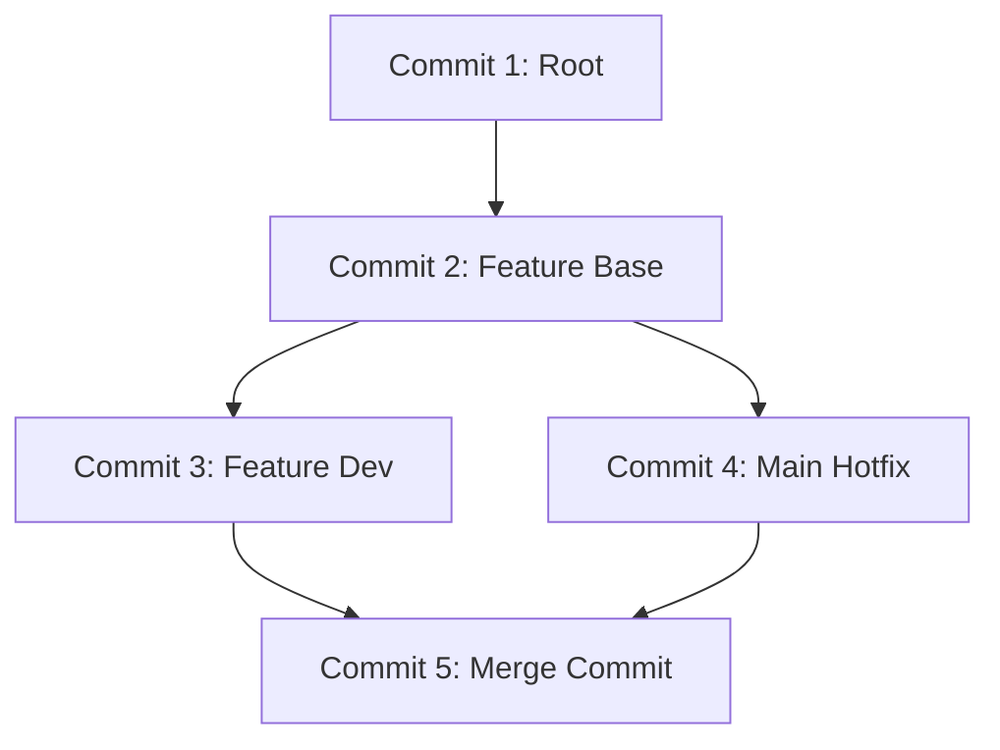

# Comprehensive Git Guide: Foundational & Contextual Worktree Workflows

This guide provides a comprehensive tutorial on using Git. It begins with the absolute core foundations and extends into advanced workflows specifically tailored to your active environment—featuring multiple Git Worktrees, conventional commits, and agentic workflows.

---

## 1. Foundational Git Concepts

At its core, Git is a **content-addressable filesystem** and a **Directed Acyclic Graph (DAG)** of commit objects, rather than a system that just tracks diffs.



### 1.1 The Core Objects
Every piece of data in Git is stored inside the `.git/objects/` directory under a cryptographic hash (SHA-1/SHA-256). There are four fundamental object types:
1. **Blobs**: Represent file contents (excluding file metadata like name or permissions).
2. **Trees**: Represent directories. A tree references other blobs (files) and other nested trees (subdirectories), mapping filenames to hashes.
3. **Commits**: Represent a snapshot in time. A commit object contains a reference to a top-level Tree, a list of parent commit hashes, the author/committer information, and the commit message.
4. **Annotated Tags**: References pointing to specific commits with a message, signature, and timestamp.

### 1.2 The Three Areas (Plus Remote)
To work with Git effectively, you must understand the separation between Git's distinct areas:

```
┌──────────────────┐     git add      ┌──────────────────┐     git commit   ┌──────────────────┐
│  Working Tree    │ ───────────────> │   Staging Area   │ ───────────────> │ Local Repository │
│ (Modified Files) │ <─────────────── │     (Index)      │ <─────────────── │  (Committed Refs)│
└──────────────────┘   git checkout   └──────────────────┘    git checkout  └──────────────────┘
         │                                                                            ▲
         │                                                                            │
         │                              git push / fetch                              │
         └────────────────────────────────────────────────────────────────────────────┘
                                         Remote Repository
```

1. **Working Tree**: The actual files you see and edit on your computer's filesystem.
2. **Staging Area (Index)**: A preparation area. It is a single file in `.git/index` that lists the exact state of files destined for the next commit. When you run `git add`, you index files.
3. **Local Repository**: The committed history stored securely inside `.git`.
4. **Remote Repository**: The central host (e.g., GitHub, GitLab) that enables sharing changes.

---

## 2. Git Worktrees: The Current Context

Your active environment is designed around **Git Worktrees**:
* **Active Path**: `C:\Users\Fate_Conqueror\.config\superpowers\worktrees\Just_Management\feature-reservations-sync-architecture`
* **Another Active Branch**: `feature/dashboard-completion-tax-export` checked out in a sibling worktree directory.

### 2.1 What is a Git Worktree?
By default, cloning a Git repository gives you a single working tree (the checkout folder) and a single local repository (in `.git`). 

`git worktree` allows you to **check out multiple branches simultaneously into different folders**, all sharing a single `.git` repository. 

#### Why use Worktrees?
* **Zero-Switch Overhead**: You do not need to stash your work, switch branches, build, and unstash just to fix a bug on another branch.
* **Coexistence**: You can run parallel tests or have two VS Code / OpenCode editors open on two separate branches at the same time.
* **Shared Cache**: Because the `.git` directory is shared, any fetch or fetch-ref in one worktree is instantly available to all other worktrees.

### 2.2 Core Worktree Commands

* **List all active worktrees**:
  ```bash
  git worktree list
  ```
  *Outputs directories, their commit hashes, and checked-out branches.*

* **Add a new worktree**:
  ```bash
  git worktree add ../feature-dashboard-completion-tax-export feature/dashboard-completion-tax-export
  ```
  *Creates a directory at `../feature-dashboard-completion-tax-export` and checks out the branch `feature/dashboard-completion-tax-export` there.*

* **Remove a worktree**:
  ```bash
  git worktree remove ../feature-dashboard-completion-tax-export
  ```
  *Deletes the working tree files and cleans up Git's administrative metadata.*

* **Prune disconnected worktrees**:
  If you manually delete a worktree folder, Git's administration files inside `.git/worktrees` remain. Prune them with:
  ```bash
  git worktree prune
  ```

> [!WARNING]
> You cannot check out the **same branch** in multiple active worktrees simultaneously. If a branch is checked out in `Worktree A`, trying to check it out in `Worktree B` will yield an error: `fatal: 'branch-name' is already checked out at '...'`.

---

## 3. Git Command Cheat Sheet (Context-Specific)

### 3.1 Initializing & Staging
| Command | Description |
| :--- | :--- |
| `git status` | View the state of files across the Working Tree and Staging Area. |
| `git diff` | View modifications not yet staged (`Working Tree` vs. `Index`). |
| `git diff --staged` | View changes prepared for the next commit (`Index` vs. `HEAD`). |
| `git add <file>` | Move a file from the Working Tree into the Staging Area. |
| `git add -p` | Interactively stage partial hunks of modified files. |

### 3.2 Committing & Branching
When writing commits in this repository, follow the **Conventional Commits** standard (e.g. `feat(tax): add export api routes` or `fix(one): resolve token signature check`).

| Command | Description |
| :--- | :--- |
| `git commit -m "msg"` | Create a new commit from the staged files. |
| `git branch -a` | List all local and remote branches. |
| `git switch <branch>` | Switch to an existing branch (in standard single-workspace setups). |
| `git switch -c <branch>`| Create a new branch and switch to it. |
| `git log --oneline -n 10`| View a quick 1-line history of the last 10 commits. |

### 3.3 Remote & Syncing
| Command | Description |
| :--- | :--- |
| `git fetch origin` | Download commits and branches from the remote repo without merging them. |
| `git pull origin <branch>`| Fetch and instantly merge/rebase remote commits into your active branch. |
| `git push origin <branch>`| Upload local branch commits to the remote tracking branch. |
| `git push -u origin HEAD` | Push the active branch and automatically link it to an upstream branch of the same name. |

---

## 4. Agentic Ecosystem Best Practices

In this workspace, background tools (such as **Sisyphus** or **Antigravity**) are run to automate verification, dependency building, and planning. Understanding how Git interacts with these agents is key:

1. **Commit Often but Cleanly**: Use granular commits representing logical blocks of work.
2. **Review your Diffs**: Before committing, run `git diff --staged` to make sure auto-generated files, secrets (such as `.env` files), or temporary debugging `console.log` statements are not checked in.
3. **Use `.gitignore`**: Ensure local configurations like `backend/.env` are listed under `.gitignore` so they are never accidentally staged.
